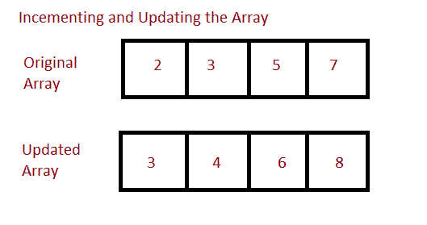

# 将每个元素递增 1 并打印数组的 Java 程序

> 原文：<https://www.studytonight.com/java-programs/java-program-to-increment-every-element-by-one-and-print-the-array>

在本教程中，我们将学习如何将数组的每个元素递增 1，然后打印递增后的数组。但是在继续之前，如果您不熟悉数组的概念，那么请务必查看 Java 中的文章[数组](https://www.studytonight.com/java/array.php)。



**输入:**输入数组元素:34 52 67 87 98 12 79 54 89

**产量:** 35 53 68 88 99 13 80 55 90

## 程序 1:将数组中的每个元素递增 1，然后打印递增后的数组

在这种情况下，我们将看到如何将每个元素递增 1，然后在预定义值时打印更新的元素。预定义意味着值已经在程序中定义。

### 算法

1.  开始
2.  声明数组。
3.  初始化数组。
4.  声明一个存储数组大小的变量。
5.  首先显示原始数组。
6.  使用 for 循环遍历所有元素。
7.  现在，将每个值递增 1，并将其存储在数组中。
8.  同样，通过使用 for 循环显示更新后的数组的所有元素。
9.  停下来。

下面是相同的代码。

下面的程序演示了如何将每个元素递增 1，然后在数组中预定义值时打印更新的元素。

```java
/*Java program to increment the elements of an array by one and then print the updated array*/
import java.util.*;  

public class Main  
{  
   public static void main(String args[])   
   {  
       //Define the array and its elements
      int arr[]={10 ,20, 30 ,50, 40 ,60, 70, 89,71};

      //Define the length of the array
      int n=arr.length;

      //Display the original array
      System.out.println("Initial Array is :");
      for(int i=0;i<n;i++)
      {
          System.out.print(arr[i]+" ");
      }
      System.out.println("");

        for(int i=0;i<n;i++)
        {
            arr[i]=arr[i]+1;   //Increment the elements by one
        }

       //Display the updated array
      System.out.println("Updated Array is ");    
      for(int i=0;i<n;i++)
      {
          System.out.print(arr[i]+" ");
      }
      System.out.println("");
   }  
} 
```

初始数组为:
10 20 30 50 40 60 70 89 71
更新数组为
11 21 31 51 41 61 71 90 72

## 程序 2:将数组中的每个元素递增 1，然后打印递增后的数组

在这种情况下，我们将看到如何将每个元素递增 1，然后在值是用户定义的时候打印更新的元素，也就是说，我们将要求用户输入数组的元素。

### 算法

1.  开始
2.  声明一个存储数组大小的变量。
3.  要求用户输入元素的总数。
4.  声明数组。
5.  要求用户输入数组的元素。
6.  首先显示原始数组。
7.  使用 for 循环遍历所有元素。
8.  现在，将每个值递增 1，并将其存储在数组中。
9.  同样，通过使用 for 循环显示更新后的数组的所有元素。
10.  停下来。

下面的程序演示了如何将每个元素递增 1，然后在用户定义值时打印更新的元素。

```java
/*Java program to increment the elements of an array by one and then print the updated array*/
import java.util.Arrays;  
import java.util.Scanner;
import java.util.*;  

public class Main  
{  
   public static void main(String args[])   
   {  
      Scanner sc=new Scanner(System.in);

      int n;    //Declare array size
      System.out.println("Enter the total number of elements ");
      n=sc.nextInt();     //Initialize array size

      int arr[]=new int[n];   //Declare array
      System.out.println("Enter the elements of the array ");
      for(int i=0; i<n ;i++)     //Initialize array
      {
          arr[i]=sc.nextInt();
      }
      //Display the original array
      System.out.println("Initial Array is :");
      for(int i=0;i<n;i++)
      {
          System.out.print(arr[i]+" ");
      }
      System.out.println("");

        for(int i=0;i<n;i++)     //Traverse through the elements of the array
        {
            arr[i]=arr[i]+1;     //Increment the elements by one
        }

       //Display the updated array
      System.out.println("Updated Array is ");    
      for(int i=0;i<n;i++)
      {
          System.out.print(arr[i]+" ");
      }
      System.out.println("");
   }  
} 
```

输入元素总数 10
输入数组的元素 2 3 4 1 5 6 11 9 87 6
初始数组为:
2 3 4 1 5 6 11 9 87 6
更新数组为
3 4 5 2 6 7 12 10 88 7

* * *

* * *