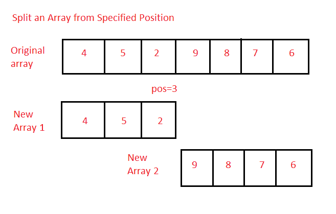

# 从指定位置拆分数组的 Java 程序

> 原文：<https://www.studytonight.com/java-programs/java-program-to-split-an-array-from-specified-position>

在本教程中，我们将学习如何从指定位置拆分数组。这意味着现在阵列将分成两个独立的阵列。但是在继续之前，如果您不熟悉数组的概念，那么请务必查看 Java 中的文章[数组](https://www.studytonight.com/java/array.php)。



**输入:**8 7 9 5 4 1 6 0 9 3 4

**输出:**位置= 5

数组 1: 8 7 9 5 4

数组 2: 3 1 6 0 9 8 3 4

## 程序 1:从指定位置拆分数组

在此方法中，我们将看到如何使用循环从指定位置拆分数组。

### 算法

1.  开始
2.  声明数组的大小。
3.  要求用户初始化数组大小。
4.  声明数组。
5.  要求用户初始化数组。
6.  输入要拆分数组的位置。
7.  声明另外两个数组来存储划分后的数组。
8.  将指定位置的元素复制到一个数组中。
9.  将下一半的元素复制到另一个数组中。
10.  显示两个数组。
11.  停下来。

下面的程序演示了如何使用循环从指定位置拆分数组。

```java
/*Java program to split an array from a specified position*/
import java.util.*;  

public class Main  
{  
   public static void main(String args[])   
   {  
       Scanner sc=new Scanner(System.in);

      int n;    //Declare array size
      System.out.println("Enter the total number of elements ");
      n=sc.nextInt();     //Initialize array size

      int arr[]=new int[n];   //Declare array
      System.out.println("Enter the elements of the array ");
      for(int i=0; i<n ;i++)     //Initialize array
      {
          arr[i]=sc.nextInt();
      }

      System.out.println("Enter the position of the array : ");
      int pos=sc.nextInt();    //Enter the position from where you want to split the array

      int brr[]=new int[pos];   //Array to store the first half
      int z=n-pos;
      int crr[]=new int[z];    //Array to store the second half of the array

      //Display the elements of the original array 
      System.out.println("Original Array Elements are ");
      for(int i=0;i<n;i++)
       {
           System.out.print(arr[i]+ " ");
       }
       System.out.println("");

      //Copy the first half elements
      for(int i=0;i<pos;i++)
      {
          brr[i]=arr[i];
      }
      //Print the first half elements
      System.out.println("The first array elements are : ");
       for(int i=0;i<pos;i++)
       {
           System.out.print(brr[i]+ " ");
       }
       System.out.println("");

       //Copy the second half elements
       int k=0;
       for(int i=pos;i<n;i++)
       {
           crr[k]=arr[i];
           k++;
       }
       //Print the second half elements
       System.out.println("The second array elements are : ");
       for(int t=0;t<z;t++)
       {
           System.out.print(crr[t]+ " ");
       }

   }  
} 
```

输入元素总数 10
输入数组的元素 2 3 4 1 5 6 7 2 8 9
输入数组的位置:4
原始数组元素为
2 3 4 1 5 6 7 2 8 9
第一个数组元素为:
2 3 4 1
第二个数组元素为:
5 6 7 2 8 9

## 程序 2:从指定位置拆分数组

在这个方法中，我们将看到如何使用`Arrays.copyofRange()`方法从指定位置拆分数组。

### 算法

1.  开始
2.  声明数组的大小。
3.  要求用户初始化数组大小。
4.  声明数组。
5.  要求用户初始化数组。
6.  输入要拆分数组的位置。
7.  声明另外两个数组来存储划分后的数组。
8.  使用`Arrays.copyofRange()`方法将指定位置的元素复制到一个数组中。
9.  使用`Arrays.copyofRange()`方法将下一半的元素复制到另一个数组中。
10.  显示两个数组。
11.  停下来。

下面的程序演示了如何使用`Arrays.copyofRange()`方法从指定位置拆分数组。

```java
/*Java program to split an array from a specified position*/
import java.util.*;  
import java.util.Arrays; 

public class Main  
{  
   public static void main(String args[])   
   {  
       Scanner sc=new Scanner(System.in);

      int n;    //Declare array size
      System.out.println("Enter the total number of elements ");
      n=sc.nextInt();     //Initialize array size

      int arr[]=new int[n];   //Declare array
      System.out.println("Enter the elements of the array ");
      for(int i=0; i<n ;i++)     //Initialize array
      {
          arr[i]=sc.nextInt();
      }

      System.out.println("Enter the position of the array : ");
      int pos=sc.nextInt();    //Enter the position from where you want to split the array

      int brr[]=new int[pos];   //Array to store the first half
      int z=n-pos;
      int crr[]=new int[z];    //Array to store the second half of the array

      //Display the elements of the original array 
      System.out.println("Original Array Elements are ");
      for(int i=0;i<n;i++)
       {
           System.out.print(arr[i]+ " ");
       }
       System.out.println("");

      //Copy the first half elements
      brr=Arrays.copyOfRange(arr, 0, pos); 

      //Print the first half elements
      System.out.println("The first array elements are : ");
       for(int i=0;i<pos;i++)
       {
           System.out.print(brr[i]+ " ");
       }
       System.out.println("");

       //Copy the second half elements
       crr=Arrays.copyOfRange(arr, pos, n); 

       //Print the second half elements
       System.out.println("The second array elements are : ");
       for(int t=0;t<z;t++)
       {
           System.out.print(crr[t]+ " ");
       }

   }  
} 
```

输入元素总数 10
输入数组的元素 4 5 8 3 1 4 6 7 3 2
输入数组的位置:6
原始数组元素为
4 5 8 3 1 4 6 7 3 2
第一个数组元素为:
4 5 8 3 1 4
第二个数组元素为:
6 7 3 2

* * *

* * *