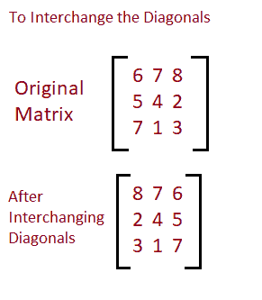

# 接受 M*N 阶矩阵并交换对角线的 Java 程序

> 原文：<https://www.studytonight.com/java-programs/java-program-to-accept-a-matrix-of-order-mn-and-interchange-the-diagonals>

在本教程中，我们将学习如何接受 M*N 阶的矩阵并交换对角线。但是在继续之前，如果您不熟悉数组的概念，那么请务必查看 Java 中的文章[数组](https://www.studytonight.com/java/array.php)。



**输入:**输入矩阵元素:

1 2 3

6 5 4

7 8 9

**输出:**

3 2 1

4 5 6

9 8 7

## 程序 1:交换矩阵的对角线

在这个程序中，我们将看到如何接受 M*N 阶的矩阵，并用用户定义的值交换对角线。

### 算法

1.  开始
2.  声明矩阵大小的变量。
3.  要求用户初始化矩阵行和列
4.  检查行数和列数是否相等。
5.  如果相等，则要求用户初始化矩阵。
6.  打印原始矩阵。
7.  交换对角线元素。
8.  打印互换的矩阵。
9.  如果行和列不相等，则打印相同的消息。
10.  停止

下面是相同的代码。

```java
//Java Program to interchange the diagonals*/
import java.util.Scanner; 

public class Main 
{ 
    public static void main(String[] args) 
    { 
        // declare variables 
        int m, n, temp; 

        // To take input from the user
        Scanner sc = new Scanner(System.in); 
        System.out.println("Enter number of rows "); 

        // Initialize the number of rows 
        m = sc.nextInt(); 

        System.out.println("Enter number of columns "); 

        // Initialize the number of columns 
        n = sc.nextInt(); 

        // declare a mxn order array 
        int a[][] = new int[m][n]; 

        // Interchange the diagonals only when it is a square matrix
        if (m == n) 
        { 
            System.out.println("Enter all the values of matrix "); 

            // Initialize the matrix elements
            for (int i = 0; i < m; i++) 
            { 
                for (int j = 0; j < n; j++) 
                { 
                    a[i][j] = sc.nextInt(); 
                } 
            } 

            System.out.println("Original Matrix:"); 

            // print the original matrix 
            for (int i = 0; i < m; i++) { 
                for (int j = 0; j < n; j++) { 
                    System.out.print(a[i][j] + " "); 
                } 
                System.out.println(""); 
            } 

            // Interchange the diagonals by swapping 
            for (int j = 0; j < m; j++) 
            { 
                temp = a[j][j]; 
                a[j][j] = a[j][n - 1 - j]; 
                a[j][n - 1 - j] = temp; 
            } 
            System.out.println("After interchanging diagonals of matrix "); 

            // print interchanged matrix 
            for (int i = 0; i < m; i++) { 
                for (int j = 0; j < n; j++) { 
                    System.out.print(a[i][j] + " "); 
                } 
                System.out.println(""); 
            } 
        }       
        else 
        { 
            System.out.println("Rows not equal to columns"); 
        } 
    } 
}
```

输入行数 3
输入列数 3
交换矩阵对角线后输入矩阵 1 2 3 4 5 6 7 8 9
原始矩阵:
1 2 3
4 5 6
7 8 9
交换矩阵对角线后
3 2 1
4 5 6
9 8 7

## 程序 2:交换矩阵的对角线

在这个程序中，我们将看到如何接受 M*N 阶的矩阵，并将对角线与预定义的值互换。

### 算法

1.  开始
2.  声明并初始化矩阵大小。
3.  检查行数和列数是否相等。
4.  如果相等，则初始化矩阵的元素。
5.  打印原始矩阵。
6.  调用一个方法来交换对角线。
7.  交换对角线元素。
8.  打印互换的矩阵。
9.  如果行和列不相等，则打印相同的消息。
10.  停止

下面是相同的代码。

```java
//Java Program to interchange the diagonals*/
import java.util.*; 

public class Main 
{ 
    //Method to interchange the diagonals
    static void interchangeDiagonals(int arr[][])
    {
        int temp=0;   
        int m=arr.length;     //Variable to store the number of rows
        int n=arr[0].length;  //Variable to store the number of columns
         System.out.println("Original Matrix:"); 

            // print the original matrix 
            for (int i = 0; i < m; i++) 
            { 
                for (int j = 0; j < n; j++) 
                { 
                    System.out.print(arr[i][j] + " "); 
                } 
                System.out.println(""); 
            } 

            // Interchange the diagonals by swapping 
            for (int j = 0; j <m; j++) 
            { 
                temp = arr[j][j]; 
                arr[j][j] = arr[j][n - 1 - j]; 
                arr[j][n - 1 - j] = temp; 
            } 
            System.out.println("After interchanging diagonals of matrix "); 

            // print interchanged matrix 
            for (int i = 0; i < m; i++) { 
                for (int j = 0; j < n; j++) { 
                    System.out.print(arr[i][j] + " "); 
                } 
                System.out.println(""); 
            }    
    }
    public static void main(String[] args) 
    { 
        // declare variables 
        int rows=3, columns=3; 
        // Interchange the diagonals only when it is a square matrix
        if (rows == columns) 
        { 
           int arr[][]  = { { 2, 9, 8 }, { 7, 6, 4 }, { 3, 9, 2 } };   //Matrix Declaration
           interchangeDiagonals(arr);
        }
        else 
        { 
            System.out.println("Rows not equal to columns"); 
        } 
    } 
}
```

原始矩阵:
2 9 8
7 6 4
3 9 2
交换矩阵对角线后
8 9 2
7 6 4
2 9 3

* * *

* * *