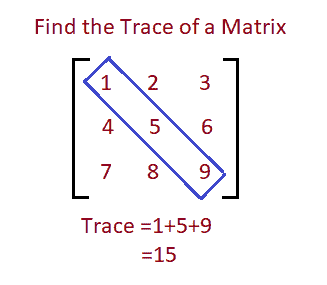
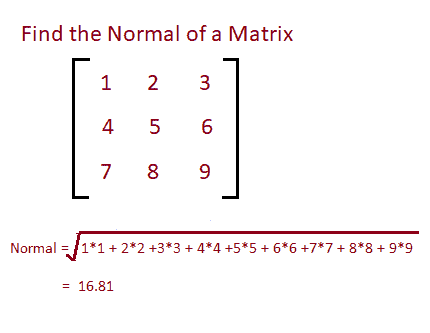

# Java 程序：寻找给定矩阵的迹和正规

> 原文：<https://www.studytonight.com/java-programs/java-program-to-find-the-trace-and-normal-of-a-given-matrix>

在本教程中，我们将学习如何找到矩阵的迹和法线。矩阵中的迹定义为对角元素的和，法线定义为矩阵元素平方和的平方根。但是在继续之前，如果您不熟悉数组的概念，那么请务必查看 Java 中的文章[数组](https://www.studytonight.com/java/array.php)。

下面是如何找到矩阵轨迹的图示。



下面是如何求矩阵法线的图示。



**输入:**输入矩阵元素:5 4 3 1 2 6 9 8 7

**输出:**矩阵的轨迹为:14.0

矩阵的法线为:16.88

## 程序 1:寻找矩阵的迹和正规

在这个程序中，我们将看到当值是用户定义的时，如何找到矩阵的迹和法线。

### 算法

1.  开始
2.  为行和列声明变量。
3.  要求用户初始化行和列。
4.  声明一个矩阵。
5.  要求用户初始化矩阵元素。
6.  打印原始矩阵。
7.  声明两个变量来计算矩阵的迹和正规。
8.  将这些变量初始化为零。
9.  使用两个 for 循环来计算矩阵的轨迹。
10.  使用第一个 for 循环遍历行。
11.  使用第二个 for 循环遍历列。
12.  使用 if 条件检查行号和列号是否相同。
13.  如果相同，则计算每次迭代中的跟踪。
14.  打印矩阵的跟踪值。
15.  现在，要再次计算矩阵的法线，循环使用两个。
16.  使用第一个 for 循环遍历行。
17.  使用第二个 for 循环遍历列。
18.  计算每个数字的平方，并在每次迭代中更新平方变量。
19.  现在，求上面计算的平方的平方根。
20.  打印结果。
21.  停止

下面的程序演示了如何找到矩阵的迹和法线。

```java
/*JAVA PROGRAM TO FIND THE TRACE AND NORMAL OF A MATRIX*/
import java.util.*;
public class Main
{
     public static void main(String []args)
     {
         ///Take input from the user
         Scanner sc=new Scanner(System.in);        
         int m,n;                 //Matrix Row and Column Declaration        
         System.out.println("Enter the number of rows: \n");
         m=sc.nextInt();  //Matrix Row Initialization        
         System.out.println("Enter the number of column: \n");
         n=sc.nextInt();  //Matrix Column Initialization        
         int arr[][]=new int[10][10];        //Matrix Size Declaration        
         System.out.println("Enter the elements of the matrix: ");
         for(int i=0;i<m;i++)    //Matrix Elements Initialization
         {
            for(int j=0;j<n;j++)
            {
                 arr[i][j]=sc.nextInt();
            }
         }        
         //Print the original Matrix
         System.out.println("The elements in the original matrix are: ");
         for(int i=0;i<m;i++)     
         {
             for(int j=0;j<n;j++)
             {
                  System.out.print(arr[i][j]+" "); //Print the matrix elements
             }
            System.out.println("");
        }       
        double sum=0;        //Declare and initialize the trace variable
        double square=0;     //Declare and initialize the normal variable       
        //Find the trace of the matrix
        System.out.println("The Trace of the above matrix is ");
  	    for(int i = 0; i < m; i++)
  	    {  
    	    for(int j = 0; j < n; j++)
       	    {
                if(i == j)
            	 {
               	     sum = sum + (arr[i][j]);      //Calculate the trace in each iteration
               	 }
            }
        }
        System.out.println(sum);  //Print the trace of the matrix       
        //Find the normal of the matrix
        System.out.println("The Normal of the above matrix is "); 
   	    for(int i = 0; i < m; i++)
   	    {
    	    for(int j = 0; j < n; j++)
       	    {
       	        square = square + (arr[i][j])*(arr[i][j]);     //Calculate the normal in each iteration
            }
    	}
        double result = Math.sqrt(square);
        System.out.println(result);     //Print the normal       
     }
}
```

输入行数:3
输入列数:3
输入矩阵的元素:1 2 3 4 5 6 7 8 9
原矩阵中的元素为:
1 2 3
4 5 6
7 8 9
上述矩阵的迹为
15.0
上述矩阵的法线为
16.881943016134134

## 程序 2:寻找矩阵的迹和正规

在这个程序中，我们将看到当值被预定义时，如何找到矩阵的迹和正规。

### 算法

1.  开始
2.  声明并初始化矩阵。
3.  打印原始矩阵。
4.  调用一个方法来计算矩阵的轨迹。
5.  在该方法中声明一个变量和，并将其初始化为 0。
6.  当对角线值遇到时，增加总和。
7.  显示总和。
8.  现在，调用一个方法来计算矩阵的法线。
9.  声明一个变量 square 并将其初始化为 0。
10.  计算每个数字的平方，并在每次迭代中更新平方变量。
11.  现在，求上面计算的平方的平方根。
12.  打印结果。
13.  停止

下面的程序演示了如何找到矩阵的迹和法线。

```java
/*Java Program to find the trace and normal of a matrix*/
import java.io.*; 
public class Main 
{   
    //To Find the normal of a matrix 
    public static void findNormal(int[][] arr) 
    { 
         double square = 0, result = 0;
        System.out.println("The Normal of the above matrix is "); 
   	for(int i = 0; i < arr.length; i++)
   	{
    	    for(int j = 0; j < arr[0].length; j++)
       	    {
       	        square = square + (arr[i][j])*(arr[i][j]);
            }
    	}
        result = Math.sqrt(square);
        System.out.println(result);
    }     
    //To Find the trace of a matrix 
    public static void findTrace(int[][] arr) 
    { 
        double sum = 0;
        System.out.println("The Trace of the above matrix is ");
  	for(int i = 0; i < arr.length; i++)
  	{  
    	    for(int j = 0; j < arr[0].length; j++)
       	    {
                if(i == j)
            	 {
               	     sum = sum + (arr[i][j]);
               	 }
            }
        }
        System.out.println(sum);          
    }    
    // Driver code 
    public static void main(String args[]) throws IOException 
    { 
        int arr[][] 
            = { { 2, 9, 8 }, { 7, 6, 4 }, { 3, 9, 2 } };  //Matrix Declaration and Initialization
            System.out.println("Original Matrix");
       for(int i = 0; i < arr.length; i++)
  	   {  
    	    for(int j = 0; j < arr[0].length; j++)
       	    {
                System.out.print(arr[i][j]+ " ");
            }
            System.out.println();
        }
        System.out.println();
        findTrace(arr);    //Find the Trace of the Matrix
        System.out.println();
        findNormal(arr);   //Find the Normal of the Matrix                  
    } 
} 
```

原始矩阵
2 9 8
7 6 4
3 9 2
T5】上述矩阵的迹为
10.0

上述矩阵的法线为
18 . 36960 . 499999999606

* * *

* * *