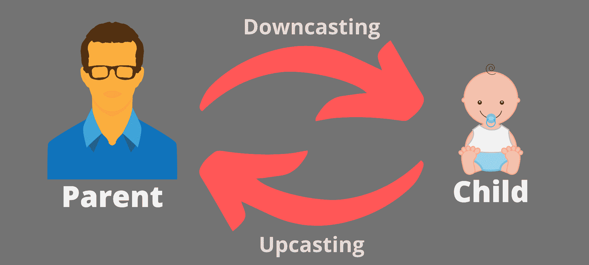

# Java 类型转换(向下转换，向上转换)

> 原文：<https://www.studytonight.com/java-examples/java-object-type-casting>

[类型转换](https://www.studytonight.com/java/type-casting-in-java.php)是数据类型的转换过程。对象类型转换可以有两种类型，这取决于我们是从父类型转换为子类型，还是从父类型转换为子类型。在本教程中，我们将学习 Java 中对象的向上转换和向下转换。



## 向上抛

*   **将子类的一个对象投射到父类的过程称为向上投射**。
*   可以通过**隐式或显式**进行向上转换。
*   上播会**减少方法的选择，**我们可以用在类型化的对象上。
*   但是，对于被覆盖的方法，**静态或动态绑定**开始起作用，它将决定要使用的方法实现。

为了演示向上转换，我们将使用一个子类和一个父类。子类有一个覆盖的 print()方法和一个 printName()方法。下面的代码显示了实现。

```java
class SuperClass
{
    public void print()
    {
        System.out.println("Printing from SuperClass");
    }
}
class Child extends SuperClass
{
	String name;
	Child(String s)
	{
		this.name = s;
	}	
	@Override
    public void print()
	{
    	System.out.println("Printing from Child class");
    }	
    public void printName()
    {
    	System.out.println(this.name); 
    }
}
```

### 隐式向上转换

当我们将子类的一个对象分配给超类类型的引用变量时，就会发生隐式上转换。我们可以在这个对象上使用 print()方法，并且将使用 Child 类的方法实现。

```java
public static void main(String[] args)
{
	Child c = new Child("child");
	c.print();

	//Implicit Upcasting
	SuperClass s2 = new Child("Second Child");
	s2.print();//print() method of Child class is called due to dynamic binding
}
```

从子类打印
从子类打印

隐式向上转换的另一个例子如下所示。如果我们创建一个超类类型的 [`ArrayList`](https://www.studytonight.com/java/arraylist-in-collection-framework.php) ，并向其中添加子类对象，那么它们将被隐式地向上投射到超类中。我们还创建了一个新类(另一个子类)。

```java
import java.util.ArrayList;
class AnotherChild extends SuperClass
{
	public void print()
    {
        System.out.println("Printing from AnotherChild class");
    }
}
public class TypeCastingDemo
{
	public static void main(String[] args)
	{
		SuperClass obj1 = new SuperClass();
		Child obj2 = new Child("First Child");
		AnotherChild obj3 = new AnotherChild();

		ArrayList<SuperClass> superClassList = new ArrayList<>();
		superClassList.add(obj1);
		superClassList.add(obj2);
		superClassList.add(obj3);

		for(int i=0; i<superClassList.size(); i++)
			superClassList.get(i).print();
	}
}
```

从父类打印
从子类打印
从另一子类打印

### 显式向上转换

我们也可以显式地强制转换对象，但这并不是真正必需的。

```java
public static void main(String[] args)
{
	Child c = new Child("child");
	c.print();

	//Explicit Upcasting
	SuperClass s2 = (SuperClass) new Child("Second Child");
	s2.print();//print() method of Child class is called due to dynamic binding
}
```

从子类打印
从子类打印

### 向上广播缩小了方法的选择范围

如上所述，**上播将缩小我们对方法的选择**。例如，在将一个子类对象向上转换为超类之后，我们就不能再使用子类的 printName()方法了。我们会得到一个编译错误。

```java
public class TypeCastingDemo
{
	public static void main(String[] args)
	{
		SuperClass s = new Child("First Child");
		s.printName();//Error
	}
}
```

线程“main”Java . lang . error:未解决的编译问题:
方法 printName()对于 type casting demo . main(type casting demo . Java:36)处的类型 SuperClass

未定义

### 带接口的上播

上播也适用于接口。让我们创建一个新的接口，并在我们的子类中实现它。

```java
interface Name
{
	public void printName();
}
class Child extends SuperClass implements Name
{
	String name;
	Child(String s)
	{
		this.name = s;
	}	
	@Override
    public void print()
	{
    	System.out.println("Printing from Child class");
    }	
    public void printName()
    {
    	System.out.println(this.name); 
    }
}
```

现在，我们将创建一个子类的对象，并将其分配给一个接口类型变量。在这种情况下，将发生隐式类型转换。我们可以使用实现的 printName()方法。

```java
public class TypeCastingDemo
{
	public static void main(String[] args)
	{
		Name obj = new Child("First Child");
		obj.printName();
	}
}
```

第一个孩子

但是我们不能使用覆盖的 print()方法。

```java
public class TypeCastingDemo
{
	public static void main(String[] args)
	{
		Name obj = new Child("First Child");
		obj.print();//Error
	}
}
```

线程“main”Java . lang . error:未解决的编译问题:
type casting demo . main(type casting demo . Java:51)处的类型 Name

的方法 print()未定义

### 向上转换到对象类

**所有类在内部扩展对象类**。对象类是所有其他类的超类。因此，我们可以将子类(或任何其他类)向上转换为对象类。

```java
public class TypeCastingDemo
{
	public static void main(String[] args)
	{
		Object o = new Child("hello");
		System.out.print(o.getClass());
	}
}
```

儿童班

## Java 中的向下转换

*   下播可以认为是上播的**反转。我们正在**将父类的一个对象类型化为子类**。**
*   与向上转换不同，**向下转换不是由编译器**隐式完成的。

正如我们在 upcasting 中看到的，下面的代码给出了一个错误。

```java
public class TypeCastingDemo
{
	public static void main(String[] args)
	{
		SuperClass s = new Child("First Child");
		s.printName();//Error
	}
}
```

为了使它工作，我们可以从超类向下转换到子类。这将使我们能够访问 Child 类的 print()方法。

```java
public class TypeCastingDemo
{
	public static void main(String[] args)
	{
		SuperClass s = new Child("First Child");
		((Child) s ).printName();//Downcasting from SuperClass to Child class.
	}
}
```

第一个孩子

### 类型转换中的类转换异常

`ClassCastException`是向下转换时经常遇到的异常。下面的代码演示了这个错误。

我们创建了一个新的另一个子类，在 main()方法中，我们创建了三个对象，每个类一个(超类类、子类和另一个子类)，我们将它们添加到一个`ArrayList`中。现在，当我们将每个对象转换到 Child 类时，我们会得到这个错误。这是因为在另一个子类和子类之间没有父子关系。所以我们不能从一个孩子变成另一个孩子。

```java
class AnotherChild extends SuperClass
{
	public void print()
    {
        System.out.println("Printing from AnotherChild class");
    }
}
public class TypeCastingDemo
{
	public static void main(String[] args)
	{
		ArrayList<SuperClass> list = new ArrayList<>();
		SuperClass s = new Child("First Child");
		Child c1 = new Child("Second Child");
		AnotherChild c2 = new AnotherChild();

		list.add(s);
		list.add(c1);
		list.add(c2);

		for(int i=0; i<list.size(); i++)
		{
			((Child) list.get(i)).printName();
		}	
	}
}
```

第一个孩子
第二个孩子
线程“main”中出现异常 java.lang.ClassCastException:类 otherChild 不能强制转换为类 Child(other Child 和 Child 位于加载程序“app”的未命名模块中)
的 typescasting demo . main(typescasting demo . Java:57)

我们可以使用运算符的**实例来纠正这个错误。如果对象是特定类型的**，该运算符**返回真。在向下转换之前，我们可以通过使用 instanceof 运算符来更正上面的代码。**

```java
public class TypeCastingDemo
{
	public static void main(String[] args)
	{
		ArrayList<SuperClass> list = new ArrayList<>();
		SuperClass s = new Child("First Child");
		Child c1 = new Child("Second Child");
		AnotherChild c2 = new AnotherChild();

		list.add(s);
		list.add(c1);
		list.add(c2);

		for(int i=0; i<list.size(); i++)
		{
			if(list.get(i) instanceof Child)
				((Child) list.get(i)).printName();
		}
	}
}
```

第一个孩子
第二个孩子

### 使用 cast()和 isInstance()方法

Java 提供了一种向下转换的替代方式。我们可以使用 cast()方法从超类向下转换到子类。同样，isInstance()方法可以替换 instanceof 运算符。这两种方法在泛型方法中经常一起使用。让我们使用这些方法覆盖上面的代码。

```java
public class TypeCastingDemo
{
	public static void main(String[] args)
	{
		ArrayList<SuperClass> list = new ArrayList<>();
		SuperClass s = new Child("First Child");
		Child c1 = new Child("Second Child");
		AnotherChild c2 = new AnotherChild();

		list.add(s);
		list.add(c1);
		list.add(c2);

		for(int i=0; i<list.size(); i++)
		{
			if(Child.class.isInstance(list.get(i)))
			{
				Child c = Child.class.cast(list.get(i));
				c.printName();
			}
		}
    }
}
```

第一个孩子
第二个孩子

**总结**

在本教程中，我们学习了如何在 Java 中向上转换和向下转换对象。上转换可以隐式或显式完成，并将类型从子类转换为超类。它缩小了我们可以对对象使用的方法的范围。向下转换是将超类转换为子类的过程。我们只能显式向下转换对象。执行向下转换是为了访问子类的方法和属性。我们必须使用 instanceof 运算符或 isInstance()方法来安全地进行向下转换。这样做是为了避免 ClassCastException。

* * *

* * *