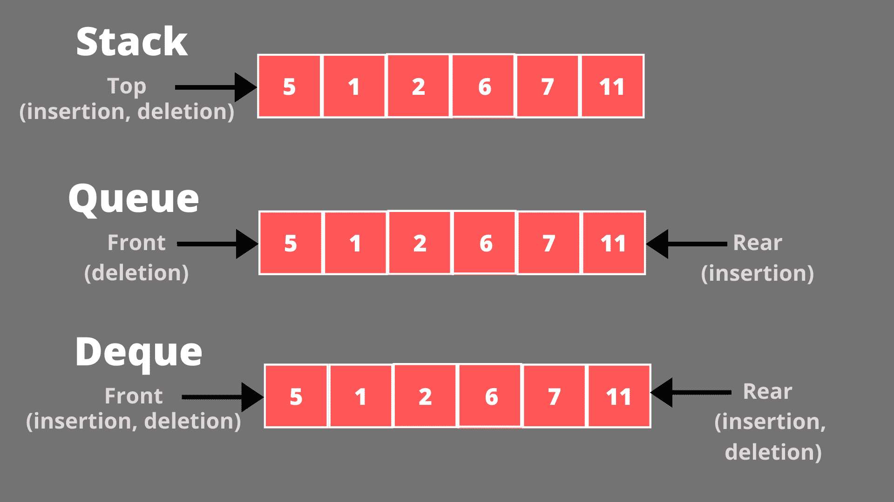
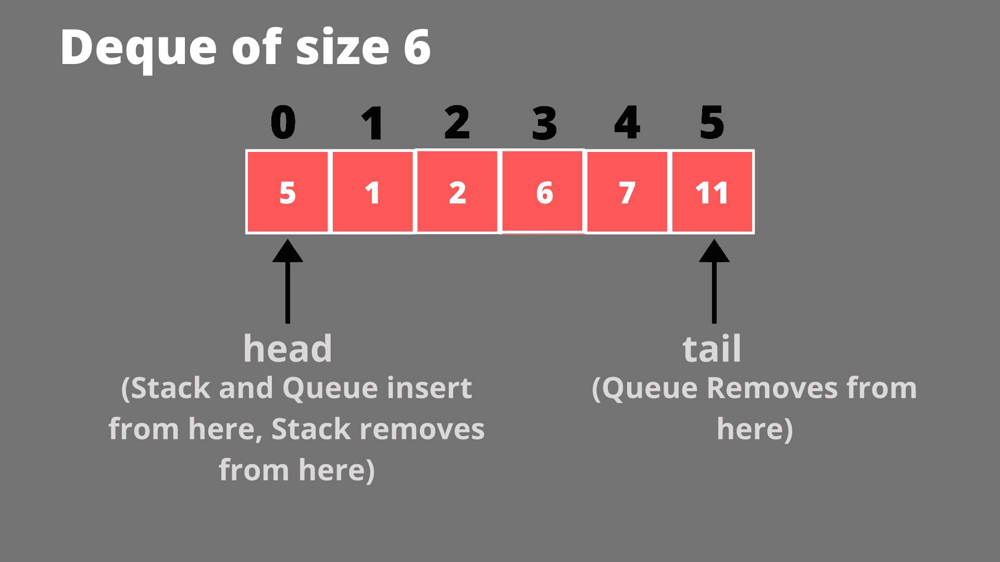

# Java 中的 ArrayDeque

> 原文：<https://www.studytonight.com/java-examples/arraydeque-in-java>

一个[队列](https://www.studytonight.com/java/queue-interface.php)是一个简单的线性数据结构，允许我们从一端插入元素，从另一端移除元素。[德清](https://www.studytonight.com/java/deque-interface.php)代表**双头队列**。与队列不同，**一个队列可以在任意一端插入和移除元素**。

在本教程中，我们将学习如何借助 ArrayDeque 类在 [Java](https://www.studytonight.com/java/overview-of-java.php) 中实现一个 Deque。

## 德格数据结构

如上所述，一个**de quee 是一个允许从两端**插入和删除的线性数据结构。这就是它被称为双端队列的原因。我们可以使用这种数据结构来实现其他线性数据结构，如堆栈和队列。我们将只允许从 Deque 的一个公共端插入和删除，以实现一个堆栈。为了使用 Deque 实现一个队列，我们将允许从一端插入，从另一端删除。



## Java 中的 ArrayDeque

*   Java 中的 ArrayDeque 类提供了一个**动态数组**，可以作为一个 Deque 使用。这个类 i **实现了德客和`Queue`接口**。
*   它使用两个称为**头**和**尾**的指针。头部从前面负责插入和删除，尾部从末端负责插入和删除。
*   如果在前面添加了一个元素，则头部会向前移动(从左到右)。如果一个元素从前面移除，那么头部向后移动。
*   如果在末尾添加了一个元素，那么尾部会从右向左移动。如果从末端移除元素，则尾部会向前移动(从左到右)。



让我们来看看在数组上执行的一些常见操作。

### 插入(向数组添加元素)

我们可以在德格的前面或后面插入元素。ArrayDeque 提供了 **offerFirst()** 和 **addFirst()** 方法在 ArrayDeque 的前面添加元素。

```java
import java.util.ArrayDeque;
import java.util.Deque;
public class ArrayDequeDemo
{
	public static void main(String[] args)
	{
		Deque<Integer> deck = new ArrayDeque<Integer>();
	    deck.addFirst(5);
	    deck.addFirst(10);
	    System.out.println("Deque After Inserting using addFirst(): " + deck);

	    deck.offerFirst(15);
	    deck.offerFirst(20);
	    System.out.println("Deque After Inserting using offerFirst(): " + deck);
	}
}
```

使用 addFirst()插入后的德格:【10，5】
使用 offerFirst()插入后的德格:【20，15，10，5】

我们可以使用 **offerLast()** 或 **addLast()** 方法在数组的后面插入元素。

```java
import java.util.ArrayDeque;
import java.util.Deque;
public class ArrayDequeDemo
{
	public static void main(String[] args)
	{
		Deque<Integer> deck = new ArrayDeque<Integer>();
	    deck.addLast(5);
	    deck.addLast(10);
	    System.out.println("Deque After Inserting using addLast(): " + deck);

	    deck.offerLast(15);
	    deck.offerLast(20);
	    System.out.println("Deque After Inserting using offerLast(): " + deck);
	}
}
```

使用 addLast()插入后的去重:【5，10】
使用 offerLast()插入后的去重:【5，10，15，20】

### 删除(从数组中删除元素)

我们有 **pollFirst()** 和 **removeFirst()** 方法，它们可以从数组的前面移除元素，并返回出现在头部或 Deque 前面的元素。

```java
import java.util.ArrayDeque;
import java.util.Deque;
public class ArrayDequeDemo
{
	public static void main(String[] args)
	{
		Deque<Integer> deck = new ArrayDeque<Integer>();
	    deck.addLast(5);
	    deck.addLast(10);  
	    deck.addLast(15);
	    deck.addLast(20);
	    System.out.println("Deque After Insertion: " + deck);

	    Integer i1 = deck.removeFirst();
	    System.out.println("Deleted Element: " + i1);
	    System.out.println("Deque after Deletion: " + deck);

	    Integer i2 = deck.pollFirst();
	    System.out.println("Deleted Element: " + i2);
	    System.out.println("Deque after Deletion: " + deck);
	}
}
```

插入后的德克尔:[5，10，15，20]
删除后的元素:5
删除后的德克尔:[10，15，20]
删除后的元素:10
删除后的德克尔:[15，20]

类似地，使用 **pollLast()** 和 **removeLast()** 方法来移除 Deque 的最后一个元素。

```java
import java.util.ArrayDeque;
import java.util.Deque;

public class ArrayDequeDemo
{
	public static void main(String[] args)
	{
		Deque<Integer> deck = new ArrayDeque<Integer>();
	    deck.addLast(5);
	    deck.addLast(10);  
	    deck.addLast(15);
	    deck.addLast(20);
	    System.out.println("Deque After Insertion: " + deck);

	    Integer i1 = deck.removeLast();
	    System.out.println("Deleted Element: " + i1);
	    System.out.println("Deque after Deletion: " + deck);

	    Integer i2 = deck.pollLast();
	    System.out.println("Deleted Element: " + i2);
	    System.out.println("Deque after Deletion: " + deck);
	}
}
```

插入后的德格:[5，10，15，20]
删除后的元素:20
删除后的德格:[5，10，15]
删除后的元素:15
删除后的德格:[5，10]

### 从数组中获取元素

我们可以使用 **peekFirst()** 或 **getFirst()** 方法轻松地从数组中获取第一个元素。正如您可能已经猜到的，我们有一个 **peekLast()** 和一个 **getLast()** 方法来从一个 Deque 中获取最后一个元素。

```java
import java.util.ArrayDeque;
import java.util.Deque;

public class ArrayDequeDemo
{
	public static void main(String[] args)
	{
		Deque<Integer> deck = new ArrayDeque<Integer>();
	    deck.addLast(5);
	    deck.addLast(10);  
	    deck.addLast(15);
	    deck.addLast(20);
	    System.out.println("Deque After Insertion: " + deck);

	    Integer i1 = deck.peekFirst();
	    Integer i2 = deck.getFirst();
	    System.out.println("First Element is(using peekFirst()): " + i1);
	    System.out.println("First Element is(using getFirst()): " + i2);

	    Integer i3 = deck.peekLast();
	    Integer i4 = deck.getLast();
	    System.out.println("Last Element is(using peekLast()): " + i3);
	    System.out.println("Last Element is(using getLast()): " + i4);
	}
}
```

插入后的 Deque，10，15，20]
第一个元素是(使用 peekFirst()): 5
第一个元素是(使用 getFirst()): 5
最后一个元素是(使用 peekLast()): 20
最后一个元素是(使用 getLast()): 20

### 遍历数组

我们可以在**迭代器**的帮助下遍历数组，就像我们访问其他集合元素一样。

```java
import java.util.ArrayDeque;
import java.util.Deque;
import java.util.Iterator;

public class ArrayDequeDemo
{
	public static void main(String[] args)
	{
		Deque<Integer> deck = new ArrayDeque<Integer>();
	    deck.addLast(5);
	    deck.addLast(10);  
	    deck.addLast(15);
	    deck.addLast(20);

	    Iterator i = deck.iterator();
	    while(i.hasNext())
	    	System.out.print(i.next() + " "); 
	}
}
```

5 10 15 20

### 反向迭代数组

我们可以使用降序迭代器以相反的顺序迭代数组。

```java
import java.util.ArrayDeque;
import java.util.Deque;
import java.util.Iterator;

public class ArrayDequeDemo
{
	public static void main(String[] args)
	{
		Deque<Integer> deck = new ArrayDeque<Integer>();
	    deck.addLast(5);
	    deck.addLast(10);  
	    deck.addLast(15);
	    deck.addLast(20);

	    Iterator i = deck.descendingIterator();
	    while(i.hasNext())
	    	System.out.print(i.next() + " "); 
	}
}
```

20 15 10 5

### 为什么我们每次手术都有两种方法？

您可能已经注意到，我们有两种方法可以执行相同的操作。例如，我们可以使用 removeLast()方法或 pollLast()方法从数组中移除最后一个元素。这些方法的区别在于，如果操作失败，其中一个方法会返回异常。另一个返回表示失败操作的值。

操作失败时返回异常的方法有:

*   addFirst()
*   addLast()
*   removeFirst()
*   removeLast()
*   getFirst()
*   getLast（）

如果操作失败，无异常返回值的方法有:

*   offerFirst()
*   offerLast()
*   pollFirst()
*   pollLast()
*   peekFirst()
*   扫视最后（）

让我们借助一个例子来理解这一点。我们有一个空的 Deque，我们在它上面使用了 removeLast()方法。我们会得到一个**nosucheelementexception**。

```java
import java.util.ArrayDeque;
import java.util.Deque;

public class ArrayDequeDemo
{
	public static void main(String[] args)
	{
		Deque<Integer> deck = new ArrayDeque<Integer>();
	    System.out.print(deck.removeLast());
	}
}
```

线程" main " Java . util . nosuchinterexception
at Java . base/Java . util . arraydequa . removelast(arraydequa . Java:372)
at 片段. arraydequademo . main(arraydequademo . Java:11)

但是如果我们使用 pollLast()方法，我们不会得到任何异常。在下面的输出中，我们可以看到该方法返回了一个 **null** 。这表示删除不成功。

```java
import java.util.ArrayDeque;
import java.util.Deque;

public class ArrayDequeDemo
{
	public static void main(String[] args)
	{
		Deque<Integer> deck = new ArrayDeque<Integer>();
	    System.out.print(deck.pollLast());
	}
}
```

零

## arraydeque as 堆栈

如前几节所述，我们可以使用 ArrayDeque 实现一个堆栈。我们将选择 Deque 的一端(前部或后部)，仅从该端插入和删除元素。我们可以使用我们讨论过的插入和删除方法。或者我们可以用方便的**推()**和**爆()**的方法搭配 ArrayDeque。

```java
import java.util.ArrayDeque;
import java.util.Deque;

public class ArrayDequeDemo
{
	public static void main(String[] args)
	{
		Deque<Integer> stk = new ArrayDeque<Integer>();
		stk.push(15);
	    stk.push(10);
	    stk.push(5);
	    System.out.println("Stack after insertion: " + stk);

	    stk.pop();
	    System.out.println("Stack after deletion: " + stk);
	    stk.pop();
	    System.out.println("Stack after deletion: " + stk);
	}
}
```

插入后堆叠:[5，10，15]
删除后堆叠:[10，15]
删除后堆叠:[15]

## 拉起尾巴

我们可以使用 ArrayDeque 实现一个队列，方法是在一端插入元素，然后从另一端移除它们。我们可以使用上面讨论的方法。或者我们可以使用 **add()** 和 **remove()** 方法。这些方法自动决定前端和后端，并相应地插入和删除元素。

```java
import java.util.ArrayDeque;
import java.util.Deque;

public class ArrayDequeDemo
{
	public static void main(String[] args)
	{
		Deque<Integer> que = new ArrayDeque<Integer>();
		que.add(5);
		que.add(15);
		que.add(20);
	    System.out.println("Queue after insertion: " + que);

	    que.remove();
	    System.out.println("Queue after deletion: " + que);
	    que.remove();
	    System.out.println("Queue after deletion: " + que);
	}
}
```

插入后排队:[5，15，20]
删除后排队:[15，20]
删除后排队:[20]

## 摘要

以下几点总结了 ArrayDeque 类的主要特性。

*   Deque 可以被认为是一个队列，在这个队列中，插入和删除可以在两端进行。
*   ArrayDeque 使用动态数组来实现 Deque 数据结构。当我们用完空间时，阵列会自动加倍。
*   我们可以使用数组来实现堆栈和队列数据结构。
*   当使用 ArrayDeques 实现堆栈时，它的工作速度比普通的 Stack 类快得多。
*   同样，使用 ArrayDeques 实现的队列比用作队列的[链接列表](https://www.studytonight.com/java/linkedlist-in-collection-framework.php)更快。
*   请注意，ArrayDeque 类不是线程安全的，我们需要同步它们以实现并发访问。
*   数组不允许在其中插入空元素。

* * *

* * *