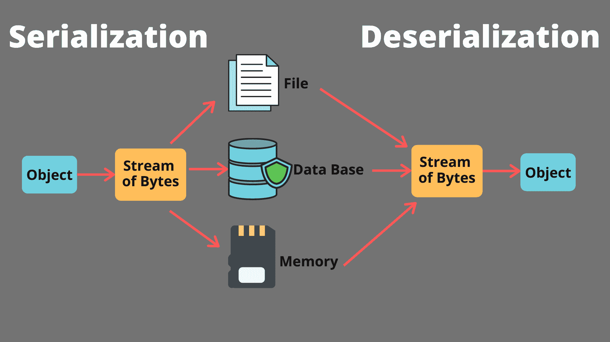

# Java 序列化和反序列化

> 原文：<https://www.studytonight.com/java-examples/java-serialization-and-deserialization>

序列化意味着将对象转换为字节流。顾名思义，反序列化是序列化的逆过程。反序列化从字节流生成对象。

执行序列化和反序列化是为了保存或保持对象的状态。它也用于通过网络传输对象。通过序列化生成的字节流与平台无关。

因此，一个对象可以在一个系统上序列化，然后传输到另一个系统，在那里它可以反序列化以获得原始对象。

在本教程中，我们将学习如何在 [Java](https://www.studytonight.com/java/overview-of-java.php) 中序列化和反序列化对象。



## 序列化和反序列化

*   一个类应该实现`Serializable`接口，使其对象可序列化。
*   Serializable 接口是一个**标记接口**，这意味着它没有任何字段或方法。
*   如果一个类实现了 Serializable 接口，那么它的所有子类也将是可序列化的。子类不需要实现 Serializable 接口。
*   只有非静态字段被序列化，静态字段不会被序列化。
*   请注意，瞬态字段在序列化过程中被完全忽略，并将被反序列化为默认值。
*   如果一个对象包含对其他对象的引用，那么这些对象也应该是可序列化的。否则，一个 **`NotSerializableException`** 就扔了。

### 对象输出流

ObjectOutputStream 类扩展了 OutputStream 类。它用于将对象作为字节写入输出流。该类的 **writeObject()** 方法将可序列化的对象转换为字节流。

```java
public final void writeObject(Object o) throws IOException
```

### 输入流

ObjectInputStream 类扩展了 InputStream 类，用于读取字节流并从中生成对象。该类的 **readObject()** 方法用于反序列化。

```java
public final Object readObject() throws IOException, ClassNotFoundException
```

## 序列化和反序列化示例

让我们尝试序列化和反序列化如下所示的学生类的对象。

```java
class Student implements Serializable
{
	String name;
	Double gpa;
	static int regNo;
	transient boolean isHosteller;

	Student(String name, Double gpa, int regNo, boolean isHosteller)
	{
		this.name = name;
		this.gpa = gpa;
		this.regNo = regNo;
		this.isHosteller = isHosteller;
	}	
	public void print()
	{
		System.out.println("Name: " + this.name);
		System.out.println("GPA: " + this.gpa);
		System.out.println("Registration Number: " + this.regNo);
		System.out.println("Is Hosteller: " + this.isHosteller);
	}
}
```

在序列化过程中，瞬态字段将被忽略。它将被反序列化为默认的布尔值(false)。静态字段将采用当前设置的值。请注意，在下面的代码中，当我们更改注册号时，反序列化对象的注册号也会发生变化。这是因为 regNo 字段是静态的。

```java
import java.io.FileInputStream;
import java.io.FileOutputStream;
import java.io.IOException;
import java.io.ObjectInputStream;
import java.io.ObjectOutputStream;
import java.io.Serializable;

public class Demo
{
	public static void main(String[] args) throws IOException, ClassNotFoundException
	{
		Student student = new Student("Justin", 8.51, 101, true);
		System.out.println("Before Deserialization:");
		student.print();

		//Serialization
		FileOutputStream fileOut = new FileOutputStream("demo.txt");
		ObjectOutputStream oos = new ObjectOutputStream(fileOut);
		oos.writeObject(student);
		oos.close();
		fileOut.close();

		student.regNo = 102;//Changing the static field

		//Deserialization
		FileInputStream fileIn = new FileInputStream("demo.txt");
		ObjectInputStream ois = new ObjectInputStream(fileIn);

		Student deserializedStudent = (Student) ois.readObject();

		System.out.println("\nAfter Deserialization:");
		deserializedStudent.print();
		ois.close();
		fileIn.close();
	}
} 
```

反序列化前:
姓名:贾斯汀
GPA: 8.51
注册号:101
是霍斯特勒:真
T6】反序列化后:
姓名:贾斯汀
GPA: 8.51
注册号:102
是霍斯特勒:假

## NotSerializableException 示例

如果学生类包含地址类的字段，那么地址类也必须是可序列化的，以使学生类可序列化。如果没有遵循，则抛出`NotSerializableException`。让我们尝试模拟 NotSerializableException *。*

```java
import java.io.FileOutputStream;
import java.io.IOException;
import java.io.ObjectOutputStream;
import java.io.Serializable;
class Student implements Serializable
{
	String name;
	Address add;

	Student(String s, Address a)
	{
		this.name = s;
		this.add = a;
	}
}
class Address//Does not implements Serializable
{
	int postalCode;
	Address(int i)
	{
		this.postalCode = i;
	}
}
public class Demo
{
	public static void main(String[] args) throws IOException, ClassNotFoundException
	{
		Address add = new Address(10001);
		Student student = new Student("Justin", add);

		//Serialization
		FileOutputStream fileOut = new FileOutputStream("demo.txt");
		ObjectOutputStream oos = new ObjectOutputStream(fileOut);
		oos.writeObject(student);
		oos.close();
		fileOut.close();
	}
}
```

执行绪「main」Java . io . notserializable exception:address
at Java . base/Java . io . object output stream . writeobject 0(object output stream . Java:1193)
at Java . base/Java . io . object output stream . default writefields(object output stream . Java:1579)
at Java . base/Java . io . object output stream . writeserializada(object output stream . Java

## 串行版本 UID

实现 Serializable 接口的每个类都有一个与之关联的类型为 long 的版本号。该标识用于验证在序列化和反序列化过程中是否加载了正确的类并具有相同的属性。如有出入，则抛出 **`InvalidClassException`** 。

我们可以自己声明这个标识，也可以让 JVM 为我们声明。但是，建议我们自己提供版本号，因为 JVM 生成的版本号依赖于编译器。这会导致`InvalidClassExceptions`。这个字段必须是静态的和最终的，我们可以使用任何访问修饰符。

```java
public static final long serialversionUID = 123L;
```

## 自定义序列化和反序列化

我们还可以自定义默认的序列化和反序列化过程。这是通过在我们的类中实现 writeObject()和 readObject()来实现的。

```java
private void writeObject(ObjectOutputStream oos) throws IOException
```

```java
private void readObject(ObjectInputStream ois) throws ClassNotFoundException, IOException
```

自定义序列化和反序列化通常用于被忽略的字段(如瞬态)。我们可以为这些字段定义自定义行为，而不是完全忽略它们。

例如，在下面的代码中，反序列化的对象包含 null 作为注册号。

```java
class Student implements Serializable
{
	String name;
	Double gpa;
	transient String regNo;

	Student(String name, Double gpa, String regNo)
	{
		this.name = name;
		this.gpa = gpa;
		this.regNo = regNo;
	}	
	public void print()
	{
		System.out.println("Name: " + this.name);
		System.out.println("GPA: " + this.gpa);
		System.out.println("Registration Number: " + this.regNo);
	}
}
public class Demo
{
	public static void main(String[] args) throws IOException, ClassNotFoundException
	{
		Student student = new Student("Justin", 8.51, "101");
		System.out.println("Before Deserialization:");
		student.print();

		//Serialization
		FileOutputStream fileOut = new FileOutputStream("demo.txt");
		ObjectOutputStream oos = new ObjectOutputStream(fileOut);
		oos.writeObject(student);
		oos.close();
		fileOut.close();

		//Deserialization
		FileInputStream fileIn = new FileInputStream("demo.txt");
		ObjectInputStream ois = new ObjectInputStream(fileIn);

		Student deserializedStudent = (Student) ois.readObject();

		System.out.println("\nAfter Deserialization:");
		deserializedStudent.print();
		ois.close();
		fileIn.close();
	}
}
```

反序列化前:
姓名:贾斯汀
GPA: 8.51
注册号:101
T5】反序列化后:
姓名:贾斯汀
GPA: 8.51
注册号:空

假设我们想要序列化瞬态 regNo 字段。当我们序列化这个字段时，应该将当前年份添加到注册号中。这将反映在反序列化的对象中。我们还需要使用 defaultReadObject()和 defaultWriteObject()以默认方式序列化其他字段。使用 writeObject()和 readObject()方法更新的类如下所示。

```java
class Student implements Serializable
{
	String name;
	Double gpa;
	transient String regNo;

	Student(String name, Double gpa, String regNo)
	{
		this.name = name;
		this.gpa = gpa;
		this.regNo = regNo;
	}	
	private void writeObject(ObjectOutputStream oos)throws IOException
	{
		oos.defaultWriteObject();//For default serialization of Student class		
		//Adding current year to the registration number
		LocalDate d = LocalDate.now();
		this.regNo = d.getYear() + "-" + this.regNo;

		//serialization of regNo
		oos.writeObject(this.regNo);
	}	
	private void readObject(ObjectInputStream ois) throws ClassNotFoundException, IOException
	{
		ois.defaultReadObject();////For default deserialization of Student class
		String s = (String)ois.readObject();
		this.regNo = s;
	}	
	public void print()
	{
		System.out.println("Name: " + this.name);
		System.out.println("GPA: " + this.gpa);
		System.out.println("Registration Number: " + this.regNo);
	}
}
```

让我们测试一下我们的自定义序列化和反序列化过程。

```java
public class Demo
{
	public static void main(String[] args) throws IOException, ClassNotFoundException
	{
		Student student = new Student("Justin", 8.51, "101");
		System.out.println("Before Deserialization:");
		student.print();

		//Serialization
		FileOutputStream fileOut = new FileOutputStream("demo.txt");
		ObjectOutputStream oos = new ObjectOutputStream(fileOut);
		oos.writeObject(student);
		oos.close();
		fileOut.close();		

		//Deserialization
		FileInputStream fileIn = new FileInputStream("demo.txt");
		ObjectInputStream ois = new ObjectInputStream(fileIn);		
		Student deserializedStudent = (Student) ois.readObject();		
		System.out.println("\nAfter Deserialization:");
		deserializedStudent.print();
		ois.close();
		fileIn.close();
	}
}
```

反序列化前:
姓名:贾斯汀
GPA: 8.51
注册号:101
T5】反序列化后:
姓名:贾斯汀
GPA: 8.51
注册号:2021-101

## 摘要

序列化和反序列化通常在存储或传输对象时执行。它们允许我们将对象转换成独立于平台的字节流，并在其他系统上反序列化该流。序列化是使用 ObjectOutputStream 的 writeObject()方法执行的。反序列化是使用 ObjectInputStream 的 readObject()方法执行的。我们还可以为序列化和反序列化定义自定义行为。

* * *

* * *