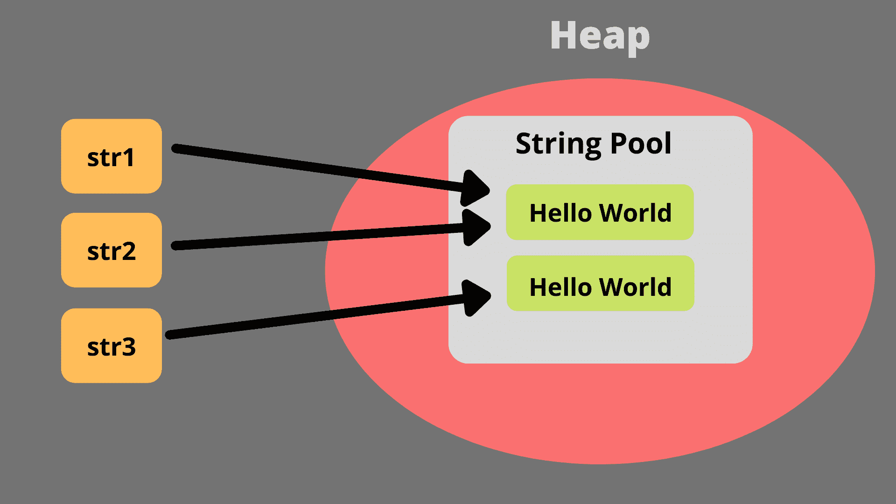

# 为什么 Java 中的字符串是不可变的？

> 原文：<https://www.studytonight.com/java-examples/why-are-strings-in-java-immutable>

一个[字符串](https://www.studytonight.com/java/string-handling-in-java.php)是一个字符序列或者一个字符数组。 [Java](https://www.studytonight.com/java/overview-of-java.php) 为我们提供了一个不可变的字符串类来处理字符串。不可变类的实例一旦创建，就不能修改。

这些对象的内部状态在整个程序执行过程中保持不变。我们无法更新对此对象或其属性的引用。

在本教程中，我们将学习为什么字符串类在 Java 中是不可变的，以及它的好处。

## 为什么字符串是不可变的？

Java 中字符串不可变的原因有几个。让我们来看看这些原因。

## 字符串池

字符串池是堆内存中的一个内存位置。字符串池存储所有字符串，并优化字符串使用的内存。它通过只为重复字符串存储一个副本来实现这一点。它工作得非常好，不会出现不一致，因为字符串是不可变的。

例如，如果我们运行以下代码，str1 和 str2 将指向字符串池中的同一个字符串对象。如果我们想为一个字符串指定一个单独的空格，我们可以使用新的关键字。

```java
public static void main(String args[])
{
	String str1 = "String";
	String str2 = "String";
	String str3 = new String("String");
}
```



## 安全

字符串用于存储敏感信息，如用户名、密码、网址等。如果字符串不是不可变的，那么任何有权访问字符串引用的人都可以修改它。字符串的不变性确保了我们可以安全地使用敏感值，而不用担心有人修改它。

例如，假设我们有一个方法，该方法将字符串密码作为输入，并验证密码是否有效。现在，如果某个黑客可以访问该字符串，那么黑客可以在验证之前修改该字符串。这可能会导致我们的应用出现不一致和安全漏洞。

## 多线程

所有不可变对象都是线程安全的。多个线程可以同时访问字符串，因为多次读取操作不会导致任何同步问题。即使某个线程修改了该值，也会创建一个全新的字符串，而不会影响原始字符串。

## Hashcode 缓存

因为字符串是不可变的，所以它提高了使用哈希来存储对象的集合的整体性能。

例如，如果一个 HashMap 包含一个 String 键，它的 Hashcode 将总是相同的，因为它是不可变的。如果字符串是可变的，那么插入后该值可以改变。它将不再生成相同的 Hashcode，这将导致不一致。

## 摘要

我们不能在创建不可变对象后修改它们。Java 中的 String 类是最终的、不可变的。这使得字符串安全且线程安全。我们可以自由地将字符串传递给方法和线程，而不用担心它的值被改变。

不变性还提高了整体性能，因为它允许 JVM 使用字符串池并避免存储重复项。在本教程中，我们学习了与不可变字符串相关的好处。

* * *

* * *