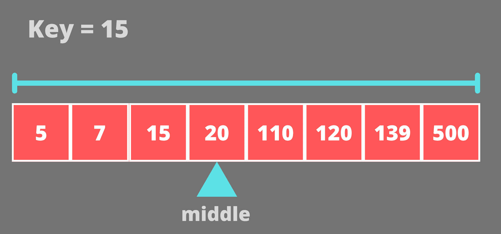
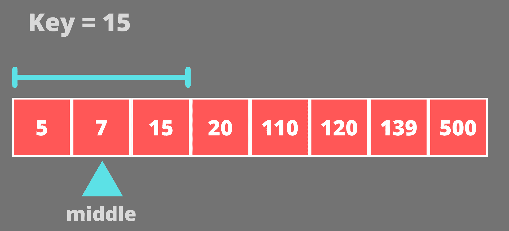
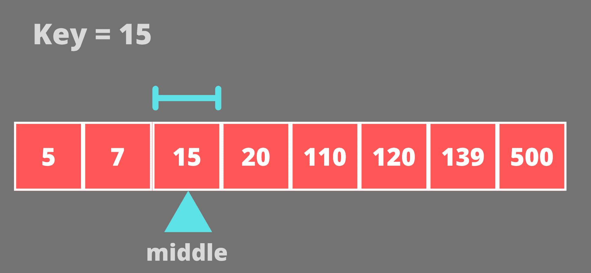

# Java 二分搜索法

> 原文：<https://www.studytonight.com/java-examples/java-binary-search>

二分搜索法是一种高效的搜索算法，用于在排序的数组中寻找一个值。它比线性搜索性能好得多。正常的线性搜索不会以任何方式利用排序的数组特征，但是**二分搜索法在每次迭代**中使用排序的数组来消除一半的数组。在本教程中，我们将学习二分搜索法算法，并用 Java 实现它。

## 二分搜索法算法

如上所述，二分搜索法算法在每次迭代中消除了一半的数组。它通过将关键字(我们试图搜索的值)与数组的中间元素进行比较来实现这一点。

*   **如果中间元素大于键，那么数组右半部分的所有元素也会大于键**，因为数组是按升序排序的。
*   类似地，**如果中间元素比关键点小，那么左半部分的所有元素也会更小**。
*   这样，在每次比较中，我们都将搜索范围缩小到数组的一半。

我们将使用三个索引指针来表示**最左边的索引**(数组的开始)、**最右边的索引**(数组的结束)和**中间的索引**。二分搜索法算法总结如下。

1.  将键与数组的中间元素进行比较。如果键与中间元素匹配，则返回中间元素的索引。
2.  否则，如果中间元素大于键，则键只能出现在左半部分。所以我们在数组的左半部分重新开始搜索。我们将右索引重置为(中间索引- 1)。
3.  否则我们在数组的右半部分重新开始搜索(因为中间的元素比键小)。我们将左索引重置为(中间索引+ 1)。
4.  如果数组中没有这个键，那么我们返回-1。

## 二分搜索法-试运行

让我们借助一个例子来理解二分搜索法是如何工作的。假设我们有排序后的数组**【5，7，15，20，110，120，139，500】**，我们试图在其中搜索元素 **15** 。

最初，我们将考虑整个数组，数组的中间元素是 20。



15 小于 20，所以我们将移到左半部分。现在，搜索将在数组**【5，7，15】**上进行。这个数组的中间元素是 7。



15 大于 7，所以我们将移动到数组的右半部分**【5，7，15】**。新阵是**【15】**。这个数组的中间元素是 15。



15 等于中间元素(15)，因此我们的搜索到此结束。

## 二分搜索法执行

上述算法既可以迭代实现，也可以递归实现。**我们可以在这里使用递归，因为实际上，我们在数组的不同部分运行相同的三个步骤**。我们将使用公式 **low +((高-低)/ 2)** 来计算中间索引，因为这将避免较大数组的溢出。

### Java 中的迭代二分搜索法实现

```java
import java.util.Arrays;
public class BinarySearch
{
	public static int binarySearchIterative(int[] sortedArray, int key)
	{
		int leftIdx = 0;
		int rightIdx = sortedArray.length - 1;
		while(leftIdx <= rightIdx)
		{
			int midIdx = leftIdx + (rightIdx - leftIdx) / 2;			
			if(sortedArray[midIdx] == key)
				return midIdx;
			else if(sortedArray[midIdx] > key)
			{
				rightIdx = midIdx - 1;//left half of the array(from leftIdx to midIdx - 1)
			}
			else
				leftIdx = midIdx + 1;//right half of the array(from midIdx + 1 to rightIdx)
		}		
		return -1;//if key is absent
	}	
	public static void main(String[] args)
	{
		int[] sortedArray = {5, 7, 15, 20, 110, 120, 139, 500};		
		int key1 = 139;
		int key2 = 2;		
		System.out.println("The sorted list is: " + Arrays.toString(sortedArray));
		System.out.println("The key " + key1 + " is present at index " + binarySearchIterative(sortedArray, key1));
		System.out.println("The key " + key2 + " is present at index " + binarySearchIterative(sortedArray, key2));
	}
}
```

排序列表为:【5，7，15，20，110，120，139，500】
键 139 出现在索引 6
键 2 出现在索引-1

### Java 中递归二分搜索法实现

对于递归方法，我们将把左极值索引和右极值索引传递给方法本身。对于初始调用，左索引将为 0，右索引将比数组长度小 1。

```java
import java.util.Arrays;
public class BinarySearch
{
	public static int binarySearchRecursive(int[] sortedArray, int key, int leftIdx, int rightIdx)
	{
		if(leftIdx <= rightIdx)
		{
			int midIdx = leftIdx + (rightIdx - leftIdx) / 2;			
			if(sortedArray[midIdx] == key)
				return midIdx;
			else if(sortedArray[midIdx] > key)
			{
				return binarySearchRecursive(sortedArray, key, leftIdx, midIdx - 1); //left half of the array(from leftIdx to midIdx - 1)
			}
			else
				return binarySearchRecursive(sortedArray, key, midIdx + 1, rightIdx);//right half of the array(from midIdx + 1 to rightIdx)
		}		
		else
			return -1;//if key is absent
	}	
	public static void main(String[] args)
	{
		int[] sortedArray = {5, 7, 15, 20, 110, 120, 139, 500};
		int leftIdx = 0;
		int rightIdx = sortedArray.length - 1;		
		int key1 = 139;
		int key2 = 2;		
		System.out.println("The sorted list is: " + Arrays.toString(sortedArray));
		System.out.println("The key " + key1 + " is present at index " + binarySearchRecursive(sortedArray, key1, leftIdx, rightIdx));
		System.out.println("The key " + key2 + " is present at index " + binarySearchRecursive(sortedArray, key2, leftIdx, rightIdx));
	}
}
```

排序列表为:【5，7，15，20，110，120，139，500】
键 139 出现在索引 6
键 2 出现在索引-1

## 为二分搜索法使用内置方法

### Java 中的数组. binarySearch()方法

Java 中的 Arrays 类为我们提供了一个 binarySearch()方法，**将排序后的数组和要搜索的键值作为参数，返回存在键值的索引**。如果密钥不在数组中，则**返回-1。**

```java
import java.util.Arrays;
public class BinarySearch
{
	public static void main(String[] args)
	{
		int[] sortedArray = {5, 7, 15, 20, 110, 120, 139, 500};
		int key1 = 139;
		int key2 = 2;		
		System.out.println("The sorted array is: " + Arrays.toString(sortedArray));
		System.out.println("The key " + key1 + " is present at index " + Arrays.binarySearch(sortedArray, key1));
		System.out.println("The key " + key2 + " is present at index " + Arrays.binarySearch(sortedArray, key2));
	}
}
```

排序后的数组为:【5，7，15，20，110，120，139，500】
键 139 出现在索引 6
键 2 出现在索引-1

### Java 中的 Collections.binarySearch()方法

Collections 类的 binarySearch()方法可用于像 ArrayLists 这样的集合来搜索元素。就像 Arrays.binarySearch()方法一样，它**将排序后的集合和一个键作为参数，并返回该键所在的索引**。如果钥匙不在列表中，则**返回-1。**

```java
import java.util.ArrayList;
import java.util.Collections;
public class BinarySearch
{
	public static void main(String[] args)
	{
		ArrayList<Integer> sortedList = new ArrayList<Integer>();
		sortedList.add(5);
		sortedList.add(7);
		sortedList.add(15);
		sortedList.add(20);
		sortedList.add(110);
		sortedList.add(120);
		sortedList.add(139);
		sortedList.add(500);		
		int key1 = 139;
		int key2 = 2;		
		System.out.println("The sorted list is: " + sortedList);
		System.out.println("The key " + key1 + " is present at index " + Collections.binarySearch(sortedList, key1));
		System.out.println("The key " + key2 + " is present at index " + Collections.binarySearch(sortedList, key2));
	}
}
```

排序列表为:【5，7，15，20，110，120，139，500】
键 139 出现在索引 6
键 2 出现在索引-1

## 常见问题

### 问:为什么叫二分搜索法？

二元意味着由两件事组成，在二分搜索法，我们只是在每次迭代中将搜索范围缩小到两半(左和右)。

### 问:为什么我们不能在未排序的数组上使用二分搜索法？

二分搜索法算法基于排序数组。对于未排序的数组，右半部分或左半部分的元素与中间元素之间没有关系。但是对于排序数组，我们知道如果中间元素大于一个数，那么右半部分的所有元素都将大于该元素。同样，如果中间元素小于一个数字，那么左半部分的所有元素也将小于该数字。

### 问:二叉查找树使用二分搜索法算法吗？

创建二叉查找树的方式是，左子树中的所有元素都小于根，右子树中的所有元素都大于根。这使得树被排序，我们可以使用二分搜索法算法来搜索树中的节点。

## 摘要

二分搜索法是在排序数组中搜索值的一种快速有效的方法。不同于线性搜索需要线性时间(O(n))，****二分搜索法需要对数时间(O(log(n))** 。 **n** **表示数组**中存在的元素总数。递归实现更容易理解，但是**递归可能会慢一点，因为递归栈**。**

 **请记住**二分搜索法只能在排序的数组**上使用，如果数组没有排序，那么我们应该或者使用像归并排序这样的排序算法来首先对数组进行排序，或者在这种情况下我们可以简单地使用线性搜索。使用额外的排序算法会增加时间复杂度，在这种情况下可以考虑线性搜索。

总体而言，**线性搜索对于较小尺寸的数组表现更好，而二分搜索法优选用于较大尺寸的数组**。

* * *

* * ***