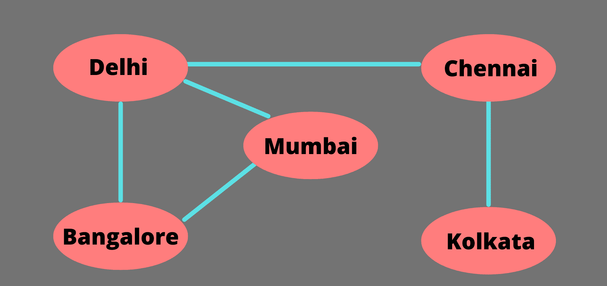
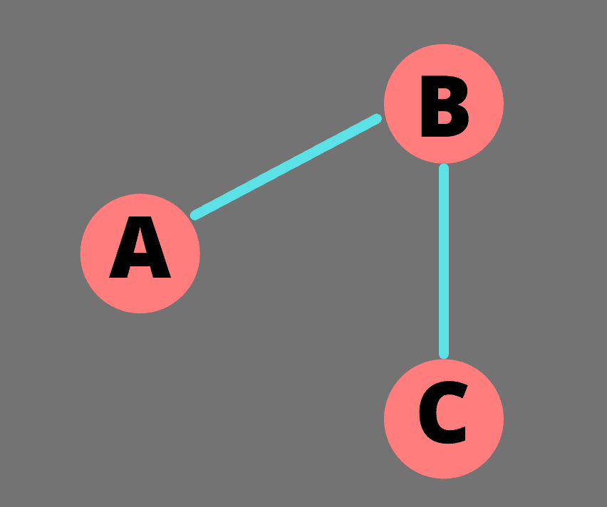
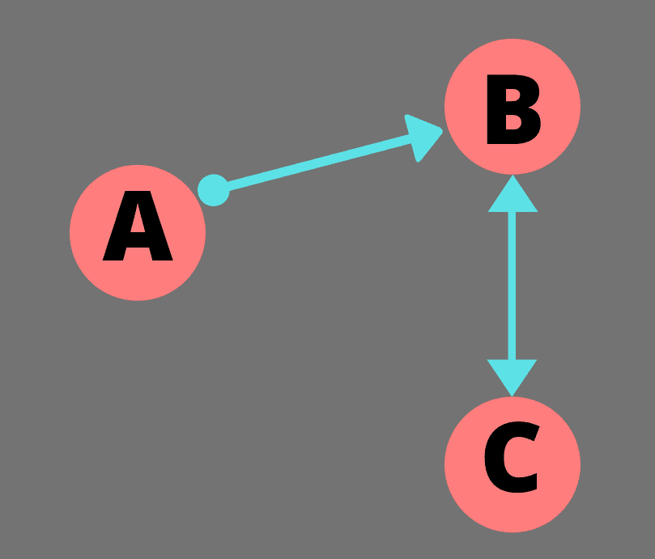
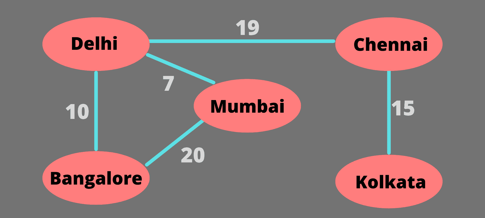
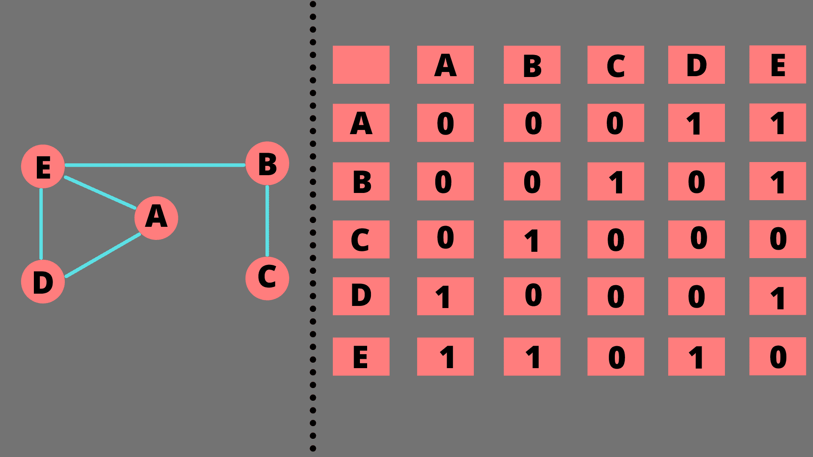
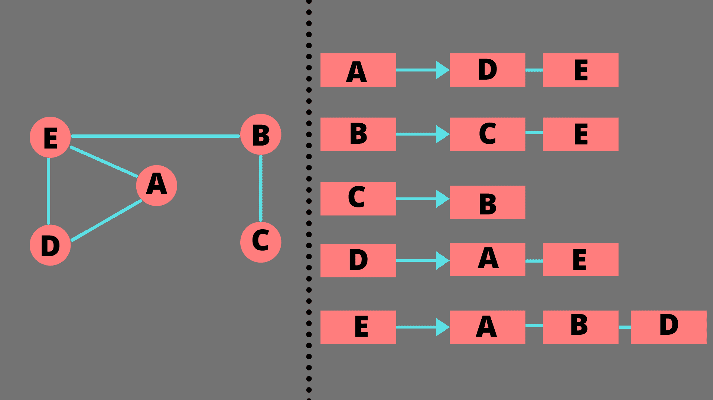
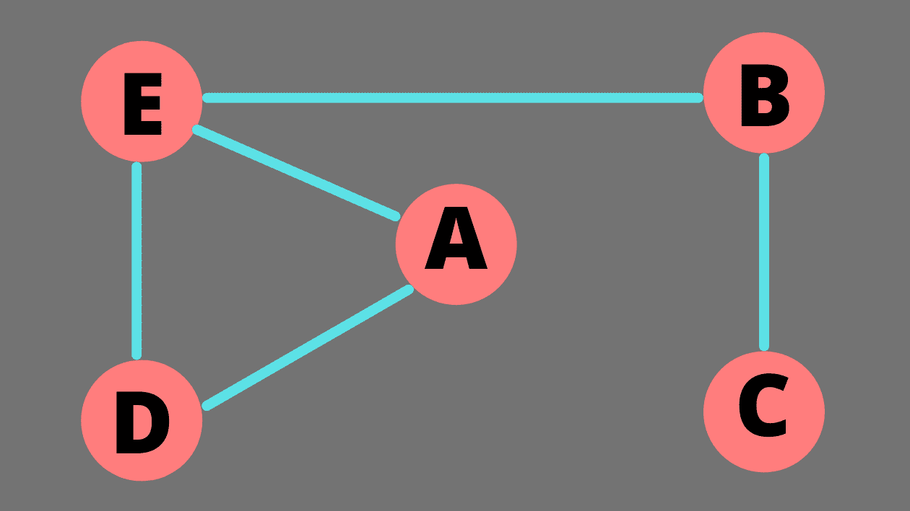

# Java 中的图

> 原文：<https://www.studytonight.com/java-examples/graphs-in-java>

图是一种数据结构，用于存储元素和元素之间的连接。图的元素称为顶点或节点，两个节点或顶点之间的连接由它们之间的边表示。

图有很多真实世界的用例。它们可以用来表示社交媒体网站上的人际网络，也可以用来表示各个城市之间的联系。

在本教程中，我们将学习图的基础知识，并在 Java 中实现一些常见的图操作。

## 图数据结构

如上所述，**图是由边**连接的节点网络。下图显示了一个图表，其中每个节点代表一个城市，两个节点之间的一条边表示它们之间有一条直接的路线。



图有各种类型，但在本教程中，我们将只关注一些最重要的图。

### 无向图

其中**边是双向的**的图，或者其中**边不表示方向的图**被称为无向图。上一节显示的城市图是无向图。在下图中，A 和 B 之间存在一条边，我们可以不受任何限制地从 A 自由移动到 B，或者从 B 自由移动到 A。



### 有向图

其中**边表示方向**的图称为有向图。例如，在下图中，A 和 B 之间的边缘有一个从 A 指向 B 的箭头。这意味着我们可以从 A 到 B，但不能从另一个方向(从 B 到 A)前进。B 和 C 之间的边有两个箭头，这意味着我们可以双向移动。



### 加权图

每条边都有权重或成本的图称为加权图。这个权重可以表示节点之间的任何相对度量。例如，在连通城市图的情况下，边的权重可以表示从一个节点到另一个节点的距离或时间。



## 表示图

一个图可以用两种方式来表示——使用邻接矩阵或者使用邻接列表。

### 邻接矩阵

图可以用二阶方阵(二维矩阵)的形式来表示。每行和每列表示节点，矩阵每个单元的值可以是 0 或 1。0 表示两个节点之间不存在边，1 表示存在边。对于加权图，我们可以使用边权重，而不是使用 1。如果图是无向图，矩阵将关于对角线对称。这些矩阵很容易创建，但是空间使用效率很低。



### 邻接表

邻接表仅仅是一组列表。数组的长度等于节点的数量。为阵列中的每个节点维护一个列表，该列表包含与我们的节点直接连接的节点。邻接表使用起来更复杂，但提供了更好的空间效率。



## 在 Java 中实现图

我们将创建两个类来实现 Java 中的图。一个是简单的顶点或节点类，只有一个名称属性。另一个将被称为图类，它将有一个邻接表来存储图。所有的方法都将被添加到 Graph 类中。

节点类如下所示。它将只包含一个字符串名称属性和一个参数化的构造器。对于更复杂的节点，我们可以向这个类中添加多个字段和方法。

```java
class Node
{
	String nodeName;
	Node(String name)
	{
		this.nodeName = name;
	}
}
```

Graph 类将使用邻接表来存储节点和节点之间的连接。我们将使用 HashMap 将每个节点映射到一个节点列表。节点列表将通过使用`ArrayList`来存储。在这个类中创建了一个构造器，它将节点列表作为参数，并初始化邻接表。最初，每个节点被映射到一个空的节点`ArrayList`。

```java
import java.util.ArrayList;
import java.util.HashMap;
import java.util.List;

class Graph
{
	HashMap<Node, ArrayList<Node>> adjList;

	Graph(List<Node> list)
	{
		this.adjList = new HashMap<Node, ArrayList<Node>>();
		for(Node n:list)
			adjList.put(n, new ArrayList<Node>());
	}
}
```

### 添加顶点和边

我们可以将想要包含在图中的所有顶点传递给图构造器。接下来，我们需要在这些顶点之间添加边。添加边就像将节点值添加到节点列表中一样简单。

例如，如果我们想在 node1 和 node2 之间创建一条边，那么 node1 的相邻节点列表应该包含 node2 的值，node2 的相邻节点列表应该包含 node1。请记住，我们正在实现一个无向图，因此我们需要向两个节点的列表中添加新条目。

```java
void addEdge(Node node1, Node node2)
{
	adjList.get(node1).add(node2);
	adjList.get(node2).add(node1);
}
```

### 移除边缘

去除边缘也很简单。我们只需要从正确的相邻列表中移除该节点。

例如，如果我们需要删除 node1 和 node2 之间的边，那么 node1 的值应该从 node2 的相邻节点列表中删除，node2 的值应该从 node1 的相邻列表中删除。

```java
import java.util.ArrayList;

void removeEdge(Node node1, Node node2)
{
	ArrayList<Node> node1List = adjList.get(node1);
	ArrayList<Node> node2List = adjList.get(node2);

	node1List.remove(node2);
	node2List.remove(node1);	
}
```

### 使用广度优先搜索遍历图

广度优先搜索将首先遍历起始节点的所有相邻节点，然后进入下一级。我们将使用队列来实现广度优先搜索算法。我们使用**队列**，因为任何新的节点都应该添加在最后，我们必须首先探索所有的邻居。

```java
import java.util.ArrayList;
import java.util.LinkedList;
import java.util.Queue;

ArrayList<String> breadthFirstSearch(Node start)
{
	ArrayList<Node> visited = new ArrayList<Node>();
	Queue<Node> q = new LinkedList<Node>();
	q.add(start);
	visited.add(start);		
	while(q.isEmpty() == false)
	{
		Node currNode = q.poll();
		for(Node n : adjList.get(currNode))
	        if(visited.contains(n) != true)
			{
				visited.add(n);
				q.add(n);
			}
	}		
	ArrayList<String> bfs = new ArrayList<String>();
	for(Node n : visited)
		bfs.add(n.nodeName);
	return bfs;
}
```

### 使用深度优先搜索遍历图

深度优先搜索在移动到另一个节点之前，尽可能深入地探索一个节点。因为每个新节点都应该首先被探索，所以我们使用一个**栈**数据结构。

```java
import java.util.ArrayList;
import java.util.Stack;

ArrayList<String> depthFirstSearch(Node start)
{
	ArrayList<Node> visited = new ArrayList<Node>();
	Stack<Node> stk = new Stack<Node>();
	stk.add(start);		
	while(stk.isEmpty() == false)
	{
		Node currNode = stk.pop();
		if(visited.contains(currNode) != true)
		{
			visited.add(currNode);
			for(Node n : adjList.get(currNode))
				stk.push(n);
		}
	}		
	ArrayList<String> dfs = new ArrayList<String>();
	for(Node n : visited)
		dfs.add(n.nodeName);		
	return dfs;		
}
```

### 示例:Java 中的图实现

Graph 类的完整代码如下所示。我们添加了一个新的 printAdjList()方法，它打印图的邻接表。

```java
import java.util.ArrayList;
import java.util.HashMap;
import java.util.LinkedList;
import java.util.List;
import java.util.Map;
import java.util.Queue;
import java.util.Stack;

class Graph
{
	HashMap<Node, ArrayList<Node>> adjList;	
	Graph(List<Node> list)
	{
		this.adjList = new HashMap<Node, ArrayList<Node>>();
		for(Node n:list)
			adjList.put(n, new ArrayList<Node>());
	}	
	void addEdge(Node node1, Node node2)
	{
		adjList.get(node1).add(node2);
		adjList.get(node2).add(node1);
	}	
	void removeEdge(Node node1, Node node2)
	{
		ArrayList<Node> node1List = adjList.get(node1);
		ArrayList<Node> node2List = adjList.get(node2);

		node1List.remove(node2);
		node2List.remove(node1);

	}	
	ArrayList<String> breadthFirstSearch(Node start)
	{
		ArrayList<Node> visited = new ArrayList<Node>();
		Queue<Node> q = new LinkedList<Node>();
		q.add(start);
		visited.add(start);		
		while(q.isEmpty() == false)
		{
			Node currNode = q.poll();
			for(Node n : adjList.get(currNode))
				if(visited.contains(n) != true)
				{
					visited.add(n);
					q.add(n);
				}
		}		
		ArrayList<String> bfs = new ArrayList<String>();
		for(Node n : visited)
			bfs.add(n.nodeName);
		return bfs;
	}	
	ArrayList<String> depthFirstSearch(Node start)
	{
		ArrayList<Node> visited = new ArrayList<Node>();
		Stack<Node> stk = new Stack<Node>();
		stk.add(start);

		while(stk.isEmpty() == false)
		{
			Node currNode = stk.pop();
			if(visited.contains(currNode) != true)
			{
				visited.add(currNode);
				for(Node n : adjList.get(currNode))
					stk.push(n);
			}
		}		
		ArrayList<String> dfs = new ArrayList<String>();
		for(Node n : visited)
			dfs.add(n.nodeName);

		return dfs;		
	}	
	void printAdjList()
	{
		for (Map.Entry mapElement : adjList.entrySet()) {
            Node n = (Node)mapElement.getKey();
            System.out.print(n.nodeName + "->");
            ArrayList<Node> list = adjList.get(n);
            for(Node a : list)
            	System.out.print(a.nodeName + " ");
            System.out.println();
	}
 }
}
```

让我们尝试一下我们在下图中学到的不同操作。



### 示例:创建图的邻接表

首先，让我们通过将节点列表传递给图构造器来创建这个图。然后我们可以使用 addEdge()方法来构建节点之间的边。让我们打印邻接表，看看图是否创建正确。

```java
public static void main(String[] args)
{
	//creating the nodes
	Node a = new Node("A");
	Node b = new Node("B");
	Node c = new Node("C");
	Node d = new Node("D");
	Node e = new Node("E");

	ArrayList<Node> list = new ArrayList<Node>();
	list.add(a);
	list.add(b);
	list.add(c);
	list.add(d);
	list.add(e);

	//Constructing the graphs
	Graph g = new Graph(list);
	g.addEdge(a, e);
	g.addEdge(a, d);
	g.addEdge(d, e);
	g.addEdge(b, e);
	g.addEdge(b, c);

	//print the adjacency list
	System.out.println("Adjacency List: ");
	g.printAdjList();

}
```

邻接表:
B->E C
D->A E
C->B
E->A D B
A->E D

### 示例:导线图

现在，让我们使用广度优先和深度优先遍历来遍历这个图。

```java
public static void main(String[] args)
{
	//creating the nodes
	Node a = new Node("A");
	Node b = new Node("B");
	Node c = new Node("C");
	Node d = new Node("D");
	Node e = new Node("E");

	ArrayList<Node> list = new ArrayList<Node>();
	list.add(a);
	list.add(b);
	list.add(c);
	list.add(d);
	list.add(e);

	//Constructing the graphs
	Graph g = new Graph(list);
	g.addEdge(a, e);
	g.addEdge(a, d);
	g.addEdge(d, e);
	g.addEdge(b, e);
	g.addEdge(b, c);

	//print BFS and DFS traversals
	System.out.print("Breadth First Traversal starting from A: ");
	System.out.println(g.breadthFirstSearch(a));
	System.out.print("Depth First Traversal starting from E: ");
	System.out.println(g.depthFirstSearch(e));
}
```

从 A 开始的广度优先遍历:[A，E，D，B，C]
从 E 开始的深度优先遍历:[E，B，C，D，A]

### 示例:删除图边

让我们删除图的几条边，然后查看邻接表。

```java
public static void main(String[] args)
{
	//creating the nodes
	Node a = new Node("A");
	Node b = new Node("B");
	Node c = new Node("C");
	Node d = new Node("D");
	Node e = new Node("E");

	ArrayList<Node> list = new ArrayList<Node>();
	list.add(a);
	list.add(b);
	list.add(c);
	list.add(d);
	list.add(e);

	//Constructing the graphs
	Graph g = new Graph(list);
	g.addEdge(a, e);
	g.addEdge(a, d);
	g.addEdge(d, e);
	g.addEdge(b, e);
	g.addEdge(b, c);

	//Deleting edges
	g.removeEdge(a, e);
	g.removeEdge(b, c);

	g.printAdjList();
}
```

B->E
D->A E
C->T3】E->D B
A->D

## 摘要

图是一种非常重要的数据结构，用于通过边存储节点和节点之间的关系。在本教程中，我们学习了图的基础知识以及图是如何存储和表示的。我们还学习了如何在 Java 中实现一个图，以及如何对它执行各种操作。

* * *

* * *