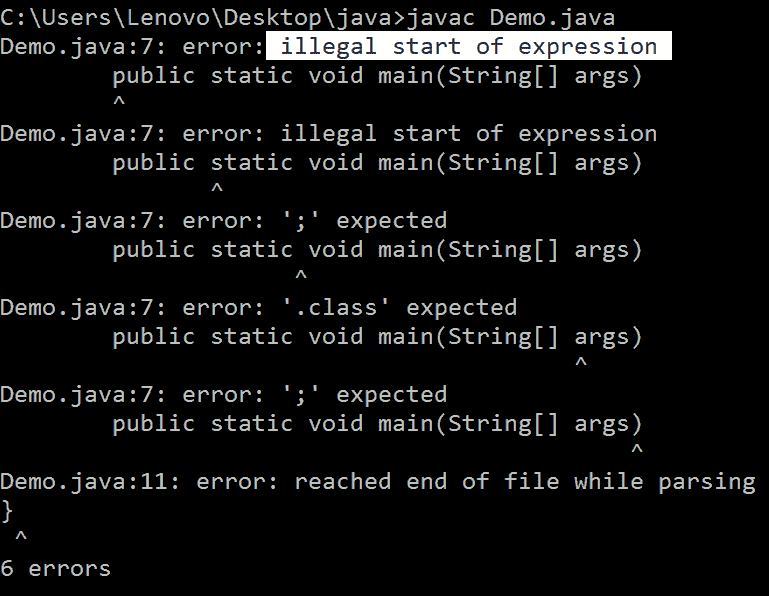
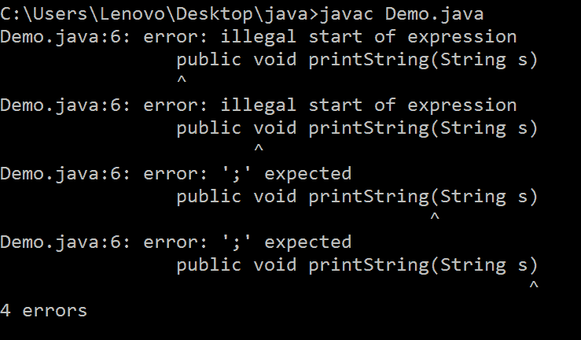
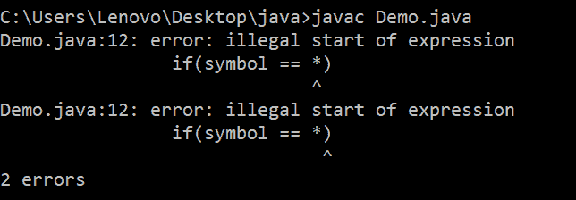

# Java 中表达式的非法开始

> 原文：<https://www.studytonight.com/java-examples/illegal-start-of-expression-in-java>

表达式的非法开始是使用 Java 时遇到的常见错误。这是一个动态错误，当我们使用 **javac** 命令时，会在编译时发生。如果我们知道错误的原因，我们可以很容易地解决它。

在本教程中，我们将学习这个错误背后的原因以及如何解决它。

## 缺少大括号

如果省略左大括号或右大括号，可能会出现表达式的非法开头错误。缺少大括号会违反 Java 编程的语法，代码无法编译。下面的代码显示了这个场景的一个简单示例。

```java
public class Demo
{
	public static void print()
	{
		System.out.print("A curly brace in missing!");
    }
	public static void main(String[] args)
	{
		print();
	}
}
```

当我们尝试使用 javac 编译上述代码时，我们将得到以下结果。



若要修复错误，请在正确的位置添加大括号。

## 方法内部的访问修饰符

任何方法或块内的变量都称为**局部变量**，它们的范围仅限于该块。我们不能对局部变量使用访问修饰符，如**私有**、**受保护**或**公共**。

如果违反了此规则，编译器将返回一个非法的表达式开始错误。下面的代码无法编译，因为我们在 print()方法中使用了受保护的访问修饰符。

```java
public class Demo
{
	public static void print()
	{
		protected String str = "protected access modifier";
	}
	public static void main(String[] args)
	{
		print();
	}
}
```

**输出:**


移除受保护的访问修饰符将修复上述代码。

## 嵌套方法

与 Python 等其他编程语言不同，Java 不支持嵌套方法或方法内部的方法。这将导致表达式错误的非法开始。下面的代码演示了这一点。

```java
public class Demo
{
	public void print()
	{
		String str = "Method Inside Method";
		public void printString(String s)
		{
			System.out.print(s);
		}
	}
}
```

**输出:**



## 方法内部的类

Java 允许我们在一个方法内部编写一个新的类，但是这个类对于这个方法来说是本地的。这些类被称为**方法-局部内部类**，它们的范围仅限于方法。但是请注意，这个内部类不应该以任何访问修饰符开始。方法不能包含任何访问修饰符。例如，在下面的代码中，print()方法内部有一个带有公共修饰符的内部类(ClassThatPrints)。这将导致表达式错误的非法开始。

```java
public class Demo
{
	public void print()
	{
		public class ClassThatPrints
		{
			public void printFromClass()
			{
				System.out.print("Hello, Java");
			}
		}
	}
}
```

**输出:**


## 不带引号的字符串或字符

字符串和字符类型必须用引号括起来。字符串或字符也可以包含特殊字符或运算符。因此，重要的是要将引号识别为字符串，而不是特殊字符。

如果我们忘记了引号，并且字符串不包含有效的变量名，那么就会出现非法的表达式开始错误。例如，在下面的代码中，我们没有用引号将星号(*)括起来。这将使编译器抛出非法的表达式开始错误。

```java
public class Demo
{
	public static void main(String[] args)
	{
		String symbol = "*";
		int num1 = 5, num2 = 10;
		int result;		
		if(symbol == "/")
			result = num2 / num1;		
		if(symbol == *)
			result = num2 * num1;
	}
}
```

**输出:**



## 摘要

在本教程中，我们了解了表达式错误非法开始背后的原因。通常，解决这个错误非常容易。有时，这个错误还会在我们的代码中导致多个其他错误。因此，寻找错误的根本原因非常重要。编译器有时不会指出错误的根本原因，所以我们应该修复前面几行中的代码。大多数 IDEs 会在我们运行代码之前警告我们错误。但是理解它们背后的原因很重要。

* * *

* * *