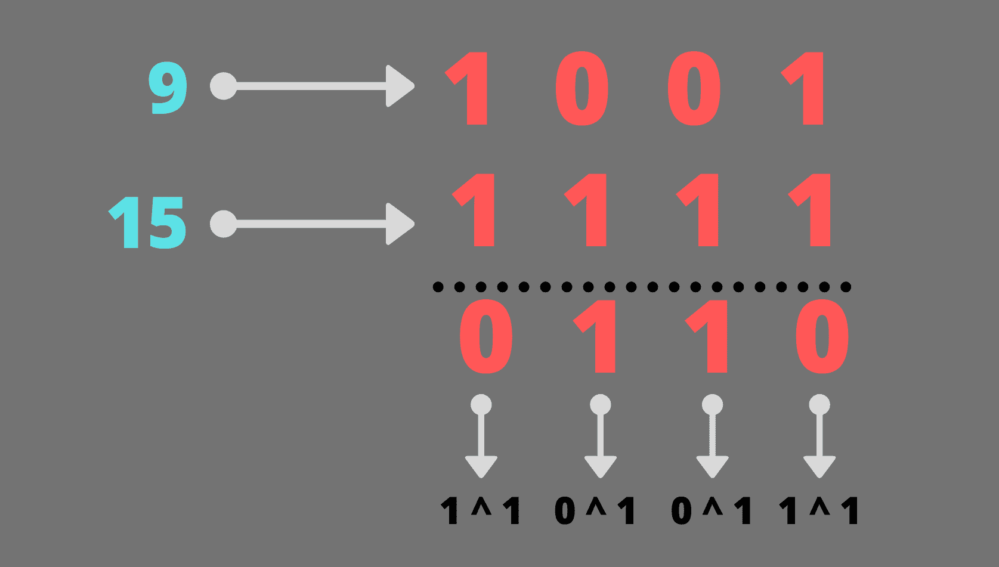

# Java 中的异或运算符

> 原文：<https://www.studytonight.com/java-examples/xor-operator-in-java>

异或是按位运算符，它通过比较操作数的各个位来工作。异或代表异或，当且仅当被比较的两位不同时，它才返回真。下面的真值表解释了异或运算的输出。记住，在二进制中，1 代表真，0 代表假。

| **A** | **B** | **A 异或 B** |
| Zero | Zero | Zero |
| Zero | one | one |
| one | Zero | one |
| one | one | Zero |

“异或”也可以用“与”、“或”和“非”等其他基本运算符来表示。异或 B 相当于 **(A 与(非 B))或(B 与(非 A))** 。我们可以用这种方式写异或，因为在任何时刻，要么 A 应该为真，B 应该为假，要么 A 应该为假，B 应该为真。

### 示例:Java 中的异或

在 Java 中，XOR 运算符由**插入符号 symbol(^)** 表示。它可以用于任何原始数据类型。让我们试着用这个运算符来验证异或的真值表。

```java
public static void main(String[] args)
{
	System.out.println("0 XOR 0: " + (0 ^ 0));
	System.out.println("0 XOR 1: " + (0 ^ 1));
	System.out.println("1 XOR 0: " + (1 ^ 0));
	System.out.print("1 XOR 1: " + (1 ^ 1));
}
```

0 异或 0: 0
0 异或 1: 1
1 异或 0: 1
1 异或 1: 0

### 示例:与布尔值异或

异或也可以作用于**布尔值**。让我们尝试使用布尔真和假来重新创建表。

```java
public static void main(String[] args)
{
	System.out.println("False XOR False: " + (false ^ false));
	System.out.println("False XOR True: " + (false ^ true));
	System.out.println("True XOR False: " + (true ^ false));
	System.out.print("True XOR True: " + (true ^ true));
}
```

假异或假:假
假异或真:真
真异或假:真
真异或真:假

### 示例:Java 中与整数值的异或运算

异或运算符可用于非 0 或 1 的整数。异或运算符将对整数的二进制等价物的各个位进行运算。**例如**，如果 9 与 15 异或，那么异或运算符将应用于两个数字的各个位(1001 代表 9，1111 代表 15)。



```java
public static void main(String[] args)
{
	System.out.println("9 XOR 15: " + (9 ^ 15));//1001 XOR 1111 = 0110
	System.out.println("1 XOR 20: " + (1 ^ 20));//00001 XOR 10100 = 10101
	System.out.println("7 XOR 7: " + (7 ^ 7));//0111 XOR 0111 = 0000
	System.out.print("32 XOR 0: " + (32 ^ 0));//100000 XOR 000000 = 100000
}
```

9 异或 15: 6
1 异或 20: 21
7 异或 7: 0
32 异或 0: 32

### 二进制字符串的异或

异或只适用于原始数据类型。但是，我们可以编写自己的方法，使用异或运算符和一些附加逻辑来查找两个二进制字符串的异或。我们将简单地同时循环两个字符串的每个字符，并对它们使用异或运算符。请记住，异或可以对字符数据类型起作用，如果两个字符相同，则**返回 0。**

```java
public class XOR
{
	public static String binaryStringXOR(String binStr1, String binStr2)
	{
		String xor = "";		
		//adding zeroes to make the two strings equal in length
		if(binStr1.length() > binStr2.length())
		{
			String temp = "";
			for(int i = 0; i < binStr1.length() - binStr2.length(); i++)
				temp += "0";
			binStr2 = temp + binStr2;
		}
		else if(binStr2.length() > binStr1.length())
		{
			String temp = "";
			for(int i = 0; i < binStr2.length() - binStr1.length(); i++)
				temp += "0";
			binStr1 = temp + binStr1;
		}		
		for(int i=0; i < binStr1.length(); i++)
		{
			xor += binStr1.charAt(i) ^ binStr2.charAt(i);
		}		
		return xor;
	}
	public static void main(String[] args)
	{
		System.out.println("1001 XOR 1111: " + binaryStringXOR("1001", "1111"));
		System.out.println("1 XOR 10100: " + binaryStringXOR("1", "10100"));
		System.out.println("0111 XOR 1: " + binaryStringXOR("0111", "1"));
		System.out.print("100000 XOR 0: " + binaryStringXOR("100000", "0"));
	}
}
```

1001 异或 1111: 0110
1 异或 10100: 10101
0111 异或 1: 0110
100000 异或 0: 100000

### 示例:在 Java 中使用 xor 查找非重复值

我们学习了异或运算符的基础知识。现在让我们用它来解决一个问题。假设我们有一个整数数组，我们知道除了一个特定的整数之外，每个整数恰好出现两次。我们的任务是找到这个不重复的整数。

我们可以简单地迭代数组，存储每个整数的频率，并返回只出现一次的整数。但是有一种更有效的方法来实现这一点，那就是使用异或运算符。请记住，数字与自身的异或运算返回 0，数字与 0 的异或运算返回数字本身。

**例如**，考虑输入数组【10，12，5，6，10，6，12】。我们可以看到，除了 5，所有元素都出现了两次。所有元素的异或可以写成 10 ^ 12 ^ 5 ^ 6 ^ 10 ^ 6 ^ 12。这可以重新安排，写成(10 ^ 10) ^ (12 ^ 12 ) ^ (6 ^ 6) ^ 5。这与写入 0 ^ 0 ^ 0 ^ 5 相同，这将返回 5。

```java
public class XOR
{
	public static int nonRepeatingInteger(int[] numArray)
	{
		int xor = numArray[0];
		for(int i = 1; i < numArray.length; i++)
			xor = xor ^ numArray[i];
		return xor;
	}
	public static void main(String[] args)
	{
		int[] arr = {10, 12, 5, 6, 10, 6, 12};
		int nonRepeatingNum = nonRepeatingInteger(arr);
		System.out.print("The non-repeating integer is:" + nonRepeatingNum);
	}
}
```

非重复整数为:5

### 摘要

在本教程中，我们学习了异或运算的基础知识。插入符号 symbol(^)在 Java 中用作 XOR 运算符，它可以处理所有原始数据类型。我们还实现了一个方法来寻找两个二进制字符串的异或。

* * *

* * *