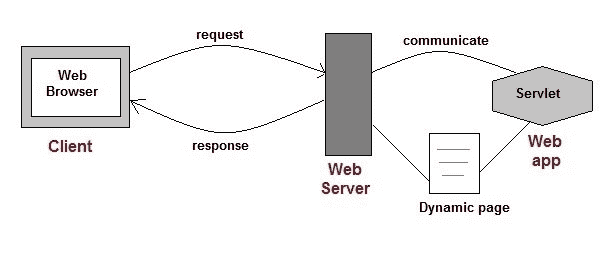
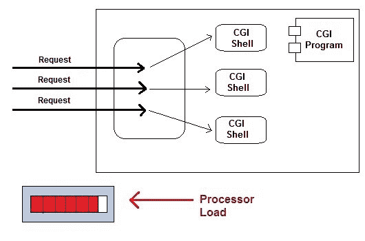
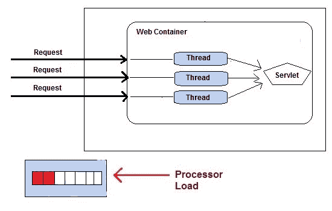

# Servlet 简介

> 原文：<https://www.studytonight.com/servlet/introduction-to-servlet.php>

**Servlet** 技术用于创建 web 应用程序。 **Servlet** 技术使用 Java 语言创建 web 应用程序。

Web 应用程序是驻留在 web 服务器上并构建动态网页的辅助应用程序。动态页面可以是随机选择显示图片的页面，甚至是显示当前时间的页面。

由于 Servlet 技术使用 Java，使用 Servlet 制作的网络应用程序是**安全的**、**可扩展的**和**健壮的**。

* * *

## 通用网关接口

在 Servlets 之前，CGI(通用网关接口)编程被用来创建网络应用程序。以下是 CGI 程序的工作原理:

*   用户单击一个链接，该链接包含指向动态页面而不是静态页面的 URL。
*   网址决定执行哪个 CGI 程序。
*   网络服务器在独立的操作系统外壳中运行 CGI 程序。外壳包括操作系统环境和执行 CGI 程序代码的过程。
*   CGI 响应被发送回网络服务器，网络服务器将响应打包成一个 HTTP 响应，并将其发送回网络浏览器。

* * *

### CGI 程序的缺点

*   高响应时间，因为 CGI 程序在自己的操作系统外壳中执行。
*   CGI 是不可扩展的。
*   CGI 程序并不总是安全的或者面向对象的。
*   它依赖于平台。

由于这些缺点，开发人员开始寻找更好的 CGI 解决方案。然后太阳微系统公司开发了 **Servlet** 作为超越传统 CGI 技术的解决方案。

* * *

## 使用 Servlets 的优势

*   响应时间更短，因为每个请求都在单独的线程中运行。
*   Servlets 是可伸缩的。
*   Servlets 是健壮的和面向对象的。
*   Servlets 与平台无关。

* * *

* * *