# Servlet API

> 原文：<https://www.studytonight.com/servlet/servlet-api.php>

Servlet API 由两个重要的包组成，它们封装了所有重要的类和接口，即:

*   **javax.servlet**
*   **javax.servlet.http**

* * *

### `javax.servlet`的一些重要类和接口

| 接口 | 班 |
| 小型应用 | ServletInputStream |
| ServletContext | 对象 |
| servletconfig | ServletRequestWrapper |
| [ServletRequest](servlet-request.php) | ServletResponseWrapper |
| [ServletResponse](servlet-response.php) | ServletRequestEvent |
| 监听器 | ServletContextEvent |
| [请求调度器](request-dispatcher.php) | servletrequestartributeevent |
| 接口 | ServletContextAttributeEvent |
| 过滤器 | servlet 异常 |
| 对象 | 不可用异常 |
| 过滤链 | 父类 |
| ServletRequestListener |  |

* * *

### `javax.servlet.http`的一些重要类和接口

| 类和接口 |
| HttpServlet | HttpServletRequest |
| httpservletresponse-http servlet 回应 | HttpSessionAttributeListener |
| 会话 | HttpSessionListener |
| 饼干 | HttpSessionEvent |

* * *

## Servlet 接口

* * *

在 Java 中，一个接口用于开发 servlet。这个接口被称为 servlet 接口。该接口由所有接口实现。servlet 接口用于 init()、service()和 destroy()方法的声明。服务器在 servlet 的生命周期中调用这些方法。servlet 调用 getServletConfig()方法来初始化参数。getServletInfo()方法用于提供重要信息。

Servlet 接口只提供了五种方法。这五种方法中，三种是 **Servlet 生命周期**方法，其余两种是**非生命周期**方法。

### 声明:

**公共接口 Servlet**

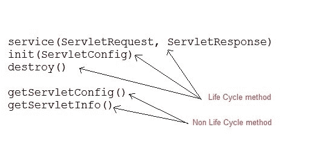

* * *

## Servlet 接口的方法

| 没有。 | 方法 | 描述 |
| 1. | 公共 void init(ServletConfigconfig) | 它用于初始化 servlet。在 servlet 生命周期中，web 容器只调用它一次。 |
| 2. | public void service(servletrequesteq，ServletResponse res) | 它用于对所有传入的请求提供响应。web 容器每次为每个请求调用它。 |
| 3. | 公开作废销毁() | 它用于销毁 servlet。它在 servlet 的生命周期中只被调用一次。 |
| 4. | public servlet configgetservletconfig() | 用于获取 ServletConfig 的对象。 |
| 5. | 公共字符串 getServletInfo() | 它用于获取关于 servlet 的作者、版权等信息。 |

* * *

### Eclipse 上的 Servlet 接口示例

为了创建 servlet 接口，下面是程序的目录结构:

以下是创建程序的步骤。

**第一步:通过点击文件= >新建= >动态网页项目**在 eclipse 上创建一个动态项目


#### **第二步:现在创建一个 HTML 文件。**

右键单击项目，然后单击 HTML 文件。给出文件名，然后点击完成按钮。

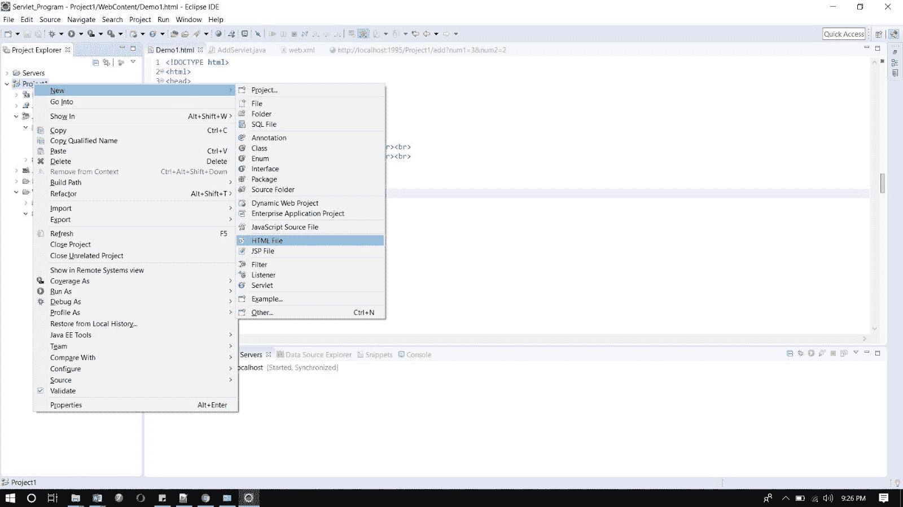

#### **并写出下面的代码。**

**Index.html**

```java
	 <!DOCTYPE html>	
<html>	
<head>	
<meta charset="ISO-8859-1">	
<title>studytonight => servlet interface example</title>	
</head>	
<body>	
<h1>studytonight.com</h1><br><br>	
************************************<br><br>	
<h3><a href="demo">Click here to proceed...</a></h3><br><br>	
************************************<br><br>	
</body>	
</html> 

```

#### **第三步:现在在 web.xml 文件中添加下面的代码。**

web.xml 文件是一个部署描述符。这里有所有的配置。

```java
	 <?xmlversion="1.0"encoding="UTF-8"?>
<web-appxmlns:xsi="http://www.w3.org/2001/XMLSchema-instance"xsi:schemaLocation="http://xmlns.jcp.org/xml/ns/javaee http://xmlns.jcp.org/xml/ns/javaee/web-app_4_0.xsd"id="WebApp_ID"version="4.0">
<servlet>
	<servlet-name>abc</servlet-name>
	<servlet-class>DemoServlet</servlet-class>
</servlet>
<servlet-mapping>
<servlet-name>abc</servlet-name>
<url-pattern>/demo</url-pattern>
</servlet-mapping>
</web-app> 

```

#### **步骤 4:现在接下来创建一个 servlet。为此创建一个类。给出包名和类名。**


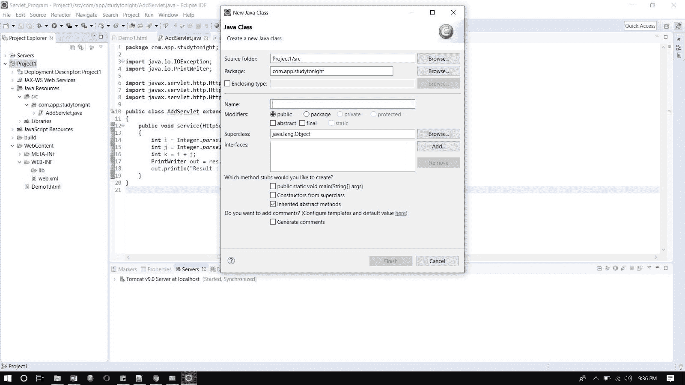

#### **现在在类文件中添加下面的代码。**

DemoServlet.java

```java
	 import java.io.*;	
import javax.servlet.*;	
public class DemoServlet implements Servlet{	
   ServletConfig config=null;	
   public void init(ServletConfig config){	
      this.config=config;	
   }	
   public void service(ServletRequest req,ServletResponse res)	
   throws IOException,ServletException{	
       res.setContentType("text/html");	
       PrintWriter pwriter=res.getWriter();	
       pwriter.print("<html>");	
       pwriter.print("<body>");	
       pwriter.print("<h1>Hello Welcome to studytonight. This example is of servlet interface. </h1>");	
       pwriter.print("</body>");	
       pwriter.print("</html>");	
   }	
   public void destroy(){	
       System.out.println("servlet destroy");	
   }	
   public ServletConfig getServletConfig(){	
       return config;	
   }	
   public String getServletInfo(){	
       return "studytonight.com";	
   }	
} 

```

#### **现在，运行代码。**

要运行代码，右键单击项目并选择运行方式= >在服务器上运行。

下面是 index.html 页面。点击链接登陆 servlet 页面。

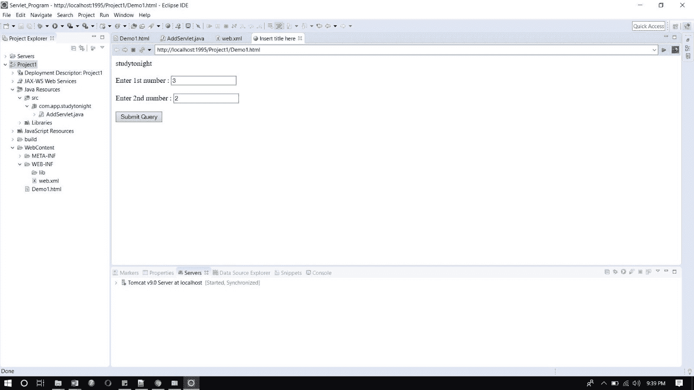

这是 servlet 页面。


* * *

## HttpServlet 类

* * *

HttpServlet 也是一个抽象类。这个类给出了 **Servlet** 接口的各种`service()`方法的实现。

为了创建一个 servlet，我们应该创建一个扩展 **HttpServlet** 抽象类的类。我们将要创建的 Servlet 类不能覆盖`service()`方法。我们的 servlet 类将只覆盖`doGet()`和/或`doPost()`方法。

**HttpServlet** 类的`service()`方法监听请求流中的 Http 方法(GET、POST 等)，并基于 Http 方法类型调用`doGet()`或`doPost()`方法。

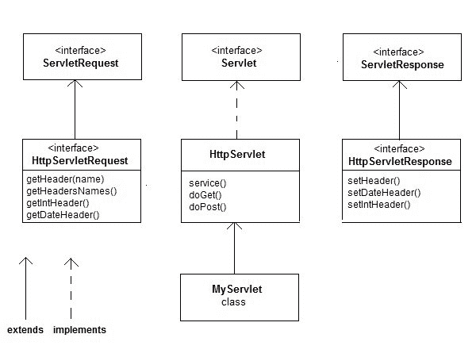

* * *

### HttpServlet 接口的方法

* * *

| 没有。 | 方法 | 描述 |
| one | 公共作废服务(ServletRequest，ServletResponse res) | 它通过创建请求和响应对象来保护服务方法。 |
| Two | 受保护的无效服务(HttpServletRequest 请求，HttpServletResponse res) | 它用于接收服务方法。 |
| three | protected void doet(http servletrequest req，HttpServletResponse res) | 它由 web 容器调用，用于处理 GET 请求。 |
| four | protected void dopost(http servletrequest req，HttpServletResponse res) | 它由 web 容器调用，并处理 POST 请求。 |
| five | protected void dohead(http servletrequest req，HttpServletResponse res) | 它由 web 容器调用，并处理 HEAD 请求。 |
| six | protected void doooptions(http servletrequest req，HttpServletResponse res) | 它由 web 容器调用，并处理 OPTIONS 请求。 |
| seven | protected void doput(http servletrequest req，HttpServletResponse res) | 它由 web 容器调用，并处理 OPTIONS 请求。 |
| eight | protected void dotrace(http servletrequest req，HttpServletResponse res) | 它由 web 容器调用，并处理 TRACE 请求 |
| nine | protected void doelete(http servletrequest req，HttpServletResponse res) | 它由 web 容器调用，并处理 DELETE 请求。 |
| Ten | 受保护长 getlastpmodified(HttpServletrequest 请求) | 它用于获取上次修改 HttpServletRequest 的时间。 |

### Eclipse 上的 HttpServlet 类示例

为了创建一个 HttpServlet 类，下面是程序的目录结构:

以下是创建程序的步骤。

**第一步:通过点击文件= >新建= >动态网页项目**在 eclipse 上创建一个动态项目

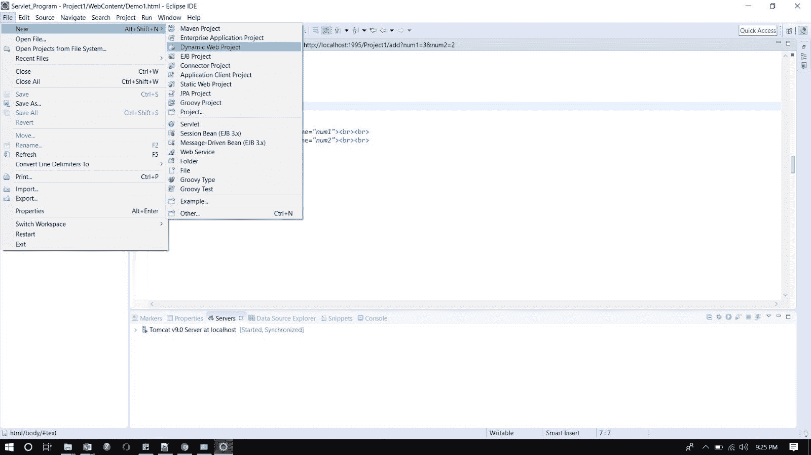

**第二步:现在创建一个 HTML 文件。**

右键单击项目，然后单击 HTML 文件。给出文件名，然后点击完成按钮。


#### 并写出下面的代码。

**Demo.html**

```java
	 <!DOCTYPE html>	
<html>	
<head>	
<meta charset="ISO-8859-1">	
<title>Insert title here</title>	
</head>	
<body>	
<form action="mar" align="center">	
<h3 align="center">studytonight.com</h3>	
<h3 align="center">--------------------------------------------------------</h3>	
Enter marks of the following subjects<br><br><br>	
Maths : <input type="text" name="num1"><br><br>	
English : <input type="text" name="num2"><br><br>	
Hindi : <input type="text" name="num3"><br><br>	
Science : <input type="text" name="num4"><br><br>	
Social Science : <input type="text" name="num5"><br><br>	
IT : <input type="text" name="num6"><br><br>	
<input type="submit">	
</form>	
</body>	
</html> 

```

**第三步:现在在 web.xml 文件中添加下面的代码。**

**web.xml 文件是一个部署描述符。这里有所有的配置。**

```java
	 <?xml version="1.0" encoding="UTF-8"?>
<web-app xmlns:xsi="http://www.w3.org/2001/XMLSchema-instance"  xsi:schemaLocation="http://xmlns.jcp.org/xml/ns/javaee http://xmlns.jcp.org/xml/ns/javaee/web-app_4_0.xsd" id="WebApp_ID" version="4.0">
 < <servlet>
  	<servlet-name>abc2</servlet-name>
  	<servlet-class>marks</servlet-class>
  </servlet>
  <servlet-mapping>
  <servlet-name>abc2</servlet-name>
  <url-pattern>/mar</url-pattern>
  </servlet-mapping> 
</web-app> 

```

* * *

#### **步骤 4:现在接下来创建一个 servlet。为此创建一个类。给出包名和类名。**


**在类文件中添加下面的代码。**

**marks.java**

```java
	 import java.io.IOException;
import java.io.PrintWriter;

import javax.servlet.ServletException;
import javax.servlet.ServletRequest;
import javax.servlet.ServletResponse;
import javax.servlet.http.HttpServlet;

public class marks extends HttpServlet{
	public void service(ServletRequest req, ServletResponse res) throws IOException, ServletException
	{
		int i = Integer.parseInt(req.getParameter("num1"));
		int j = Integer.parseInt(req.getParameter("num2"));
		int k = Integer.parseInt(req.getParameter("num3"));
		int l = Integer.parseInt(req.getParameter("num4"));
		int m = Integer.parseInt(req.getParameter("num5"));
		int n = Integer.parseInt(req.getParameter("num6"));
		int total = i + j + k + l + m + n;
		float avg = total / 6;

		PrintWriter out = res.getWriter();
		out.println("Maths : " + i );	
		out.println("English : " + j );	
		out.println("Hindi : " + k);	
		out.println("Science : " + l);	
		out.println("Social Science : " + m);	
		out.println("IT : " + n);	
		out.println("Total Marks : "+ total);	
		out.println("Average: "+avg);
	}

} 

```

#### **现在，运行代码。**

要运行代码，右键单击项目并选择运行方式= >在服务器上运行。

下面是 index.html 页面。点击链接登陆 servlet 页面。

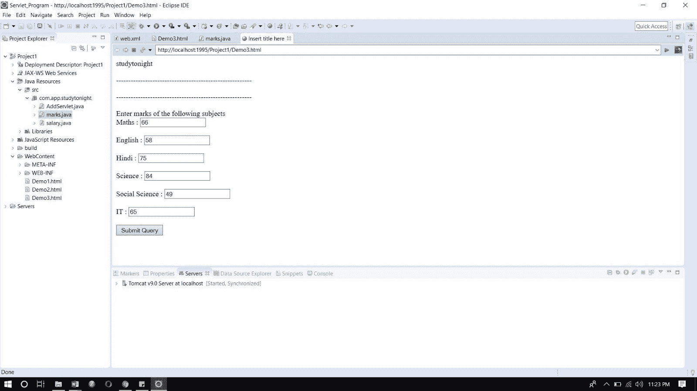

这是 servlet 页面。

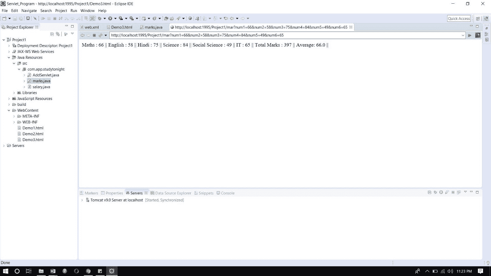

## GenericServlet 类

* * *

在 Servlet 中，GenericServlet 是一个抽象类。这个类实现了 servlet、ServletConfig 和 Serializable 接口。这个类提供了大多数基本 servlet 方法的实现。这个类的协议是独立的，因为它可以处理任何类型的请求。

#### **级:**


### 泛型 Servlet 接口的方法

* * *

#### **实现的接口:**

java.io.Serializable、Servlet、ServletConfig

#### **施工方:**

GenericServlet():此构造器不执行任何操作。一切都由 init 方法初始化。

| 没有 | 方法 | 说明 |
| one | 公共 void init(ServletConfig 配置) | 它用于 servlet 的初始化。 |
| Two | 公共抽象 void 服务(ServletRequest 请求，ServletResponse 响应) | 它用于为传入的请求提供所有服务。当用户请求时，只有它调用。 |
| three | 公开作废销毁() | 它用于销毁 servlet。它在 servlet 的生命周期中只被调用一次。 |
| four | public servlet config getservletconfig() | 用于获取 ServletConfig 的对象 |
| five | 公共字符串 getServletInfo() | 它用于获取关于 servlet 的作者、版权等信息。 |
| six | 公共 void init() | 对于程序员来说，这是一个非常简单方便的方法。 |
| seven | public servlet context getservletcontext() | 它用于获取 servlet 的对象 |
| eight | 公共字符串 getInitParameter(字符串名称) | 它用于从给定的参数名称中获取所有参数值。 |
| nine | 公共枚举 getInitParameterNames() | 它用于获取在 web.xml 文件中定义的参数 |
| Ten | public String getServletName() | 它用于获取 servlet 对象的名称。 |
| Eleven | 公共作废日志(字符串消息) | 它用于在 servlet 日志文件中写入消息。 |
| Twelve | 公共无效日志(字符串消息，可抛出测试) | 它用于在 servlet 日志文件和栈跟踪中写入消息。 |

* * *

### Eclipse 上的泛型 Servlet 接口示例

为了创建 GenericServlet 类，下面是程序的目录结构:

以下是创建程序的步骤

**第一步:通过点击文件= >新建= >动态网页项目**在 eclipse 上创建一个动态项目

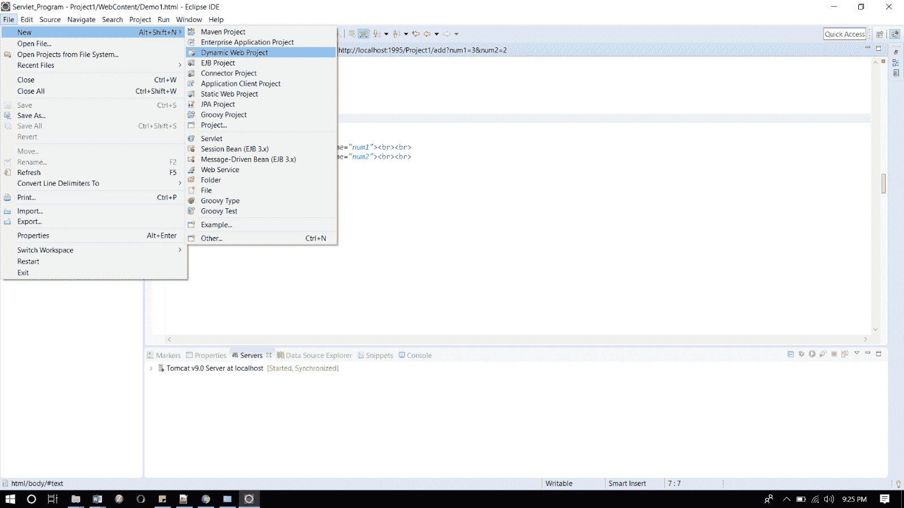

* * *

**第二步:现在创建一个 HTML 文件。**


* * *

**并写出下面的代码。**

演示 2.html

```java
	 <!DOCTYPE html>	
<html>	
<head>	
<meta charset="ISO-8859-1">	
<title>Studytonight.com</title>	
</head>	
<body>	
<form action="sal" align="center">	
<h3 align="center">studytonight.com</h3>	
<h3 align="center">--------------------------------------------------------</h3><br><br>	
Enter Basic Salary  <input type="text" name="num1"><br><br>	
Enter Basic DA   <input type="text" name="num2"><br><br>	
Enter Basic HRA   <input type="text" name="num3"><br><br>	
<input type="submit">	
</form>	
</body>	
</html> 

```

* * *

#### **第三步:现在在 web.xml 文件中添加下面的代码。**

**web.xml 文件是一个部署描述符。这里有所有的配置。**

```java
	 <?xml version="1.0" encoding="UTF-8"?>	
<web-app xmlns:xsi="http://www.w3.org/2001/XMLSchema-instance"  xsi:schemaLocation="http://xmlns.jcp.org/xml/ns/javaee http://xmlns.jcp.org/xml/ns/javaee/web-app_4_0.xsd" id="WebApp_ID" version="4.0">	
  <display-name>Generic_Servlet</display-name>	
<servlet>	
  	<servlet-name>abc1</servlet-name>	
  	<servlet-class>salary</servlet-class>	
  </servlet>	
  <servlet-mapping>	
  <servlet-name>abc1</servlet-name>	
  <url-pattern>/sal</url-pattern>	
  </servlet-mapping>	
</web-app> 

```

#### **步骤 4:现在接下来创建一个 servlet。为此创建一个类。给出包名和类名。**

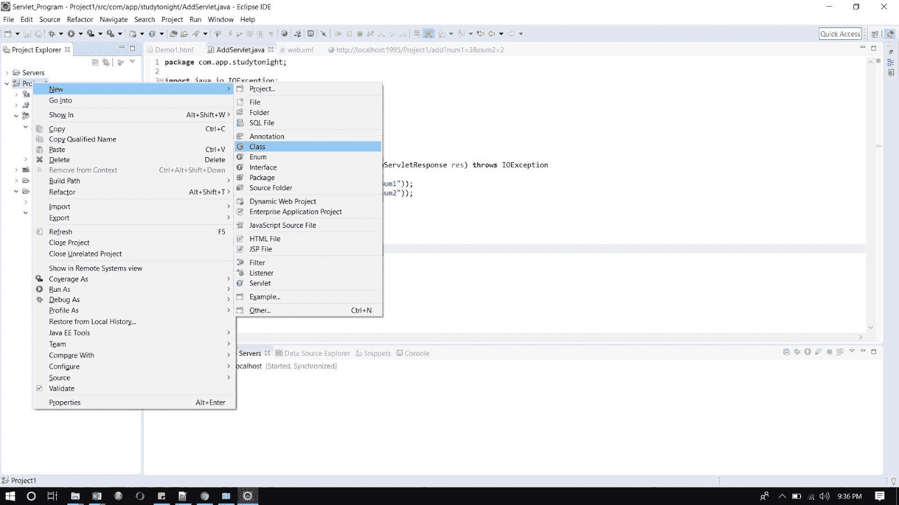


#### **在类文件中添加下面的代码。**

**salary.java**

```java
	 import java.io.IOException;
import java.io.PrintWriter;

import javax.servlet.GenericServlet;
import javax.servlet.ServletException;
import javax.servlet.ServletRequest;
import javax.servlet.ServletResponse;

public class salary extends GenericServlet
{
	/**
	 * 
	 */
	private static final long serialVersionUID = 1L;

	public void service(ServletRequest req, ServletResponse res) throws IOException, ServletException
	{
		int i = Integer.parseInt(req.getParameter("num1"));
		int j = Integer.parseInt(req.getParameter("num2"));
		int k = Integer.parseInt(req.getParameter("num3"));
		int da = (j * i) / 100;
		int hra = (k * i) / 100;
		int g = i + da + hra;
		PrintWriter out = res.getWriter();
		out.println("studytonight.com");	
		out.println("DA : "+da);	
		out.println("HRA : "+hra);	
		out.println("Gross Salary : "+g);
	}
} 

```

#### **现在，运行代码。**

要运行代码，右键单击项目并选择运行方式= >在服务器上运行。

下面是 demo2.html 页面。点击链接登陆 servlet 页面。

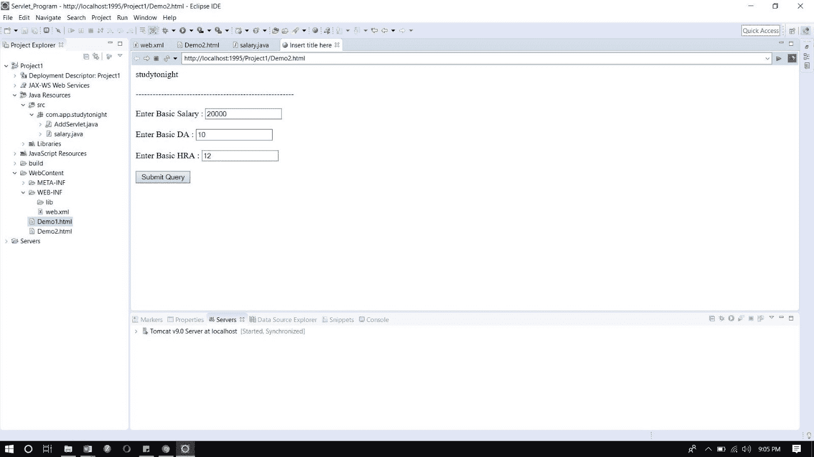

这是 servlet 页面。

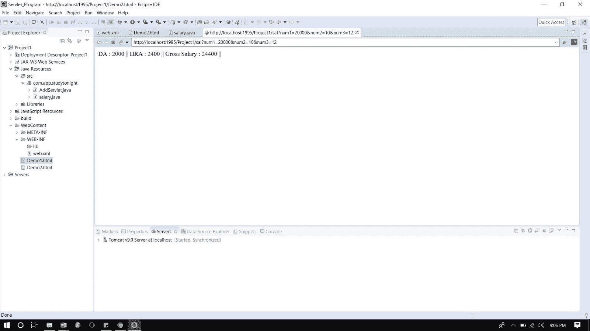

* * *

* * *