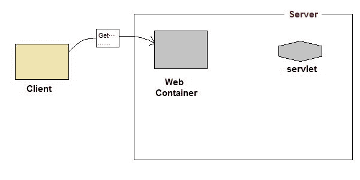
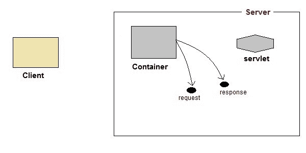
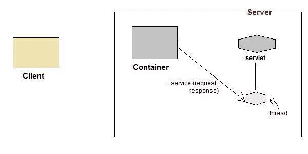
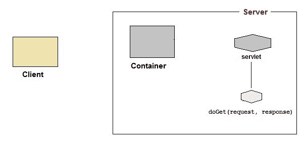
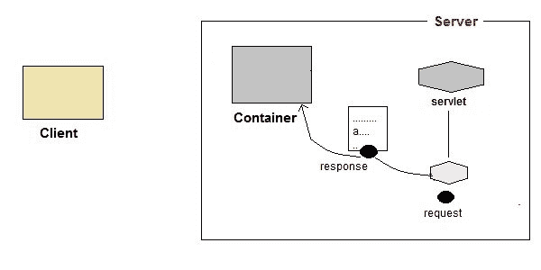
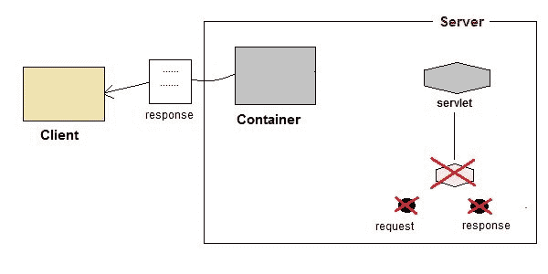

# Servlet 应用是如何工作的

> 原文：<https://www.studytonight.com/servlet/how-a-servlet-application-work.php>

**Web 容器**负责管理 Java EE 应用的 servlets 和 [JSP 页面](/jsp/introduction-to-jsp.php)的执行。

当一个请求进入一个 servlet 时，服务器将请求传递给网络容器。 **Web 容器**负责实例化 servlet 或者创建一个新的线程来处理请求。Web 容器的工作是获取对 servlet 的请求和响应。容器创建多个线程来处理对单个 servlet 的多个请求。

**servlet 没有 main()方法**。Web 容器管理一个 Servlet 实例的生命周期。

* * *

## 关于 Servlet 如何工作的快速修订

1.  User sends request for a servlet by clicking a link that has URL to a servlet.

    

2.  The container finds the servlet using **deployment descriptor** and creates two objects :
    1.  **[【http servletrequest】](servlet-request.php)**
    2.  **[【http servletresponse】](servlet-response.php)**

    

3.  Then the container creates or allocates a thread for that request and calls the Servlet's `service()` method and passes the **request, response** objects as arguments.

    

4.  The `service()` method, then decides which servlet method, `doGet()` or `doPost()` to call, based on **HTTP Request Method**(Get, Post etc) sent by the client. Suppose the client sent an HTTP GET request, so the `service()` will call Servlet's `doGet()` method.

    

5.  Then the Servlet uses response object to write the response back to the client.

    

6.  After the `service()` method is completed the **thread** dies. And the request and response objects are ready for **garbage collection**.

    

* * *

* * *