# 使用 Eclipse 集成开发环境创建第一个 Servlet 应用程序

> 原文：<https://www.studytonight.com/servlet/creating-servlet-in-eclipse.php>

**Eclipse** IDE 是业界最流行的 Java IDE。它是由一个开源社区开发的，可以从[](http://www.eclipse.org/)免费下载

* * *

## 使用 Eclipse IDE 创建 Servlet 的步骤

要在 Eclipse IDE 中创建一个 Servlet 应用程序，您需要遵循以下步骤:

1.  Goto **File** -> **New** -> **Dynamic Web Project**

    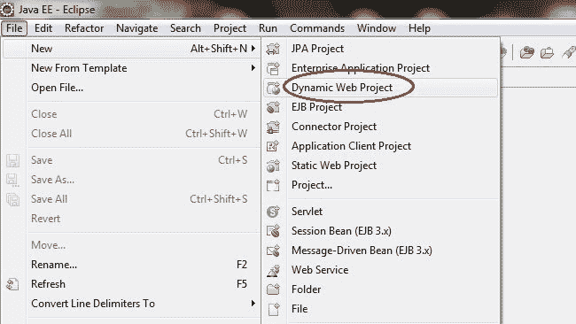

* * *

3.  Give a Name to your Project and click **Next**

    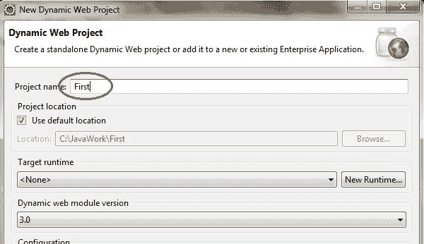

    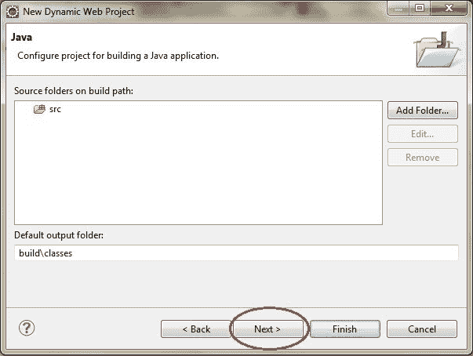

* * *

5.  Check **Generate web.xml Deployment Descriptor** and click **Finish**

    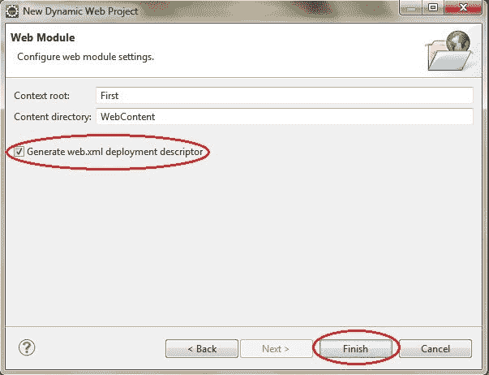

* * *

7.  Now, the complete directory structure of your Project will be automatically created by Eclipse IDE.

    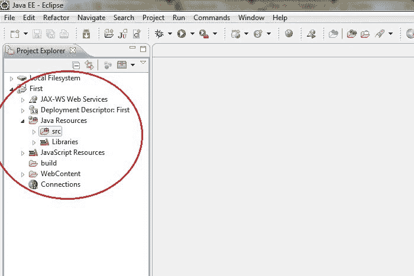

* * *

9.  Click on **First** project, go to **Java Resources** -> **src**. Right click on **src** select **New** -> **Servlet**

    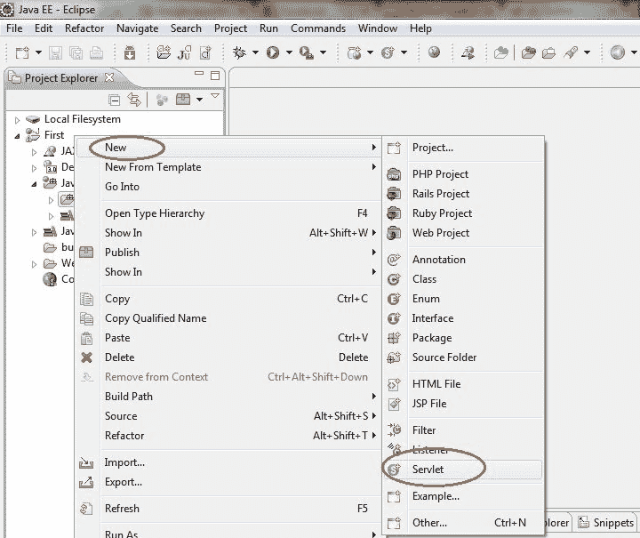

* * *

11.  Give Servlet class name and click **Next**

    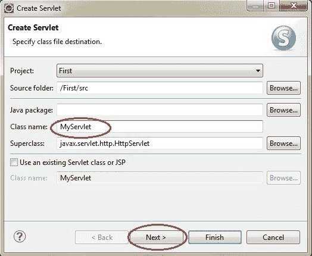

* * *

13.  Give your Servlet class a Nmae of your choice.

    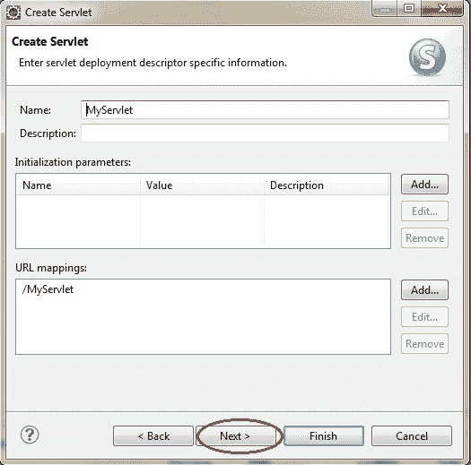

* * *

15.  Leave everything else to default and click **Finish**

    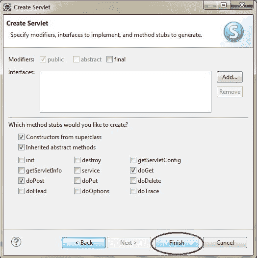

* * *

17.  Now your Servlet is created, write some code inside it. You can take reference from the code in the picture below.

    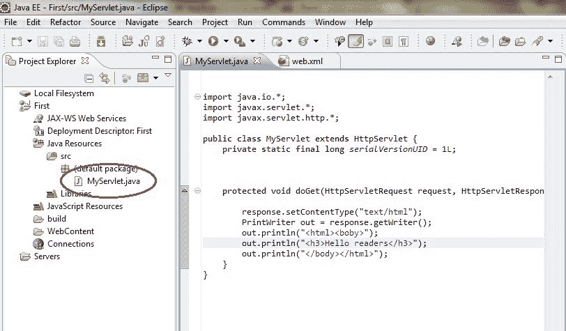

* * *

19.  Add **servlet-api.jar** JAR file to your project. Click on **Libraries**, right click on **Web App Libraries** select **Build Path** -> **Configure Build Path**

    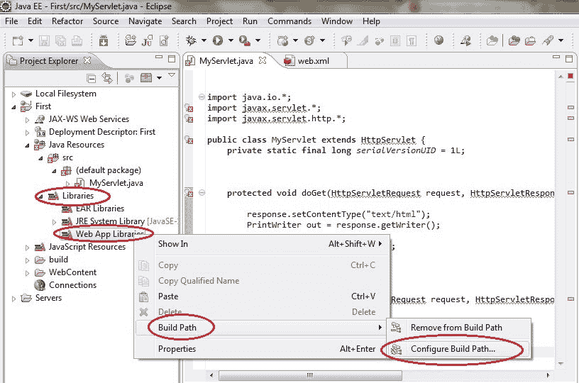

* * *

21.  Click on **Add External JARs**

    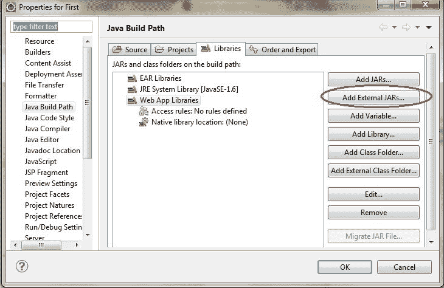

* * *

23.  这个 JAR 现在被添加到项目的构建路径中。
24.  Select **servlet-api.jar** from **Apache Tomcat Directory**

    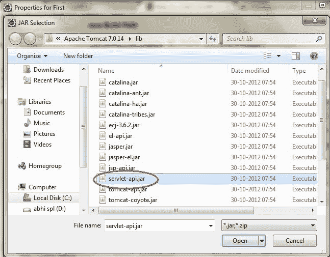

    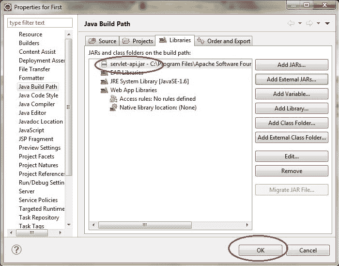

* * *

26.  Now all you have to do is Start the server and run the application.

    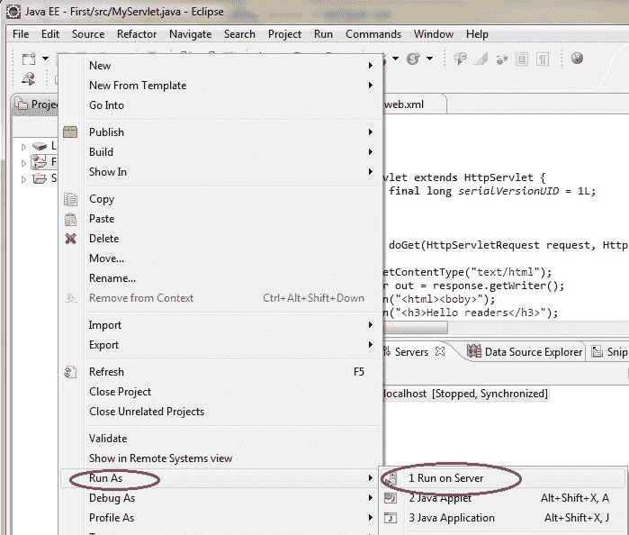

### Eclipse 上的 Servlet 响应示例

步骤 1:在 eclipse 上创建一个动态项目。


第二步:现在创建一个 HTML 文件。


**并写出下面的代码。**

```java
	 <!DOCTYPE html>
<html>
<head>
<meta charset="ISO-8859-1">
<title>Insert title here</title>
</head>
<body>
<form action="display" method="get">
Enter User name: <input type="text" name="val1">
Enter Password: <input type="text" name="val2">
<input type="submit" value="login">
</form>
</body>
</html> 

```

步骤 3:现在在 web.xml 文件中添加下面的代码。

**web.xml 文件是一个部署描述符。这里有所有的配置。**

```java
	 <?xml version="1.0" encoding="UTF-8"?>
<web-app xmlns:xsi="http://www.w3.org/2001/XMLSchema-instance"  xsi:schemaLocation="http://xmlns.jcp.org/xml/ns/javaee http://xmlns.jcp.org/xml/ns/javaee/web-app_4_0.xsd" id="WebApp_ID" version="4.0">
 <servlet>
  	<servlet-name>abc3</servlet-name>
  	<servlet-class>com.app.studytonight.demo4</servlet-class>
  </servlet>
  <servlet-mapping>
  <servlet-name>abc3</servlet-name>
  <url-pattern>/display</url-pattern>
  </servlet-mapping>
</web-app> 

```

步骤 4:现在接下来创建一个 servlet。为此创建一个类。给出包名和类名。


在类文件中添加下面的代码。

**演示 4.java**

```java
	 package com.app.studytonight;

import javax.servlet.http.*;
import javax.servlet.*;
import java.io.*;
public class demo4 extends HttpServlet{
   public void doGet(HttpServletRequest req,HttpServletResponse res)
   throws ServletException,IOException
   {
     res.setContentType("text/html");
     PrintWriter pwriter=res.getWriter();
     String uname=req.getParameter("val1");
     String pw=req.getParameter("val2");
     pwriter.println("User Details Page:");
     pwriter.println("Hello "+uname);
     pwriter.println("Your Password is **"+pw+"**");
     pwriter.close();
  }
} 

```

**现在，运行代码。**


* * *

* * *