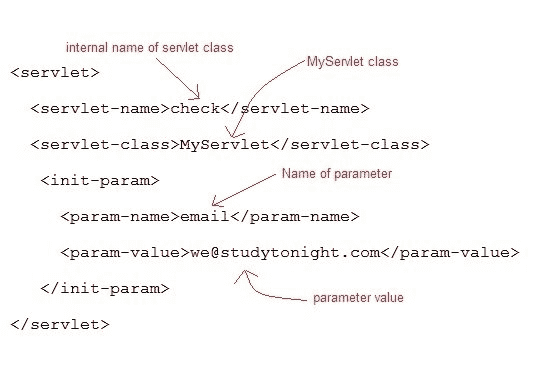

# `ServletConfig`接口介绍

> 原文：<https://www.studytonight.com/servlet/servlet-config.php>

当 **Web 容器**初始化一个 servlet 时，它会为该 servlet 创建一个 **ServletConfig** 对象。ServletConfig 对象用于在初始化期间通过从 **web.xml** (部署描述符)获取配置信息，将信息传递给 servlet。

* * *

## ServletConfig 的方法

*   字符串`getInitParameter(String name):`返回一个字符串值初始化参数，如果该参数不存在，则返回空值。
*   枚举`getInitParameterNames():`返回 servlet 初始化参数的名称，作为字符串对象的枚举，如果 servlet 没有初始化参数，则返回空枚举。
*   ServletContext `getServletContext():`返回对 ServletContext 的引用
*   字符串`getServletName():`返回 servlet 实例的名称

* * *

### 如何在 web.xml 中初始化一个 Servlet

**在部署描述符(web.xml)文件中，**



**或者，在 Servlet 类内部，使用以下代码，**

```java
 ServletConfig **sc** = getServletConfig();
 out.println(sc.**getInitParameter**("email")); 
```

* * *

### 演示 ServletConfig 用法的示例

**web.xml**

```java
<web-app...>
   <servlet>
      <servlet-name>check</servlet-name>
      <servlet-class>MyServlet</servlet-class>
      <init-param>
            <param-name>email</param-name>
            <param-value>we@studytonight.com</param-value>
      </init-param>
    </servlet>
    <servlet-mapping>
        <servlet-name>check</servlet-name>
        <url-pattern>/check</url-pattern>
    </servlet-mapping>
    <welcome-file-list>
        <welcome-file>index.html</welcome-file>
     </welcome-file-list>   
</web-app> 
```

**MyServlet 类:**

```java
import java.io.*;
import javax.servlet.*;
import javax.servlet.http.*;

public class MyServlet extends HttpServlet {

  protected void doGet(HttpServletRequest request, HttpServletResponse response)
         throws ServletException, IOException {

        response.setContentType("text/html;charset=UTF-8");
        PrintWriter out = response.getWriter();
        ServletConfig sc = getServletConfig();
        out.println(sc.getInitParameter("email")); 
    }
} 
```

* * *

* * *