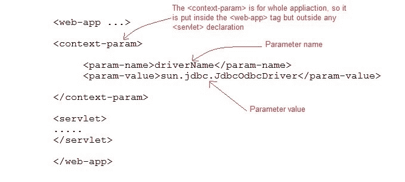

# 小服务程序中的服务上下文接口

> 原文：<https://www.studytonight.com/servlet/servlet-context.php>

对于每一个**网络应用****服务上下文**对象都是由网络容器创建的。ServletContext 对象用于从**部署描述符** (web.xml)中获取配置信息，该信息可用于作为 web 应用一部分的任何 servlet 或 JSP。

* * *

### 服务上下文的一些重要方法

| 方法 | 描述 |
| 对象`getAttribute(String name)` | 返回给定名称的容器属性，如果没有该名称的属性，则返回空值。 |
| 弦`getInitParameter(String name)` | 返回指定参数名称的参数值，如果参数不存在，则返回空值 |
| 枚举`getInitParameterNames()` | 以字符串对象枚举的形式返回上下文初始化参数的名称 |
| 作废`setAttribute(String name,Object obj)` | 在应用范围内设置具有给定属性名的对象 |
| 作废`removeAttribute(String name)` | 从应用上下文中移除具有指定名称的属性 |

* * *

### 如何在 web.xml 中初始化上下文参数



* * *

### 如何获取 ServletContext 的对象

```java
ServletContext app = getServletContext();
*OR*
ServletContext app = getServletConfig().getServletContext(); 
```

* * *

### ServletContext 的优势

*   提供 servlets 之间的通信
*   适用于作为 web 应用一部分的所有 servlets 和 JSP
*   用于从 web.xml 获取配置信息

* * *

### 上下文初始化参数和 Servlet 初始化参数的区别

| 上下文初始化参数 | Servlet 初始化参数 |
| 可用于作为 web 一部分的所有 servlets 和 JSP | 仅适用于为其配置了<init-param>的 servlet</init-param> |
| 上下文初始化参数在`<web-app>`内初始化，而不是在特定的`<servlet>`元素内初始化 | 在每个特定 servlet 的`<servlet>`中初始化。 |
| ServletContext 对象用于获取上下文初始化参数 | ServletConfig 对象用于获取 Servlet Init 参数 |
| 整个 web 应用只有一个 ServletContext 对象 | 每个 servlet 都有自己的 ServletConfig 对象 |

* * *

### 演示 ServletContext 用法的示例

**web.xml**

```java
<web-app ...>

  <context-param>
    <param-name>driverName</param-name>
    <param-value>sun.jdbc.JdbcOdbcDriver</param-value>
  </context-param>

  <servlet>
    <servlet-name>hello</servlet-name>
    <servlet-class>MyServlet</servlet-class>
  </servlet>

  <servlet-mapping>
    <servlet-name>hello</servlet-name>
    <url-pattern>/hello</url-pattern>
  </servlet-mapping> 

</web-app>
```

**MyServlet 类:**

```java
import java.io.*;
import javax.servlet.*;
import javax.servlet.http.*;

public class MyServlet extends HttpServlet {

  protected void doGet(HttpServletRequest request, HttpServletResponse response)
            throws ServletException, IOException {
        response.setContentType("text/html;charset=UTF-8");
        PrintWriter out = response.getWriter();
        ServletContext sc = getServletContext();
        out.println(sc.getInitParameter("driverName"));   
    }
} 
```

* * *

* * *