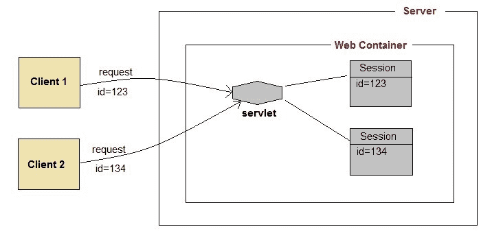

# 在 Servlets 中管理会话

> 原文：<https://www.studytonight.com/servlet/session-management.php>

我们都知道 **HTTP** 是无状态协议。所有请求和响应都是独立的。但是有时您需要跟踪客户在多个请求中的活动。例如，当一个用户登录到你的网站时，不管他登录后访问了哪个网页，他的凭证都会在服务器上，直到他注销。这是通过创建一个会话来管理的。

**会话管理**是**网络容器**用来存储特定用户的会话信息的机制。Servlet 应用程序使用四种不同的技术进行会话管理。它们如下:

1.  **饼干**
2.  **隐藏表单域**
3.  **网址改写**
4.  http session

会话用于存储从客户端发出的所有请求中我们可以从客户端获得的所有内容。

* * *

## 会话如何工作

session 背后的基本概念是，每当用户开始使用我们的应用程序时，我们可以在整个应用程序中可用的对象中保存关于他的唯一标识信息，直到它被销毁。因此，无论用户去哪里，我们都将始终拥有他的信息，并且我们始终可以管理哪个用户在做什么。每当用户想要退出您的应用程序时，用他的信息销毁该对象。

* * *

* * *