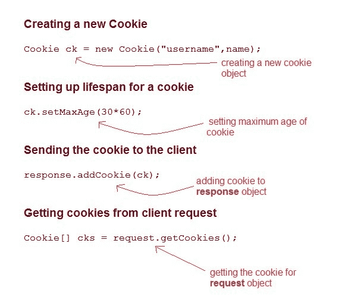
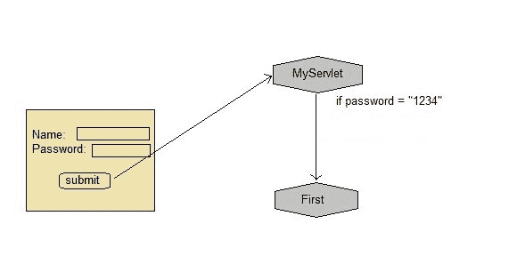

# 在 Servlet 中使用 Cookies 进行会话管理

> 原文：<https://www.studytonight.com/servlet/storing-session-using-cookies.php>

**cookie**是作为响应从网络服务器发送到客户端的小信息。**cookie**是用于存储客户端状态的最简单的技术。

**cookie**存储在客户端计算机上。它们有一个生命周期，并在生命周期结束时被客户端浏览器销毁。

然而，使用 Cookies 存储客户端状态有一个缺点，如果客户端已经转而在浏览器中保存 COokie 设置，那么客户端状态将永远无法保存，因为浏览器不允许应用存储 cookies。

* * *

## servlet:Cookies API

Cookie 是使用 Servlet API中的 **Cookie** 类创建的。使用`addCookie()`方法将饼干添加到**响应**对象。此方法通过 HTTP 响应流发送 cookie 信息。`getCookies()`方法用于访问添加到响应对象的 cookies。



* * *

### 示例演示了 Cookies 的用法



以下提到的文件是示例所必需的:

**index.html**

```java
<form method="post" action="validate">
    Name:<input type="text" name="user" /><br/>
    Password:<input type="text" name="pass" ><br/>
    <input type="submit" value="submit">
</form> 
```

**web.xml**

```java
<web-app...>

    <servlet>
        <servlet-name>validate</servlet-name>
        <servlet-class>MyServlet</servlet-class>
    </servlet> 
    <servlet-mapping>
        <servlet-name>validate</servlet-name>
        <url-pattern>/validate</url-pattern>
    </servlet-mapping>

    <servlet>
        <servlet-name>First</servlet-name>
        <servlet-class>First</servlet-class>
    </servlet>
    <servlet-mapping>
        <servlet-name>First</servlet-name>
        <url-pattern>/First</url-pattern>
    </servlet-mapping>

    <welcome-file-list>
        <welcome-file>index.html</welcome-file>
    </welcome-file-list>

</web-app> 
```

**MyServlet.java**

```java
import java.io.*;
import javax.servlet.*;
import javax.servlet.http.*;

public class MyServlet extends HttpServlet {

  protected void doPost(HttpServletRequest request, HttpServletResponse response)
            throws ServletException, IOException {
        response.setContentType("text/html;charset=UTF-8");
        String name = request.getParameter("user");
        String pass = request.getParameter("pass");

        if(pass.equals("1234"))
        {
            Cookie ck = new Cookie("username", name);
            response.addCookie(ck);
            response.sendRedirect("First");
        }
    }
} 
```

**First.java**

```java
import java.io.*;
import javax.servlet.*;
import javax.servlet.http.*;

public class First extends HttpServlet {

  protected void doGet(HttpServletRequest request, HttpServletResponse response)
            throws ServletException, IOException {
        response.setContentType("text/html;charset=UTF-8");
        PrintWriter out = response.getWriter();
        Cookie[] cks = request.getCookies();
        out.println("Welcome "+ cks[0].getValue());
    }
} 
```

### 饼干的种类

饼干有两种。它们如下:

*   会议
*   坚持的

#### **1)会话 cookie:**

会话 cookies 没有任何过期时间。它存在于浏览器内存中。当网络浏览器关闭时，cookies 会自动销毁。

#### **2)持续饼干:**

持久 cookies 有一个过期时间。它存储在用户的硬盘中，并根据到期时间销毁。

* * *

### 饼干是如何工作的？

当用户启动一个网站并向网站请求信息时。网站服务器回复并发送一个 cookie。这块饼干放在硬盘上。下次当你回到同一个网站时，你的电脑会把 cookies 发回来。现在，网站服务器识别数据，并将您的信息出售给其他卖家。

#### **演示 5.html**

```java
    <!DOCTYPE html>
<html>
<head>
<meta charset="ISO-8859-1">
<title>Insert title here</title>
</head>
<body>
<form action="abc" method="post">
Enter User name: <input type="text" name="val1"><br>
Enter Password: <input type="text" name="val2"><br>
<input type="submit" value="go">
</form>
</body>
</html> 

```

#### **cookie1.html**

```java
    package com.app.studytonight;

import java.io.*;  
import javax.servlet.*;  
import javax.servlet.http.*;  

public class cookie1 extends HttpServlet {  

  public void doPost(HttpServletRequest request, HttpServletResponse response){  
    try{  
    response.setContentType("text/html");  
    PrintWriter out = response.getWriter();  
    String n=request.getParameter("val1");  
    out.print("Welcome "+n);  
    Cookie ck=new Cookie("uname",n);  
    response.addCookie(ck); 
    out.print("<form action='pqr' method='post'>");  
    out.print("<input type='submit' value='go'>");  
    out.print("</form>");  
    out.close();  
        }
    catch(Exception e)
    {
        System.out.println(e);
    }  
  }  
} 

```

#### **cookie2.html**

```java
    package com.app.studytonight;
import java.io.*;  
import javax.servlet.*;  
import javax.servlet.http.*;  

public class cookie2 extends HttpServlet {  

public void doPost(HttpServletRequest request, HttpServletResponse response){  
    try{  
    response.setContentType("text/html");  
    PrintWriter out = response.getWriter();   
    Cookie ck[]=request.getCookies();  
    out.print("Hello "+ck[0].getValue());  
    out.close();  
         }
    catch(Exception e)
    {
        System.out.println(e);
    }  
    }  
} 

```

#### **web.xml**

```java
    <servlet>  
<servlet-name>s1</servlet-name>  
<servlet-class>com.app.studytonight.cookie1</servlet-class>  
</servlet>  

<servlet-mapping>  
<servlet-name>s1</servlet-name>  
<url-pattern>/abc</url-pattern>  
</servlet-mapping>  

<servlet>  
<servlet-name>s2</servlet-name>  
<servlet-class>com.app.studytonight.cookie1</servlet-class>  
</servlet>  

<servlet-mapping>  
<servlet-name>s2</servlet-name>  
<url-pattern>/pqr</url-pattern>  
</servlet-mapping>  
  </web-app> 

```


* * *

* * *