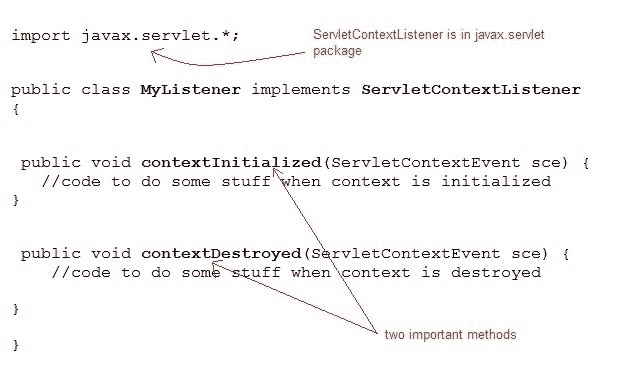
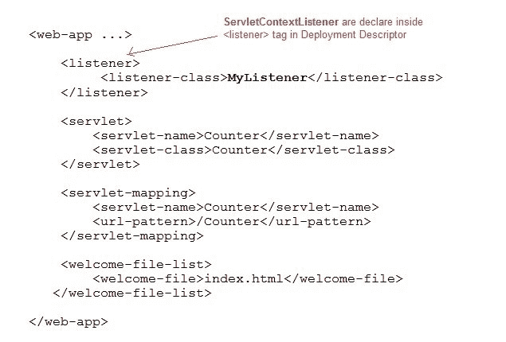

# Servlet 中的 ServletContextEvent 和 ServletContextListener

> 原文：<https://www.studytonight.com/servlet/servlet-context-listener.php>

**ServletContextEvent** 类给出关于 web 应用程序的 servlet 上下文变化的通知。 **ServletContextListener** 接收关于 servlet 上下文更改的通知，并执行一些操作。ServletContextListener 用于在初始化和销毁上下文时执行重要任务。简而言之，ServletContextEvent 和 ServletContextListener 成对工作，每当 Servlet 上下文发生变化时，ServletContextEvent 都会发布一个通知，由 ServletContextListener 接收，然后根据该通知执行某些任务。

* * *

## ServletContextListener 接口的方法

| 方法 | 描述 |
| 作废`contextDestroyed(ServletContextEvent e)` | 在应用程序被销毁时调用。 |
| 作废`contextInitialized(ServletContextEvent e)` | 在应用程序初始化时调用。 |

* * *

### 制作和使用上下文监听器

上下文监听器不是 servlet 或者 JSP，它是一个实现 **ServletContextListener** 接口的类，提供`contextDestroyed()`和`contextInitialized()`的定义。



* * *

### 演示 servletcontextlistener 用法的示例

**index.html**

```java
 <a href="**Counter**">Total Page views</a> 
```

**web.xml**



在这个例子中，我们将不得不创建一个名为**计数器**的表，该表有一个名为**页面视图**的列来保存页面视图的数量。

**mylister . Java**

```java
import java.sql.*;
import javax.servlet.*;

public class MyListener implements ServletContextListener
{
    ServletContext ctx;
    Connection con;
    Statement s;
    PreparedStatement ps;
    ResultSet rs;
    int count;

    public void contextInitialized(ServletContextEvent sce) {

        try {
            Class.forName("com.mysql.jdbc.Driver");
     	      con = DriverManager.getConnection("jdbc:mysql://localhost:3306/test","user","password");

            s = con.createStatement();

            // fetching pageviews value from table counter
            rs = s.executeQuery("select pageview from counter");

            while(rs.next()) {
                count = rs.getInt(1);
            }

            ctx = sce.getServletContext();
            ctx.setAttribute("pcount", count);
        }
        catch(Exception e) { 
            e.printStackTrace(); 
        }  
    }

    public void contextDestroyed(ServletContextEvent sce) {

        try
        {
            ctx = sce.getServletContext();
            count = (Integer)ctx.getAttribute("pcount");
            ps = con.prepareStatement("update counter set pcount='"+count+"'");
            ps.executeUpdate(); 
        } 
        catch(Exception e) { 
            e.printStackTrace(); 
        }
    }   
}
```

**Counter.java**

```java
import java.io.*;
import javax.servlet.*;
import javax.servlet.http.*;

public class Counter extends HttpServlet {

    protected void doGet(HttpServletRequest request, HttpServletResponse response)
            throws ServletException, IOException {
        response.setContentType("text/html;charset=UTF-8");
        PrintWriter out = response.getWriter();
        ServletContext ctx = getServletContext();
        Integer count = (Integer)ctx.getAttribute("pcount");
        out.println(count+": pageview");
        ctx.setAttribute("pcount", ++count);      
    }
} 
```

* * *

* * *