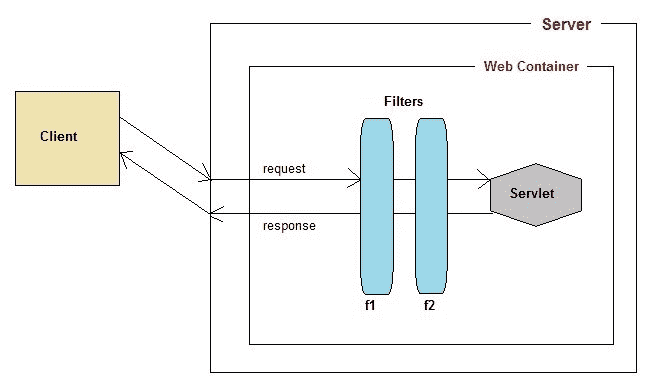
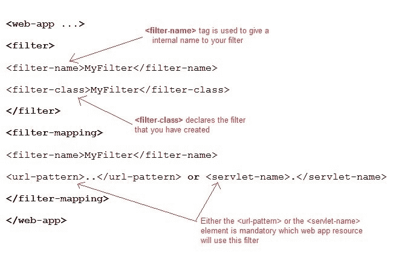
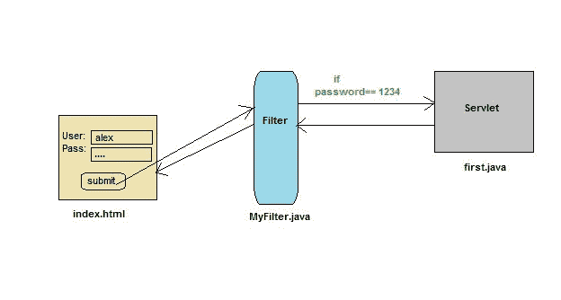

# Servlet：过滤器API简介

> 原文：<https://www.studytonight.com/servlet/filter-api.php>

**过滤器**是您可以使用和配置来执行一些过滤任务的组件。过滤器用于请求的预处理和响应的后处理。您可以使用任意数量的过滤器对请求进行预处理，对响应进行后处理。过滤器在 web 应用的部署描述符中配置。



* * *

## Servlet:过滤器是如何工作的？

*   当请求到达**网络容器**时，它会检查是否有任何过滤器具有与请求的网址相匹配的网址模式。
*   **网络容器**使用匹配的网址模式定位第一个过滤器，并执行过滤器的代码。
*   如果另一个过滤器有匹配的网址模式，那么它的代码就会被执行。这种情况一直持续到没有匹配网址模式的过滤器。
*   如果没有错误发生，请求将传递给目标 servlet。因此，我们知道，只有当所有相关的过滤器成功执行时，请求才会被传递给目标 servlet。
*   servlet 将响应返回给调用者。应用于请求的最后一个筛选器是应用于响应的第一个筛选器。
*   最后，响应将被传递到**网络容器**，该容器将其传递给客户端。

* * *

## Servlet:关于过滤器API的更多信息

**过滤 API** 是 **Servlet API** 的一部分。过滤器接口在 **javax.servlet** 包中找到。

为了创建过滤器，我们必须实现过滤器接口。过滤器接口为过滤器提供了以下生命周期方法:

1.  void `init(FilterConfig filterConfig)`:由 web 容器调用，向过滤器指示它正在投入使用。
2.  void**doFilter(servlet request，ServletResponse response，FilterChain chain)** :由于客户端请求链末端的资源，每次请求/响应对通过链时，由容器调用。
3.  void `destroy()`:由 web 容器调用，向过滤器指示它正在停止服务。

* * *

### Servlet:什么是 FilterChain 接口？

**FilterChain** 对象用于调用链中的下一个过滤器，或者如果调用过滤器是链中的最后一个过滤器，则调用链末端的 rosource。过滤器链末端的资源可以是目标 Servlet(在请求流的情况下)或客户机(在响应流的情况下)，如上图所示。

* * *

### 在部署描述符中声明一个 Servlet 过滤器



* * *

### 演示 Servlet 过滤器使用的示例

在本例中，我们使用过滤器进行身份验证(检查正确的用户名和密码)。这里**index.html**会向用户询问用户名和密码，**我的过滤器**会验证用户输入的密码，如果用户输入了“1234”作为密码，那么他会先被转发到**的** servlet，否则 index.html 会再次显示给用户。

这正是我们之前使用两个 servlet 类所做的，一个用于验证，另一个用于欢迎用户。现在我们将插入一个过滤器来验证用户。



**index.html**

```java
<form method="post" action="first">
    Name:<input type="text" name="user" /><br/>
    Password:<input type="text" name="pass" /><br/>
    <input type="submit" value="submit" />
</form> 
```

**web.xml**

```java
<web-app..>
    <filter>
        <filter-name>MyFilter</filter-name>
        <filter-class>MyFilter</filter-class>
    </filter>
    <filter-mapping>
        <filter-name>MyFilter</filter-name>
        <servlet-name>first</servlet-name>
    </filter-mapping>
    <servlet>
        <servlet-name>first</servlet-name>
        <servlet-class>first</servlet-class>
    </servlet>
    <servlet-mapping>
        <servlet-name>first</servlet-name>
        <url-pattern>/first</url-pattern>
    </servlet-mapping>
    <welcome-file-list>
        <welcome-file>index.html</welcome-file>
    </welcome-file-list>
</web-app>
```

**MyFilter.java**

```java
import java.io.*;
import javax.servlet.*;
import javax.servlet.http.*;

public class MyFilter implements Filter {

    public void init(FilterConfig fc) throws ServletException {}

    public void doFilter(ServletRequest request, ServletResponse response,
            FilterChain chain) throws IOException, ServletException {
        PrintWriter out = response.getWriter();
        String pass = request.getParameter("pass");
        if(pass.equals("1234"))
        {
            chain.doFilter(request, response);  
        }
        else
        {
            out.println("You have enter a wrong password");
            RequestDispatcher rs = request.getRequestDispatcher("index.html");
            rs.include(request, response);
        }
    }
   public void destroy() { }
}
```

**first.java**

```java
import java.io.*;
import javax.servlet.*;
import javax.servlet.http.*;

public class first extends HttpServlet {

    protected void doPost(HttpServletRequest request, HttpServletResponse response)
            throws ServletException, IOException 
     {
        response.setContentType("text/html;charset=UTF-8");
        PrintWriter out = response.getWriter();
        String user = request.getParameter("user");
        out.println("Wellcome " + user);
     }
} 
```

* * *

* * *