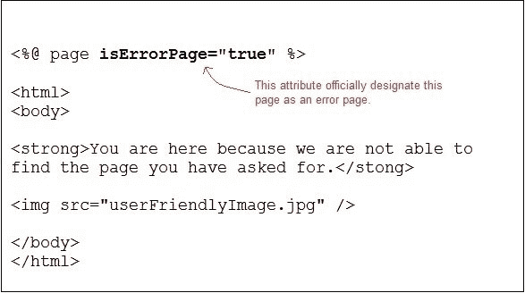
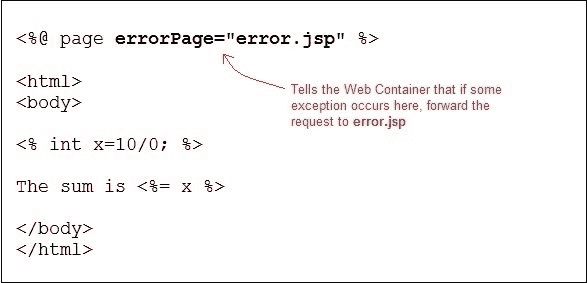

# JSP 异常处理

> 原文：<https://www.studytonight.com/jsp/exception-handling-in-jsp.php>

异常处理是处理应用中可能出现的异常情况的过程。JSP 中的异常处理比 Java 技术中的异常处理容易得多。尽管 JSP 技术也使用相同的异常类对象。

很明显，你不想向任何浏览你网站的随机用户显示错误栈跟踪。您不能阻止应用中的所有错误，但您至少可以提供一个用户友好的错误响应页面。

* * *

## 在 JSP 中执行异常处理的方法

JSP 提供了 3 种不同方式来执行异常处理:

1.  使用页面指令的**iserrrpage**和 **errorPage** 属性。
2.  使用**部署描述符**中的 **<错误页面>** 标签。
3.  使用简单的`try...catch`块。

* * *

### isErrorPage 和 ErrorPage 属性的示例

`isErrorPage`page 指令中的属性正式指定一个 JSP 页面为错误页面。

**error.jsp**



页面指令中的`errorPage`属性通知 Web 容器，如果当前页面出现异常，将请求转发到指定的错误页面。

**sum.jsp**



每当<u>sum.jsp</u>页面出现异常时，用户会被重定向到<u>error.jsp</u>页面，在那里您可以显示一条漂亮的消息，或者您也可以将异常跟踪打印到后台的文件/数据库中，以便稍后检查是什么导致了错误。

 ** * *

### 在部署描述符中声明错误页

您也可以在 DD 中为整个 Web 应用声明错误页面。使用**部署描述符**中的`<error-page>`标签。您甚至可以为不同的异常类型或 HTTP 错误代码类型(503、500 等)配置不同的错误页面。

**声明所有异常类型的错误页面**

```java
<error-page>
<exception-type>**java.lang.Throwable**</exception-type>
<location>**/error.jsp**</location>
</error-page> 
```

**为更详细的异常声明错误页面**

```java
<error-page>
<exception-type>**java.lang.ArithmeticException**</exception-type>
<location>**/error.jsp**</location>
</error-page> 
```

**基于 HTTP 状态码声明错误页面**

```java
<error-page>
<error-code>404</error-code>
<location>**/error.jsp**</location>
</error-page> 
```

* * *

### 使用尝试...捕捉块

使用`try...catch`块就像在[核心 Java](/java/overview-of-java.php) 中使用它一样。

```java
<html>
<head>
   <title>Try...Catch Example</title>
</head>
<body>
  ****try**{
      int i = 100;
      i = i / 0;
      out.println("The answer is " + i);
   }
   **catch** (Exception *e*){
      out.println("An exception occurred: " + *e*.**getMessage()**);
   }
  **%>**
</body>
</html>** 
```

* * *

* * **