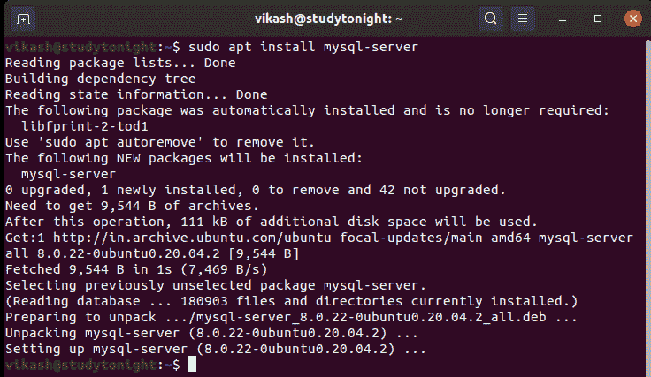
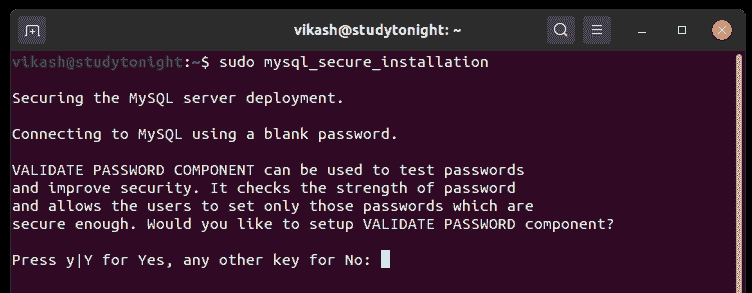
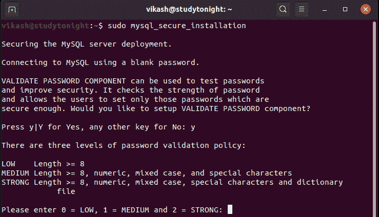
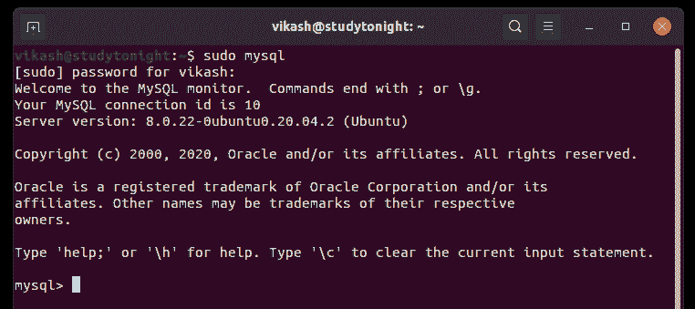
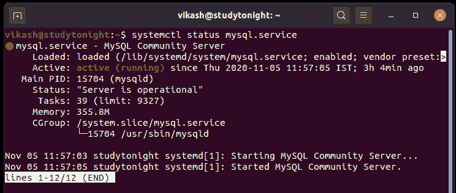
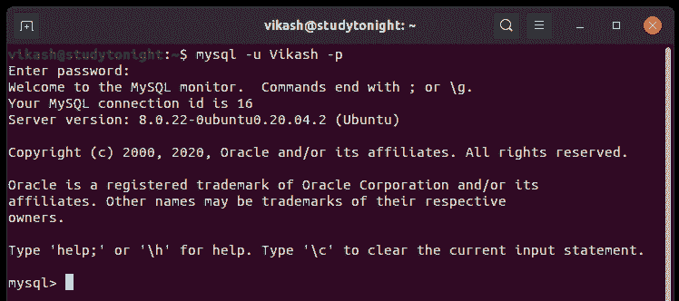
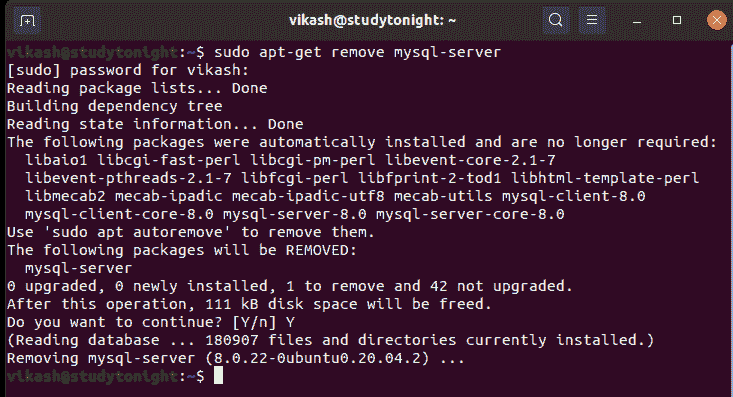

# 如何在 Ubuntu 20.04 LTS 上安装 MySQL？

> 原文：<https://www.studytonight.com/linux-guide/how-to-install-mysql-on-ubuntu-20-04-lts>

MySQL 是一个开源的关系数据库管理系统(RDBMS)，用于将数据存储到表中。在本教程中，我们将在 Ubuntu 20.04 LTS 上安装 MySQL。因此，让我们开始并遵循以下步骤。

## 步骤 1:更新包索引

安装之前，我们先用`sudo apt update`命令更新包索引。


## 第二步:安装 MySQL 服务器

更新包索引后，现在我们可以使用下面的命令安装 MySQL 服务器了。

```
$ sudo apt install mysql-server
```

它会将数据库安装到我们的本地系统中。我们可以在控制台屏幕上看到教学信息。



根据您的网络速度，安装 MySQL 服务器软件包需要几分钟时间。

## 步骤 3:配置 MySQL

成功安装后，我们需要运行安全脚本，尤其是如果我们是第一次安装它。



这将带我们通过一系列提示。

选择 Y 或 Y 进行密码设置，如上图所示。



如上图所示的密码插件，对于认证你想选择什么样的密码有三级密码

输入密码时，没有任何符号显示为*符号。您的密码不可见。脚本完成后，它会询问您是要继续输入密码，还是要输入新密码。如果您满意，请输入 y 继续。

输入密码后，它会提示您一些安全选项，您应该选择这些选项来保护 MySQL 服务器。

*   删除匿名用户？(按 y|Y 表示“是”，按任何其他键表示“否”):Y
*   不允许根用户远程登录？(按 y|Y 表示“是”，按任何其他键表示“否”):Y
*   删除测试数据库并访问它？(按 y|Y 表示“是”，按任何其他键表示“否”):Y
*   现在重新加载特权表吗？(按 y|Y 表示“是”，按任何其他键表示“否”):Y

脚本完成后，继续使用 MySQL 客户端创建一个专用数据库用户。

## 第四步:连接到 MySQL 服务器

```
$ sudo mysql
```

完成所有配置和设置后，让我们使用上面的命令运行 MySQL。运行此命令并输入您的系统密码

输入有效密码后，它会显示以下消息。



要清洗终端控制台，可以使用`ctrl + L`快捷键。

## 第五步:检查 MySQL 的版本

要检查 MySQL 服务器的安装版本，请运行`mysql --version`命令。


## 第 6 步:测试 MySQL 状态

要检查服务器的当前状态，我们可以使用`systemctl status mysql.service`命令，该命令将显示信息以及进程 id。



## 在 MySQL 中创建新用户

我们可以为 MySQL 创建新用户来控制用户的可访问性。使用下面的命令，将用户名和密码作为参数。

```
CREATE USER 'username'@'host' IDENTIFIED WITH authentication_plugin BY 'password';
```

成功创建用户后，它会返回一条消息“查询正常”。


创建新用户后，我们还可以授予新用户适当的权限，如 CREATE、ALTER、DROP、INSERT、DELETE、SELECT 等。

授予用户权限的一般语法如下:

```
GRANT PRIVILEGE ON database.table TO 'username'@'host'; 
```

## 登录到 MySQL 服务器

要访问 MySQL 数据库，请使用下面的命令来创建和运行 SQL 查询。

```
$ mysql -u username -p
```



这里 **-u** 为用户标志， **-p** 为密码认证标志。

## 停止 MySQL 服务器

要停止运行 MySQL，我们可以使用以下命令。

```
$ service msql stop
```

## 重新启动 MySQL 服务器

要重新启动 MySQL，请运行以下命令。它将首先停止当前进程，然后启动 MySQL 服务的新实例。

```
$ service msql restart
```

## 删除 MySQL

要从 Ubuntu 中删除 MySQL，请运行以下命令。它将从您的本地系统中删除 MySQL 服务器。

```
$ sudo apt-get remove mysql-server 
```



* * *

* * *