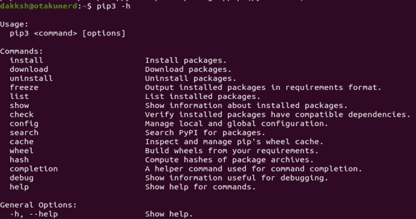
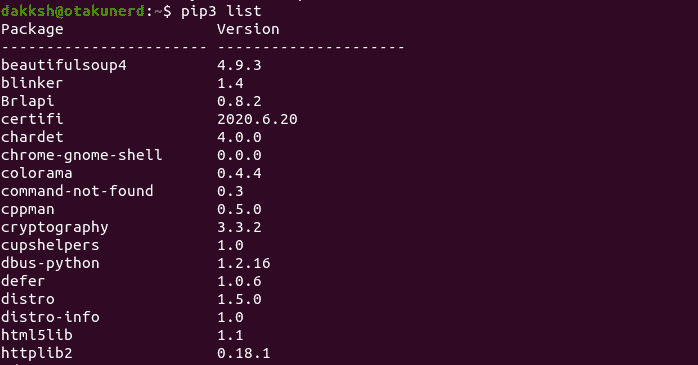

# 在 Ubuntu 上安装和使用PIP

> 原文：<https://www.studytonight.com/linux-guide/installing-and-using-pip-on-ubuntu>

Pip 是一个用于索引的工具，并且主要从 Python 包索引(PyPI)安装包，但是它也可以与其他包索引一起使用。

Pip 代表“首选安装程序”，是一个基于 python 的应用，用于 python 编程语言的包管理。它有助于管理库和依赖项，而不是手动操作。

Python 有两个版本，第 2 版和第 3 版。最新版本的默认版本是 Python 3。仍在使用 Python 2 的用户，建议切换到 Python 3。

从`**apt**`安装 Python 包时，Python2 包前加一个`python2-`，Python3 包加`python3-`。

当安装 python 包时，如果您想全局安装，通常建议安装 apt repo 中可用的包，因为它们经过测试，是安全的 deb 包。

## 安装`**pip**`

要安装 **`pip`** ，首先，更新你的软件包库，然后安装`**pip**`，使用以下命令。

```
sudo apt update
sudo apt upgrade
sudo apt install python3-pip
```

安装完成后，检查安装是否成功，运行以下命令。

```
pip3 --version
```

输出可能会有所不同，但看起来如下所示


## 使用`pip`

在这一节中，我们将看到 pip 的一些基本命令和用法。有了 pip，可以安装来自 PyPI、版本控制、本地项目的包，但我们将主要关注 PyPI。

获取 pip 运行支持的所有命令的列表

```
pip3 --help
```



关于命令的更多信息，我们可以运行`**pip3 <command> --help**`或`**pip3 <command> -h**`。

例如，为了获得安装帮助，我们运行

```
pip3 install -h
```

### 安装软件包

要安装软件包，您需要知道软件包名称。比如说你想安装`[colorama](https://pypi.org/project/howdoi/)`包。命令如下

```
pip3 install colorama # To install a specific version, say 0.4.0 write colorama==0.4.0
```


### 使用需求文件安装

`**requirement.txt**`是 python 包使用的文本文件，列出了依赖项和运行该项目所需的版本号。要使用需求文件进行安装，我们可以使用以下命令。

```
pip3 install -r requirement.txt
```

### 列出安装包

要列出包，我们运行以下命令。

```
pip3 list
```



### 升级包

要升级软件包，我们需要安装带有`--upgrade` / `-U`标志的软件包。

```
pip3 install -U colorama
```


### 卸载包

可以使用以下形式的卸载命令卸载 Pip 包。

```
pip3 uninstall colorama
```


## 结论

本教程讲述了如何安装`**pip**`，以及它是什么。它还展示了如何使用`**pip**`做基本的事情，以及如何在你的 Ubuntu 上安装 python 包。

* * *

* * *