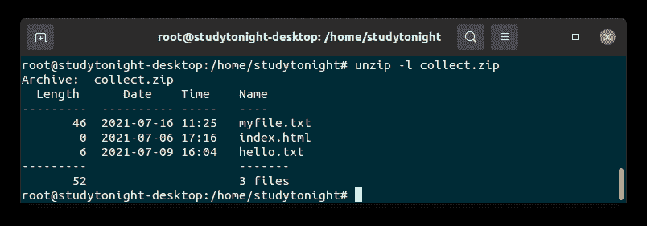

# 如何在 Linux 中解压文件？

> 原文：<https://www.studytonight.com/linux-guide/how-to-unzip-files-in-linux>

解压缩是一个实用程序命令，用于从 zip 文件中提取文件和目录。它可以用来提取单个或多个文件，甚至可以提取受密码保护的文件。

在本文中，我们将学习在几个选项和场景中使用`unzip`命令。所以，让我们开始学习。

## Linux 中`Unzip`文件的命令

```
unzip filename.zip
```

在开始解压缩之前，首先确保它安装在您的计算机上，因为大多数 Linux 版本都没有预安装它。

因此，首先，使用以下命令安装它。这是针对 **Debian/Ubuntu** 系统的。

```
$ sudo apt install unzip
```

如果您使用的是 **Centos** ，那么使用此命令安装解压缩实用程序。

```
$ sudo yum install unzip
```

如果您正在使用**软呢帽**，那么使用这个命令来安装解压缩实用程序。

```
$ sudo dnf install unzip
```

## 如何`Unzip`文件和目录？

这是一个简单易行的命令，只需用这个命令在 Linux 中解压一个 zip 文件。请确保 zip 文件应该在同一个目录中，否则您必须提供正确的 zip 文件路径来定位该文件。

```
$ unzip filename.zip
```

它会将所有文件提取到当前目录位置。

您必须对解压 zip 的目录有写权限。

## 抑制`unzip`命令的输出

当我们解压缩一个文件时，它会向控制台显示所有文件内容，如果我们想要隐藏/跳过这些信息，那么您可以使用-q 选项和解压缩命令。

```
$ unzip -q filename.zip
```

## `Unzip`将压缩文件保存到不同的目录

如果我们想将 zip 文件解压缩到当前目录之外的其他目录，那么使用命令的`-d`选项并提供目录的完整路径。

```
$ unzip filename.zip -d /path/to/directory 
```

由于我们正在向不同的目录写入(解压缩)，因此必须将`sudo`与命令一起使用，因为我们必须对该目录拥有写入权限。

## `Unzip`受密码保护的压缩文件

如果 zip 文件受密码保护，则使用`-p`选项，命令将在解压缩前提示输入密码。

```
$ unzip -p filename.zip
```

## 解压缩多个文件

我们可以通过使用正则表达式来匹配所有的 zip 文件来解压缩多个文件。我们可以使用**星号(*)通配符**进行多选。比如:

```
$ unzip '*.zip'
```

它将在当前目录中搜索 zip 文件，并在同一目录中提取每个文件。最好使用单引号来绑定通配符。

## 显示压缩文件的内容

在这种情况下，您希望在提取之前看到 zip 文件的内容，然后在命令中使用`-l`选项，它会在控制台屏幕上列出 zip 文件的所有内容。

```
$ unzip -l filename.zip
```

输出:



## 覆盖现有文件

如果解压缩文件已经被提取，并且您想再次`unzip`解压缩，那么解压缩命令提示一些选项，如覆盖一个文件，覆盖所有文件等。要覆盖这些，您可以使用解压命令的`-o`选项。

```
$ unzip -o filename.zip
```

## 结论

`unzip`命令对 Linux 用户非常有用。它简化了工作，并提供了多用途的几个选项。在本文中，我们学习了如何在多个场景中使用解压，比如解压单个文件、多个文件、覆盖文件、列出 zip 文件内容等。

* * *

* * *