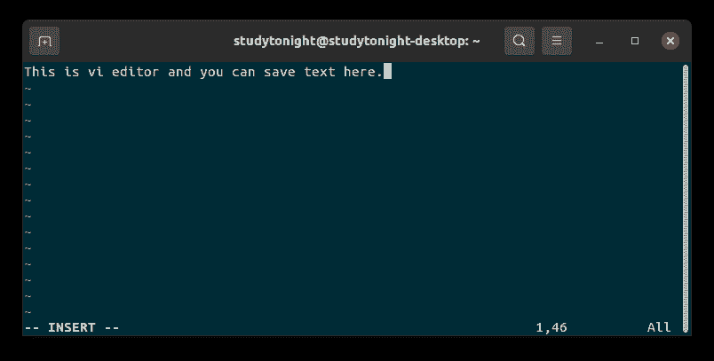
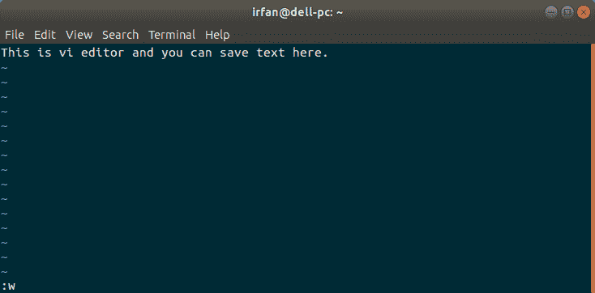
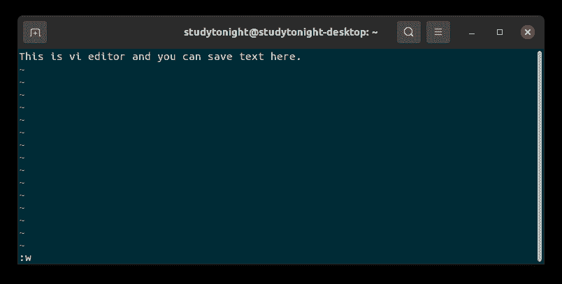
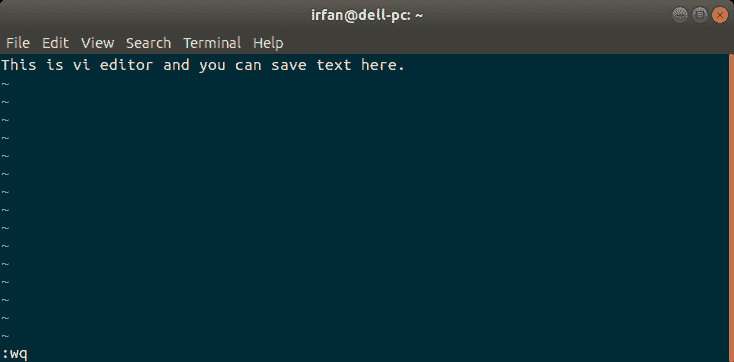
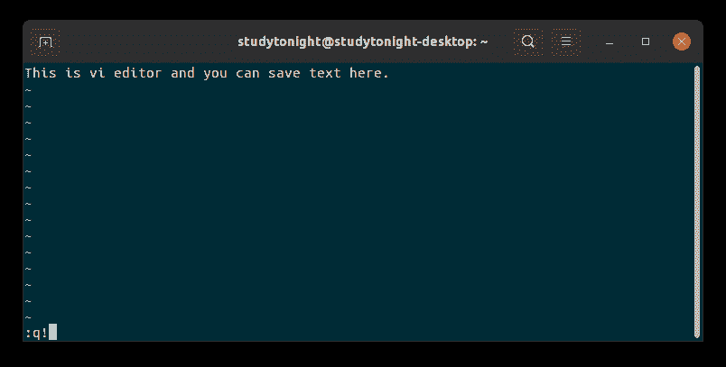

# 如何在 Vim/Vi 中保存文件并退出编辑器？

> 原文：<https://www.studytonight.com/linux-guide/how-to-save-a-file-in-vim-vi-and-quit-the-editor>

Vim 是 Linux 中常用的编辑工具，用于编辑。它是最受欢迎的编辑器之一，也可以用于文本编辑和编码。

Vim 也被称为 Vi，预装在所有的 Linux 发行版和 macOS 中。在本文中，我们将通过一些例子学习如何在 Vim 编辑器中保存和归档。

在 vim 编辑器中保存和退出文件的组合键。首先按下`Esc`并输入以下内容:

```sh
:wq
```

之后按`Enter`。这是针对您的问题的单行解决方案。让我们深入了解整个过程。

首先，按下`Ctrl+Alt+t`打开终端，系统中会打开一个终端。现在，看一步一步的过程。

## 1.用 Vim 编辑器打开文件

要在 Vim 编辑器中打开文件，在终端中写入`vim fileName`命令，然后按回车键。它将打开您在命令中指定的文件。如果该文件不存在，它将首先创建一个同名文件，然后打开该文件。请参见命令。

```sh
$ vim fileName
```

文件名可以是任何文本、HTML 或文档文件。因此，我们必须指定扩展名为 file.txt、file.doc 等的文件。

## 2.写入 Vim 编辑器

打开文件后，我们可以通过插入文本(书写)来修改文件。

要写入文件，按下将 vim 编辑器转换为写入模式的`i`，在这里可以写入文件。大家可以看到下面截图我们插入一行，左下方可以看到编辑器模式，现在是**插入**。



## 3.保存到 Vim 编辑器中

写入/插入文本后，我们可以通过按以下键来保存文件:

1.  转义字符

2.  :(冒号)

3.  w

4.  进入

先按`Esc`，再按`:`(冒号)和`w`，最后按`Enter`。它会将您的文件数据保存到 vi 编辑器中。请参见屏幕截图以获取帮助。





## 4.保存并退出 Vim 编辑器

如果要在保存文件后退出 vim 编辑器，可以使用以下组合键:

1.  转义字符

2.  :(冒号)

3.  w

4.  q

5.  进入

先按`Esc`，再按`:`(冒号)、`w``q`，最后按`Enter`。它将保存您的文件并退出 vim 编辑器。请参见下面的截图以获取帮助。

 

## 5.退出而不保存 Vim 编辑器

如果我们想退出 vim 而不保存文件，您可以使用以下组合键:

1.  转义字符

2.  :(冒号)

3.  q

4.  ！

5.  进入

首先按`Esc`，然后按`:`(冒号)、`q`和`!`，最后按回车键。它将退出 vim 编辑器而不保存您的文件。请参见下面的截图以获取帮助。



除了保存和退出 vim 编辑器，您还可以使用这个强大的编辑器做更多的事情。你可以[阅读我们已有的文章](https://www.studytonight.com/post/learn-basic-vim-commands)，

## 结论

在本文中，我们重点学习如何保存和归档，以及保存后的 vim 编辑器。我们从零开始学习，打开 vim 编辑器，编写文本，保存文本，保存或不保存后退出。

* * *

* * *