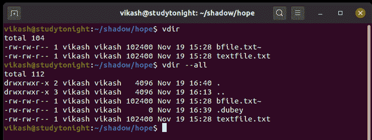
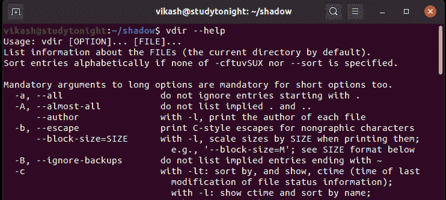

# 如何在 Linux 中列出目录内容

> 原文：<https://www.studytonight.com/linux-guide/how-to-list-directory-contents-in-linux>

在 Linux 中，`dir` (目录)、`ls` (列表)命令已经可以用来检查目录内容的列表，但是除此之外，Linux 还提供了`vdir` (虚拟目录)来列出目录内容。

`vdir` 命令用于列出 Linux/Unix 操作系统中文件的相关信息。

*   `vdir` 代表虚拟目录。
*   `vdir` 命令类似于 **`ls -l -b`** 命令。
*   默认情况下，文件以长格式列出，特殊字符由反斜杠转义序列表示。
*   如果没有指定-cftuvSUX 或- sort，它将按字母顺序对条目进行排序。

### **Linux vdir 命令的语法**

以下是 Linux 中 vdir 命令的语法。

```sh
 vdir [OPTION]... [FILE]...
```

### Linux vdir 命令选项

下表简要描述了`vdir` 命令的可用选项。

| [计]选项 | 描述 |
| --- | --- |
| -所有人 | 它用于显示带有点(.)的文件。)在名字的开头。基本上是一个隐藏文件。 |
| -一个，-几乎所有 | 不要列出隐含的。和.. |
| -作者 | 它用于显示每个文件的作者。 |
| -B，-忽略-备份 | 它用于忽略备份文件的列表。 |
| 分类 | 它用于将指示符(一个*/=>@&#124;)添加到条目中。 |
| -文件类型 | 同样，除了不要附加' * ' |
| -我，伊诺德 | 它用于打印每个文件的索引号。 |
| -r-倒车 | 它用于在排序时以相反的顺序列出文件。 |
| -R，-递归 | 它用于递归列出子目录。 |
| 救命 | 它用于显示帮助。 |
| -版本 | 它用于打印版本信息。 |

### 示例:在 Linux 中显示隐藏文件

在目录 **hope 中，**有一个文件 **.dubey.txt** 有 dot(。)的名义。该文件是一个隐藏文件，如果不使用 **-a** 或 **-所有 **vdir** 命令中的**选项，该文件将无法显示，但当我们使用这些选项时，该文件将会显示。



## 示例:用-l 显示文件的作者

在本例中，通过使用`**vdir -l --author**`命令，我们显示了包含所有者详细信息、组详细信息等的文件。请参见下面的输出。


## 示例:显示不包括备份文件的文件(以~)结尾

我们知道备份文件以一个 **~** 符号结束，像 **bfile.txt~** 是当前文件夹中的一个备份文件，默认可见。如果我们想排除这些文件，那么在 vdir 命令中使用 **-B** 或 **-忽略-备份**选项。请参见下面的输出。


## 示例:显示帮助并退出

在上面的选项表中，只有几个重要的选项给出了描述，但是通过使用`vdir --help`命令，您可以使用描述来探索更多的选项。



## 示例:显示 vdir 命令的版本信息

要显示 vdir 命令的版本信息，请使用`vdir`命令和`--version`选项。


## 结论

在本教程中，我们介绍了如何在 Linux 操作系统中使用`vdir` 命令列出目录内容，并提供了可用的选项和合适的示例。在 Linux 中，ls 和 dir 也可以用于相同的目的。

* * *

* * *