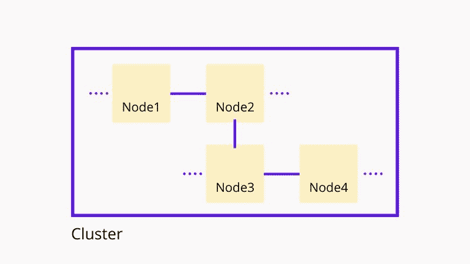

# 什么是ElasticSearch？

> 原文：<https://www.studytonight.com/elasticsearch/what-is-elasticsearch>

如果让一群开发人员从一个[传统的 RDBMS](https://www.studytonight.com/dbms/rdbms-concept.php) 中搜索匹配一些文本来查找一些数据，初学者会在 SQL 查询中使用 [LIKE 子句，稍微热情一点的开发人员可能会编写一个](https://www.studytonight.com/dbms/like-clause.php) [PL/SQL 过程](https://www.studytonight.com/plsql/plsql-procedure-and-function)，或者有人甚至会选择所有的数据，放入一个数据结构中，然后应用一些[搜索算法](https://www.studytonight.com/data-structures/binary-search-algorithm)，这样的技术还有很多。但是随着数据量的增长，所有这些都将慢慢地失去作用。一旦数据达到百万行的数量级，可能需要几秒钟才能成功对数据执行文本搜索。

为了快速存储和搜索(全文搜索)大量的半结构化或非结构化数据，我们可以使用ElasticSearch服务。

Elasticsearch 不是数据库，而是**分布式搜索引擎服务**，用于以 JSON 对象(文档)的形式存储数据，进行超快速的全文搜索，可扩展性很高，即使是初学者也非常容易使用。

Elasticsearch 附带一个**简单但复杂的 API** ，可用于执行各种操作，**预配置的默认值**，可在生产中使用，无需对简单用例进行任何更改，以及一个小的学习曲线。

您可以在您的 Windows 笔记本电脑、MacOS、任何 Linux 机器上安装 Elasticsearch，也可以将其**部署在集群中的多个物理或虚拟服务器上**。

ElasticSearch即服务可以使用 docker 映像安装在 Docker 上，并且可以在 Kubernetes 环境中运行。

## 为什么我们需要ElasticSearch？

正如本教程介绍中提到的， **RDBMS 在查询海量数据**以获取结果方面有所欠缺，这在数据量不断增长的今天是一个有效的用例。

例如，任何电子商务网站都很容易列出成千上万种产品，每个客户在购买任何东西之前，都要搜索它，如果搜索需要时间，在大多数情况下，用户会去其他电子商务网站。因此，拥有一个快速搜索系统，已经成为拯救企业的必要条件。

从本质上来说，关系数据库管理系统将数据分布在标准化的表中，这为数据提供了适当的结构，但是很难搜索到任何东西。因此，软件行业慢慢向 NoSQL 转移，ElasticSearch也以 NoSQL 为基地。

Elasticsearch 提供了一种查询语言 [Query DSL](https://www.elastic.co/guide/en/elasticsearch/reference/current/query-dsl.html#query-dsl) (领域特定语言)，可以用来查询存储的数据。

## 理解ElasticSearch

Elasticsearch 服务是分布式的，这意味着它部署在一个集群中，多个节点运行在不同的物理或虚拟服务器上。虽然我们也可以运行单个节点设置。让我们试着用相当简单的语言来理解这一切意味着什么。

ElasticSearch集群是指运行在不同物理或虚拟机上的一组ElasticSearch节点。当我们设置ElasticSearch集群时，一个节点被分配为主节点，用于对集群进行配置更改，集群中的其他节点知道哪个是主节点。

我们可以通过发出 HTTP 请求，使用 REST API 与任何节点进行通信，而在内部，每个节点都通过传输层进行通信。

下面我们有一个简单的图表来解释一个简单的ElasticSearch服务集群。

ElasticSearch集群的默认名称是**ElasticSearch**。我们可以在运行ElasticSearch时指定初始启动的节点数量，也可以在**配置/ElasticSearch. yml** 文件中指定物理或虚拟服务器的 IP 地址，您也可以在其中找到所有其他配置。

以下是ElasticSearch服务的主要逻辑单元:

**集群** -ElasticSearch集群由一个或多个节点组成，并可通过其集群名称进行识别。

**节点** -单个ElasticSearch实例。在大多数环境中，每个节点都运行在单独的机箱或虚拟机上。

**索引** -在 Elasticsearch 中，索引是文档的集合。你可以理解它，就像一个表是为关系数据库管理系统准备的，同样，我们在ElasticSearch中有索引。

**碎片** -正如已经讨论过的，Elasticsearch 是一个分布式搜索引擎，因此索引通常被分成更小的单元，称为碎片，分布在多个节点上。

**副本** - Elasticsearch 还保留了所有碎片的副本，作为一种故障安全机制，称为副本。

我们将在单独的教程中详细介绍所有这些内容。

## 弹性研究的应用

当我们使用 Kubernetes 在云上移动企业软件时，我第一次与ElasticSearch相遇，我们有一个用例，将每个 docker 容器中的日志聚合到一个数据存储引擎中，从该引擎中可以在一些用户界面上显示日志。显然，我们使用ElasticSearch来存储日志，并使用 Kibana(同一公司的另一款产品)作为可视化的用户界面。

但这是ElasticSearch的一个非常特殊的用例，但也是一个流行的用例。

以下是ElasticSearch可以使用的一些主要用例，它将获得成功。

*   应用或网站搜索有大量数据的社交网站或有大量产品目录的电子商务网站等。

*   企业搜索为其他产品提供大量数据的任何 Saas 产品。

*   日志和日志分析，正如我上面提到的。

*   Docker 中的系统度量和容器监控，以关注容器的运行状况。

*   应用程序性能监控

*   和各种其他形式的分析，收集实时数据，然后进行分析。

## 支持ElasticSearch的编程语言

它支持许多编程语言，但官方客户端提供以下编程语言:

*   爪哇

*   JavaScript

*   去

*   。NET (C#)

*   服务器端编程语言（Professional Hypertext Preprocessor 的缩写）

*   Perl 语言

*   计算机编程语言

*   红宝石

## 下载并安装

您可以从这里下载并安装 elastic search:[https://www.elastic.co/downloads/elasticsearch](https://www.elastic.co/downloads/elasticsearch)

有多种不同的方法可以做到这一点，它们是:

1.通过下载。zip 文件并执行 shell 文件 **/bin/elasticsearch** ( [使用 Kibana 和 Fluent Bit 在 Linux 机器上安装 elasticsearch](https://www.studytonight.com/post/setup-fluent-bit-with-elasticsearch-and-kibana-efk-for-log-management-on-linux-machine-non-kubernetes))来运行 elastic search 服务，或者在 windows 的情况下运行 **/bin/elasticsearch.bat** 文件。

2.通过使用任何软件包管理器，如苹果电脑的**百胜**、**易捷**或[家酿](https://www.studytonight.com/post/what-is-homebrew-and-how-to-install-it-on-mac-osx)。

3.在 Docker 中，使用 Elasticsearch docker 映像。

## 结论:

所以 Elasticsearch 是一个分布式存储引擎，即使存储的数据量在几十 GB 或几百 GB，它也能超快地搜索存储在其中的数据。在下一个教程中，我们将尝试理解它的体系结构，以便更好地理解它的工作原理以及它在搜索数据方面的速度。

* * *

* * *