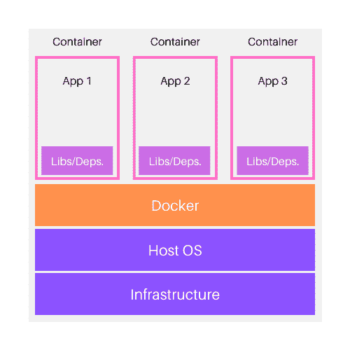
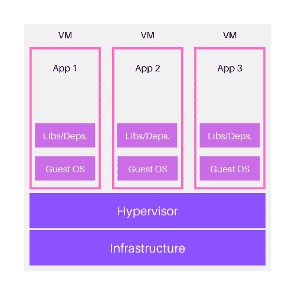

# 容器与虚拟机

> 原文：<https://www.studytonight.com/docker/container-vs-virtual-machine>

Docker 容器和虚拟机在体系结构上是完全不同的，但是经常混淆为相似。在本教程中，我们将通过了解 docker 容器和虚拟机的体系结构以及它们如何在主机操作系统上工作来了解它们之间的区别。

我们已经介绍了 docker 容器是如何工作的，**使用相同的操作系统内核**，资源限制使用**cggroups**和**命名空间**来决定 docker 容器的边界。让我们深入一点去理解这一切意味着什么。

## 码头容器

在下图中，我们有一个运行在主机上的基本 Docker 设置的体系结构，其上运行着 3 个容器，其中运行着 3 个不同的应用。

Docker 引擎利用主机操作系统内核(Linux)与底层硬件进行通信。在 docker 上运行的所有容器共享同一个主机操作系统内核，因此它们不必设置自己的操作系统内核，这使得它们轻量级。

此外，在 docker 容器中，应该只运行一个应用进程，正如 docker 所建议的那样，并且容器应该有其所需的库和依赖项。

码头上运行的每一个容器都是完全相互隔离的。

容器在 Linux 上本地运行，如果您想在 Windows 操作系统上安装它，windows docker 应用将为自己安装一个 Linux 虚拟机。

## 虚拟计算机

与容器不同，虚拟机**不利用主机操作系统内核**，相反，它**安装自己的客户操作系统**。虚拟机还**模拟硬件层**，通过虚拟机管理程序虚拟利用主机资源。

这使得虚拟机沉重且缓慢。

一个虚拟机与另一个虚拟机完全隔离。就虚拟机而言，您甚至可以在不同的虚拟机上安装不同的操作系统。

## 容器与虚拟机

现在您已经理解了容器和虚拟机之间的区别，让我们看看两者之间的主要区别:

| 容器 | 虚拟计算机 |
| --- | --- |
| 尺寸较小 | 尺寸较大，一般以 GB 为单位。 |
| 启动速度很快。 | 启动缓慢。 |
| 共享由操作系统内核通过**用户组**管理的资源。它也共享相同的操作系统内核。 | 彼此完全隔离。 |

Docker 并不意味着用其内核来虚拟化操作系统，而是将应用打包到一个**冻结的应用状态**中，该状态可以在一个容器中运行。

在大规模基础架构设置中，我们将运行操作系统的虚拟机安装在服务器机架上，在其顶部运行 docker，其容器运行各个服务。

在下一个教程中，我们将学习如何在不同的操作系统上本地安装 docker。

* * *

* * *