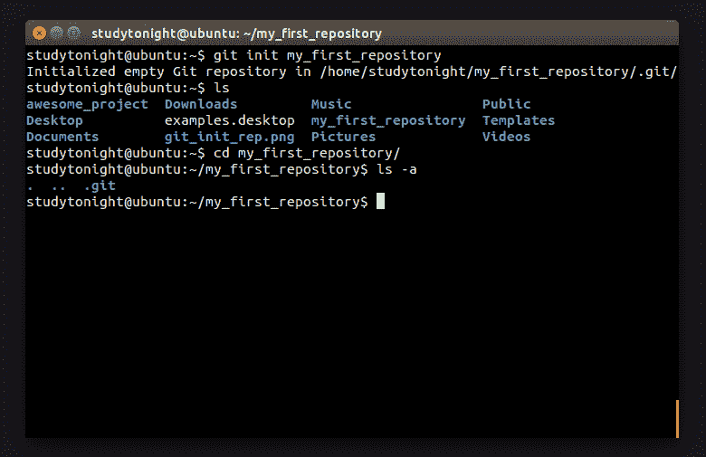
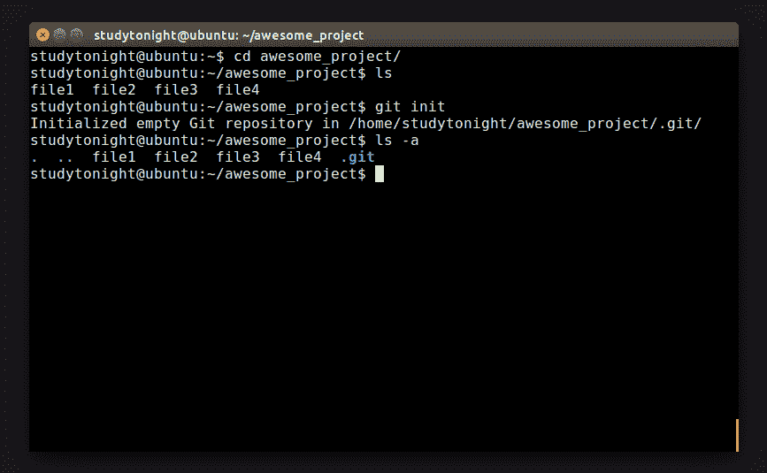
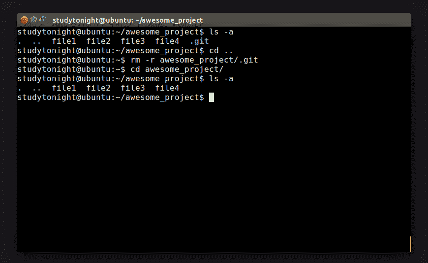

# 使用 Git 仓库

> 原文：<https://www.studytonight.com/github/repositories-in-git>

每当我们开始一个项目时，我们都需要将所有文件存储在一个`repository`中。让我们首先创建一个仓库。我们建议您在单独的专用路径中工作。

要创建仓库，请使用 **$ git init** 命令。继续键入以下命令来创建您的第一个仓库。

```sh
$ git init my_first_repository
```

您将获得一条消息**“在”**中初始化了空的 Git 仓库，以及您的仓库的路径。要检查，输入`ls`，果然，这是你的第一个仓库。

```sh
Go into your repository and type ls.
```

嗯。那里什么都没有。回想一下，当我们谈论 VCS 的特征时，我们讨论了隐藏文件。让我们通过输入 **$ ls -a** 来检查这些隐藏文件，其中列出了**隐藏文件**。



**。git 文件夹**是您的**本地仓库**，它存储所有**历史**和**版本控制信息**。

但是，如果您已经在进行您的出色项目，并且没有首先初始化 git 仓库，该怎么办呢？别担心。转到该目录，输入 **$ git init** ，不输入仓库的名称。Git 将假设您需要为这个项目目录创建一个仓库。如果你现在输入 **$ ls** ，你会看到那个奇妙的小 **git 文件夹**正坐在那里等着你开始你的令人敬畏的项目。



仓库的名称没有**那么重要。git 目录**里面。重命名您的仓库就像使用`mv`命令一样简单。

```sh
$ mv my_first_repository awesome_project
```

移除仓库很容易，但却是致命的。在迈出这一步之前要三思。如果您决定继续并移除您的仓库，**删除**。git 目录**会为你做这项工作。**

 **```sh
$ rm -r awesome_project/.git
```



完成了。是的，就是这么简单。既然您已经对仓库有了足够的了解，那么让我们来了解一下如何将更改提交给它们。

* * *

* * ***