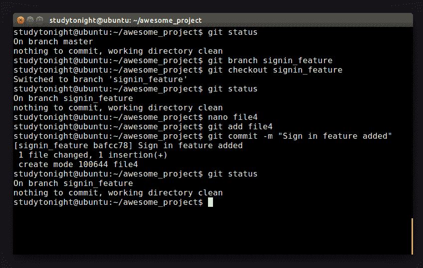
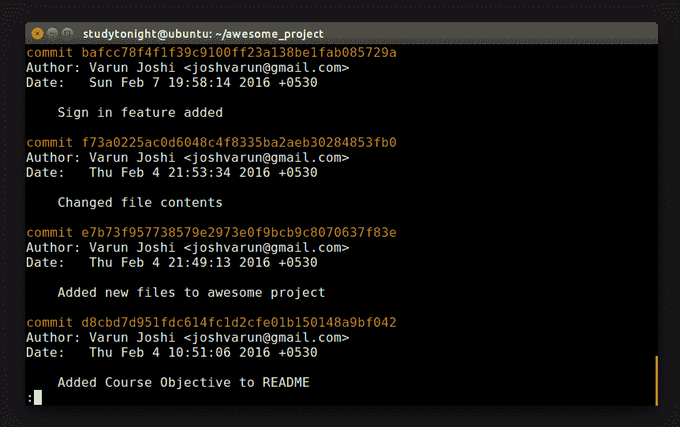
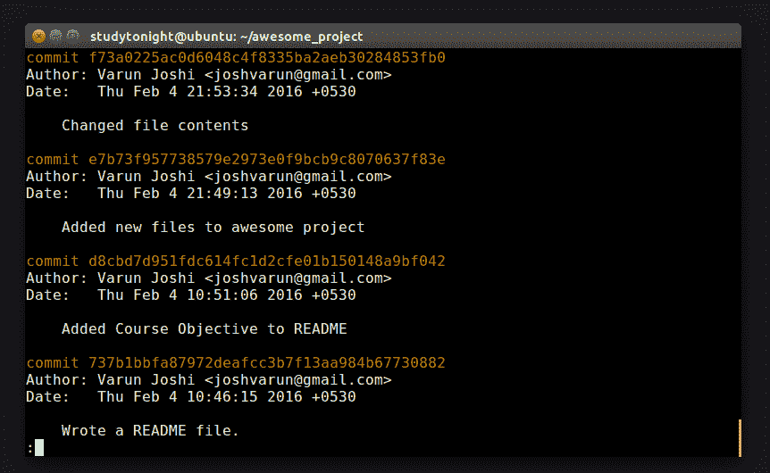
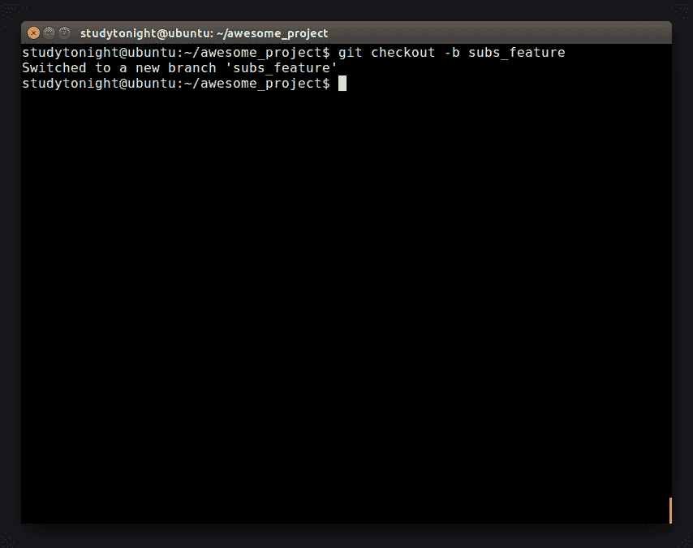
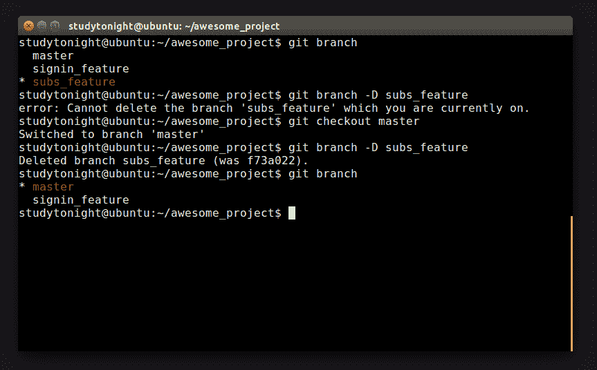

# GIT：分叉

> 原文：<https://www.studytonight.com/github/branching-in-git>

几乎每个 VCS 都有某种形式的分支支持。`Branching`的意思是，你偏离了发展的主线，继续做工作，而不打乱那个主线。在许多 VCS 工具中，这是一个有些昂贵的过程，通常需要您创建源代码目录的新副本，这对于大型项目来说可能需要很长时间。

以一棵树为例。一棵树总是有一些树枝和大树干。类似地，Git 中的分支是项目的较小部分，不需要干扰主分支(召回主分支)。它们有自己的提交，一旦完成就会被添加到 master 中。主枝就像树干。在大多数情况下，包含在主分支中的代码通常是正在部署的代码。

有些人将 Git 的分支模型称为其`"killer feature"`，这无疑让 Git 在 VCS 社区中脱颖而出。为什么这么特别？Git 分支非常轻量级，使得分支操作几乎是即时的，并且在分支之间来回切换通常也一样快。与许多其他风投不同，Git 鼓励经常分支和合并的工作流，甚至一天分多次。理解和掌握这个特性给了你一个强大而独特的工具，可以完全改变你的开发方式。

让我们考虑一下我们的**牛逼项目**是基于一个网络开发项目。您目前在主分支上，进展很顺利，但是您需要在项目中添加一个登录功能。现在，您肯定不希望这段代码干扰您当前的代码，是吗？让我们给这个特性一个自己的分支。您可以使用`git branch`命令创建一个新分支。检查仓库的状态，确保您没有任何要提交的内容。

命名新的分支登录功能:`$ git branch signin_feature`

再次检查状态。嗯，我们还在主分支。我们如何切换到我们的新分支？还记得我们以前的朋友吗？此命令可用于在分支之间切换。当您没有为它提供哈希值时，Git 假设您想要切换到一个分支。继续切换到我们刚刚创建的新分支，检查状态以确保正确。

```
$ git checkout signin_feature
```



继续创建一个新文件，这里是文件 4，并提交它。成功提交后，请检查日志。当然，您可以看到新提交的条目就在那里。



让我们切换回 master 并再次查看日志。哦哦。缺少提交。我们擦掉了吗？别担心承诺还在。Git 足够聪明，知道这个提交是在`signin_feature`分支中，主分支与它无关。



请记住，无论何时分支，新分支都是当前分支的副本。到目前为止，我们从主服务器分支出来，因此所有的主服务器提交在日志中都是可用的。

还有一种方法可以创建新的分支。我们的朋友`git checkout`帮助我们完全绕过分支命令。继续并在命令行中键入以下内容。让我们创建一个新的订阅功能:

```
$ git checkout -b subs_feature
```



**-b 选项**允许您创建一个分支，并在一个命令中切换到所有分支。

现在我们已经创建了一些分支，让我们了解更多关于管理它们的知识。我们现在总共有 3 个分支机构，但更大的项目有数百甚至数千个分支机构。我们如何跟踪哪些分支存在？

Git 允许我们通过使用**“git 分支”**命令来查看仓库中的所有分支:

```
$ git branch
```

这将为您提供所有分支以及您当前分支的列表。假设我们决定跳过订阅功能并将其删除。不是你的每一个想法都能进入最终项目。

您可以使用分支命令中的 **-D 选项**来删除您的分支:

```
$git branch -D subs_feature
```

哎呀！我们无法删除当前正在工作的分支。切换回主机，然后重试。



唷！这是一个漫长的过程。干得好。你应该得到一块饼干！接下来，我们研究合并。这是什么意思？继续读...

* * *

* * *