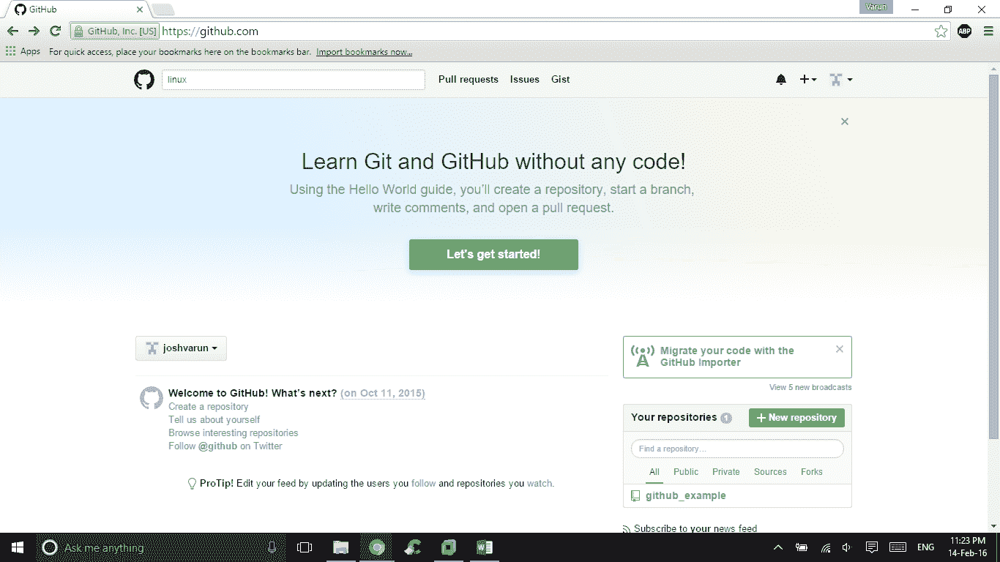
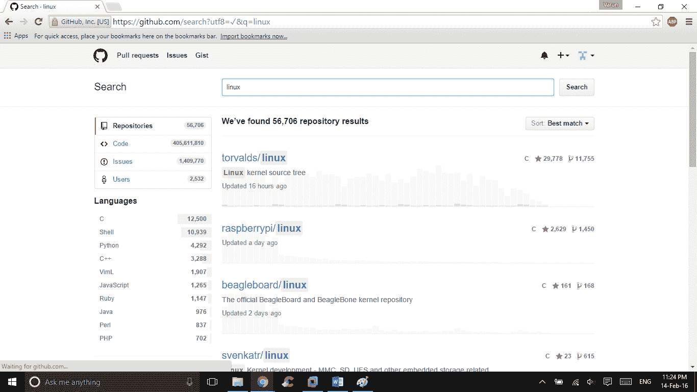
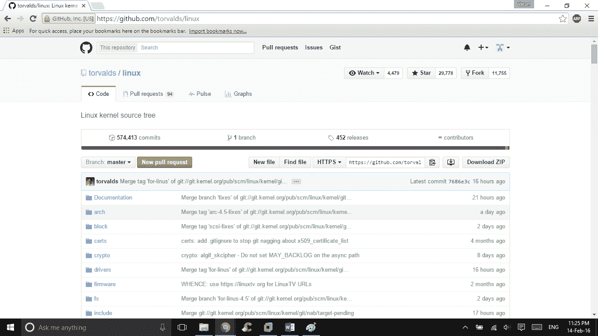
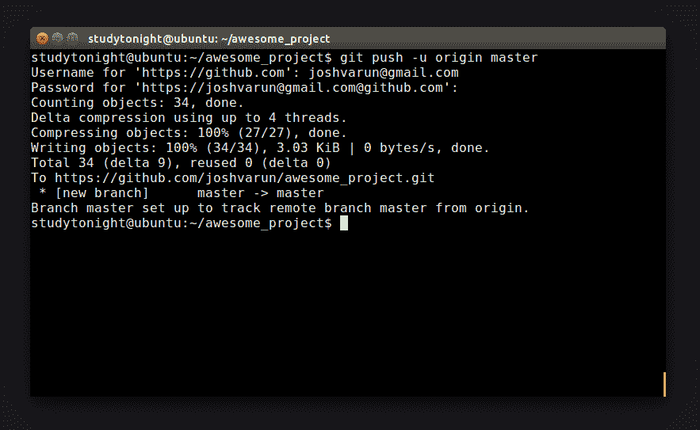
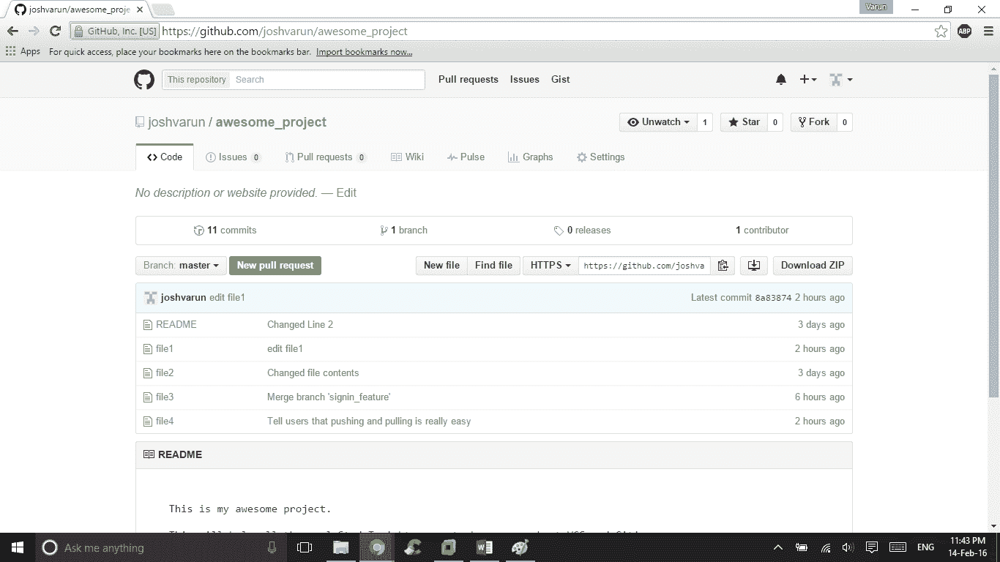

# GIT：使用 Github

> 原文：<https://www.studytonight.com/github/github>

有很多选项允许您托管您的仓库。如果你精通系统管理，你可以自己托管它们。如果你不介意你的仓库是公共的，那么有很多服务可以免费托管，例如 Bitbucket、CloudForge、Assembla 等。这些服务中最受欢迎的是`GitHub`。

GitHub 拥有数百万开发人员的用户群，并提供优秀的工具来管理您的项目。去 [GitHub](https://github.com/) 设置账号。一旦你注册了，GitHub 会为你提供所有他们必须提供的功能



我们建议您通过游览来更好地了解 GitHub。您可以搜索仓库，例如，继续并在搜索栏中键入“Linux”。第一个结果是 Linux 内核源代码树。它后面的小图显示了人们在一段时间内提交到仓库的频率。让我们去看看这一页。



我们看到了项目的简要描述以及关于仓库的一些统计数据。随着时间的推移，Linux 仓库已经有超过 50 万次提交和 452 次发布。那是巨大的！



如果 GitHub 不能轻松地提供这些信息，我们将不得不将仓库的一个副本克隆到我们的计算机上，以便能够发现 GitHub 项目的活跃程度，开始是什么样的项目，代码当前是什么样子，或者我们可能有任何其他问题。因为他们在 GitHub 上托管，所以我们可以从我们的网络浏览器中找到所有的信息。

GitHub 还提供了一些其他不错的特性。有些项目有自己的问题跟踪器。如果我们点击页面的问题标签，我们可以看到人们在哪里归档 bug 并询问关于所述项目的问题。如果您不熟悉问题跟踪器，它为人们提供了一个很好的地方来提出和讨论关于有问题的项目的问题，并且通常提供工具来帮助项目维护人员有效地解决这些问题。

拉请求是一个有趣的概念，起源于 GitHub。请记住，在 GitHub 中，提取代码意味着我们从远程仓库中合并变更。遵循这一逻辑，当您有代码想要某人拉进他们的项目时，您使用拉请求。这是一个非常有用的协作工具。

让我们停下来想想我们的`awesome_project`。它远不如 Linux 活跃，但我们仍然希望在 GitHub 上发布它。在右上角，我们可以看到一个创建新回购按钮。就名字而言，我们现在只使用令人敬畏的项目。如果需要，请提供描述。这个库将是公开的，因为我们是免费的。

没关系，我们还是想和你们分享我们的仓库！GitHub 在创建一个全新的仓库方面提供了一些帮助。但是由于我们有自己的仓库，我们只需要完成最后两个步骤。我们需要添加 GitHub 作为一个远程，我们需要将我们的更改向上推。

让我们继续这样做:

```sh
$ git remote add origin https://github.com/joshvarun/awesome_project.git
$ git push -u origin master

```



我们将运行他们说在项目中运行的线路。我们需要提供用户名和密码。这种推动似乎奏效了。我们将切换回 GitHub，刷新页面，我们就有了我们的项目历史。你可以看到，在整个项目过程中，我们做了 11 次承诺。



像 GitHub 这样的许多托管服务提供了一个功能完善的界面来帮助您管理和探索您的项目历史。一些团队已经开始依赖这些服务来帮助他们更有效地合作。

* * *

* * *