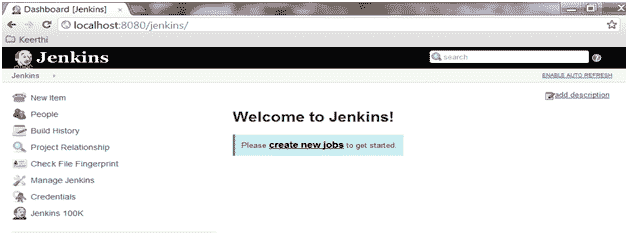
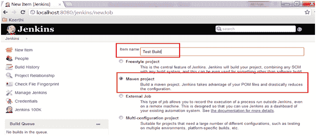
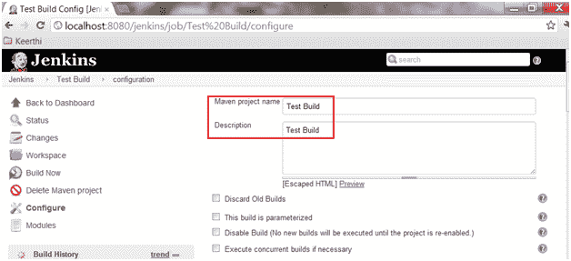
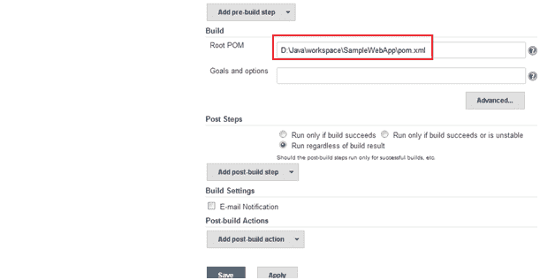
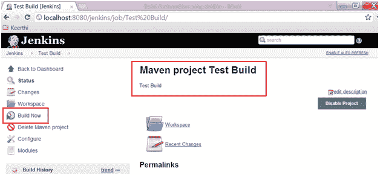
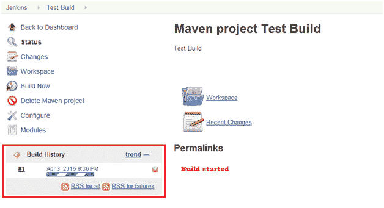
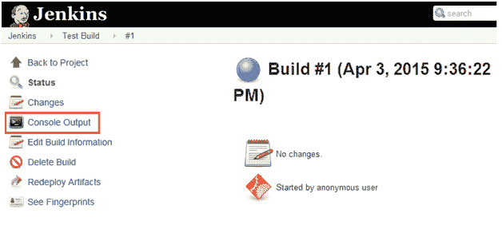
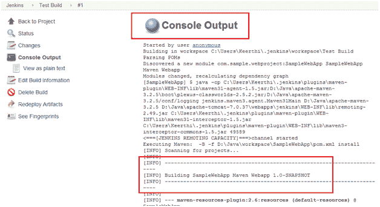
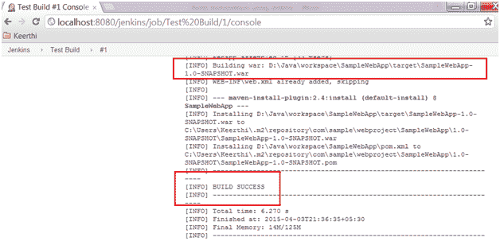
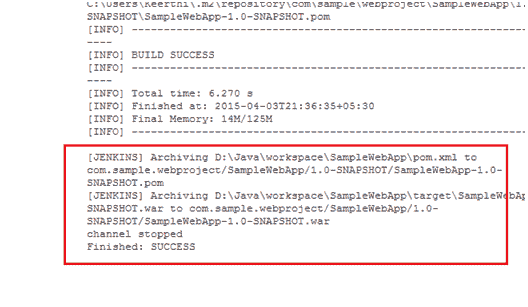

# 如何配置 Jenkins 构建服务器

> 原文：<https://www.studytonight.com/jenkins/configuring-jenkins>

在上一章中，我们详细研究了什么是 Jenkins，它的用法以及与 Jenkins 一起工作时的最佳实践。现在，让我们看看如何在本地机器上配置 Jenkins。

**注意:**下面的步骤展示了如何在 windows 环境中安装和配置 Jenkins，以及如何使用 Apache Tomcat web 服务器。

* * *

## Jenkins 设置

1.  从 https://jenkins-ci.org/下载最新的 Jenkins 战报。向右上方点击链接最新和最大的下载最新的战争文件。
2.  在我们机器的本地网络服务器中部署 **Jenkins.war** 文件。例如雄猫
3.  Start the server and open the browser and hit the URL [http://localhost:8080/jenkins](http://localhost:8080/jenkins)

    

5.  Click on the **create new jobs** link to configure a project for build automation. Enter the details of the project as shown below and click OK.

    

7.  In the next page, fill all the required details like - description, path of the project's pom.xml and other details and click save.

    

    

    

*   A project/job is created in Jenkins. As shown below:

    

    *   Click on the **Build now** option as shown above. This will read the pom.xml and pull out the latest code and executes a build process and generates the jar/war file accordingly.

    

    *   Click on the build number link and it opens up the build details. Click on the console output to see the logs of the build.

    

    

    

    

* * *

* * *