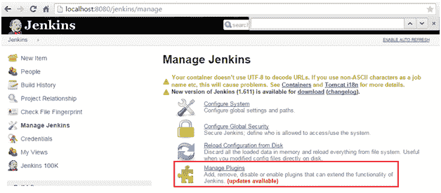
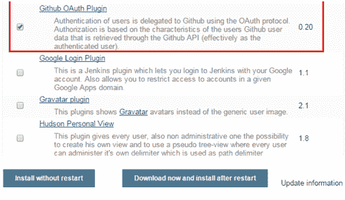
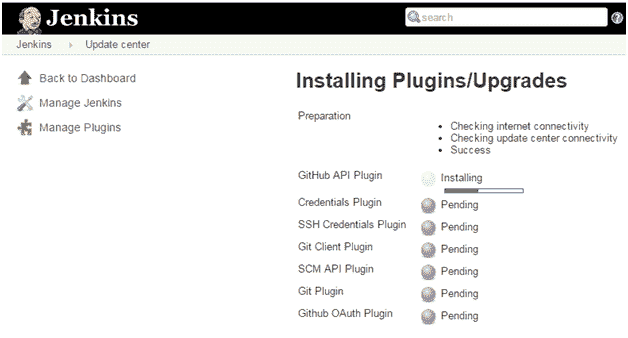
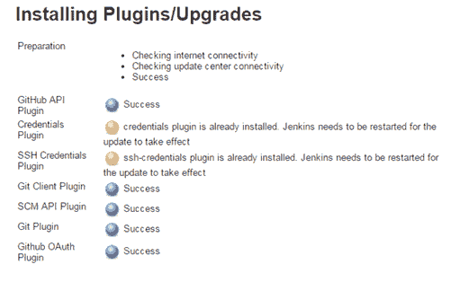
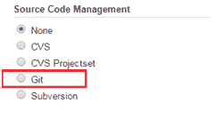

# Jenkins 插件管理

> 原文：<https://www.studytonight.com/jenkins/plugin-management>

Jenkins 是这样一个方便的工具，可以通过添加额外的插件来轻松扩展，以适应更多的功能。例如，包括 Git 作为配置管理选项，JUnit 插件等。这可以通过选择选项**管理 Jenkins-管理插件**来轻松完成，如下所示。

从管理 Jenkins 屏幕点击**管理插件**。这将进入列出所有可用插件的页面。单击可用选项卡，从可用插件列表中选择需要安装的插件。例如，选择如下图所示的 Github 插件，点击页面底部的<u>不重启安装</u>按钮。这将下载 github 插件，并安装在 Jenkins。

当您单击“安装”时，下载将开始。

安装完成后，您将看到一条成功消息。

现在，打开任何创建的构建作业，点击**配置**。Git 选项将添加到**源代码管理**下。

* * *

* * *