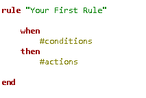

# Drools 中使用的不同术语

> 原文：<https://www.studytonight.com/drools/terms-in-drools>

在本教程中，我们将介绍 Drools 中使用的一些重要术语。这对初学者来说是很好的了解，这样你就可以开始理解 Drools 世界中的各种术语了。

1.  **Rules:** `Rules` are the heart of the **Rule Engine**. In rules you specify the condition and then the execution part of the condition. Below is the **syntax** of the rule in drools:

    

3.  **事实:**发射规则的物体被称为`Facts`。它可以是一个简单的 Java POJO，也可以是一个复杂的对象。 **Java 对象**是 Drools 中事实的同义词

5.  **Session:** `Knowledge Session`在 Drools 中是触发规则的核心组件。**知识会话**保存所有规则和其他资源。`Knowledge Session`是从`KnowledgeBase`创造出来的。为了触发规则，事实被插入到会话中，并且当满足特定规则的条件时，随后的规则被触发。`Session`有两种类型:

**a)无状态知识会话**:当规则被触发时，无状态知识会话不会跟踪事实的变化。简单地说，一旦我们在会话中插入了所有事实并触发了所有规则，那么这些规则就不能在更新的事实上触发。打个比方，类似于**网络应用程序**，我们不跟踪**会话**。

**b)有状态知识会话**:在有状态知识会话中，一旦所有**事实**被插入并且**规则**被触发，并且一个规则正在更新事实并且发布事实的更新，另一个规则也可以被触发，因为事实仍然在**会话**中。类似于在**网络应用程序**中，直到**会话**激活，您添加到购物车的所有项目都是可见的。

9.  **知识库:**这是一个管理**规则**、**流程**和**内部类型**集合的界面。在`Drools`中，这些通常被称为知识定义或知识

11.  **议程:**这是一个逻辑概念。议程是规则等待被触发的合乎逻辑的地方。

13.  **激活:**当时规则的一部分。`Activations`被放置在启动适当规则的议程中。

* * *

* * *