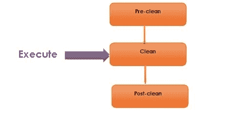
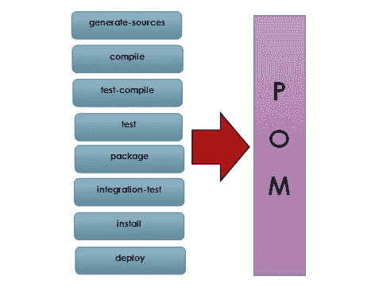

# Maven 构建生命周期

> 原文：<https://www.studytonight.com/maven/maven-build-life-cycle>

什么是构建生命周期？为了执行任何 maven 项目的任务和目标而定义的步骤序列在 maven 中被称为构建生命周期。Maven 2.0 版本基本上是一个面向构建生命周期的版本，并明确表示这些步骤已经被很好地定义，以在构建生命周期成功执行后获得期望的输出。

Maven 附带 3 个内置构建生命周期，如下所示:

*   **清洁** -该阶段涉及项目的清洁(对于全新的构建&部署)
*   **默认** -此阶段处理项目的完整部署
*   **站点** -这个阶段处理生成项目的 java 文档。

现在，我们将深入研究上述内置构建生命周期中涉及的详细阶段。

* * *

## Maven:构建清洁阶段的生命周期

如上所述，这个清理阶段用于清理项目，并为新的编译和部署做好准备。用于相同目的的命令是 mvn 后清理。调用此命令时，maven 通过在内部执行以下命令来执行以下任务:

1.  mvn 预清洗
2.  mvn 清洁
3.  mvn 后清洗

这个 maven 的清理是一个目标，在执行它时，通过删除所有编译的文件来清理输出目录(目标文件夹)。

**注意:**无论何时调用任何生命周期的 maven 命令，maven 都会一直执行到调用阶段。例如，当调用“mvn 清理”时，maven 将只执行阶段清理。但是，没有调用编译/部署/站点阶段。

* * *

## Maven:构建生命周期(默认)

下面是 maven 构建生命周期(默认)中的阶段列表。这些阶段将通过 maven 命令调用。

| 生命周期阶段 | 描述 |
| 生效 | 考虑到构建所需的所有信息，验证并确保项目是良好和完美的 |
| 生成源 | 生成任何源代码以将其包含在编译过程中 |
| 过程源 | 处理源代码，以防需要应用某些过滤器 |
| 生成源 | 生成包含包的任何源代码 |
| 流程-资源 | 将资源复制到目标文件夹并准备打包的过程 |
| 编制 | 项目源代码的编译。 |
| 过程类 | 为编译生成的类文件执行字节码增强 |
| 生成测试源 | 复制和处理测试目标目录中的资源。 |
| 测试编译 | 编译测试目标目录中的源代码 |
| 试验 | 使用合适的测试框架执行/运行测试。注意:这些测试用例不考虑打包和部署 |
| 准备包装 | 在发送到最终包装前执行任何最终更改/验证。 |
| 包裹 | 将成功编译和测试的代码打包成一些可分发的格式——JAR、WAR、EAR |
| 集成前测试 | 在执行集成测试之前执行操作。这可能需要为应用设置一些环境更改。 |
| 集成测试 | 将应用部署到可以运行集成测试的环境中。 |
| 整合后测试 | 基本上，清理集成前测试阶段的环境。 |
| 核实 | 执行质量检查，并确保符合要求的标准 |
| 安装 | 在本地仓库中安装应用。任何其他项目都可以将此用作依赖项。 |
| 部署 | 最终的包将被复制到一个远程仓库中，可能作为一个正式的版本，也可以提供给其他开发人员。 |

* * *

## Maven:站点生命周期(站点)

除了清理、编译源代码、构建应用的可部署格式之外，maven 还有比这些阶段做得更多的阶段。这个阶段是 maven 提供的重要特性之一，它生成任何 java 项目的详细文档。

本项目文件包含下列专用阶段:

*   现场前
*   位置
*   事后网站
*   现场部署

maven 中用于为给定项目生成 javadocs 的命令是“ *mvn site* ”。基本上，当这个命令被调用时，maven 会调用文档生成和其他报告生成插件。

**Doxia** 基本上是 maven 用于内容生成的框架。这会以静态和动态方式生成内容。

* * *