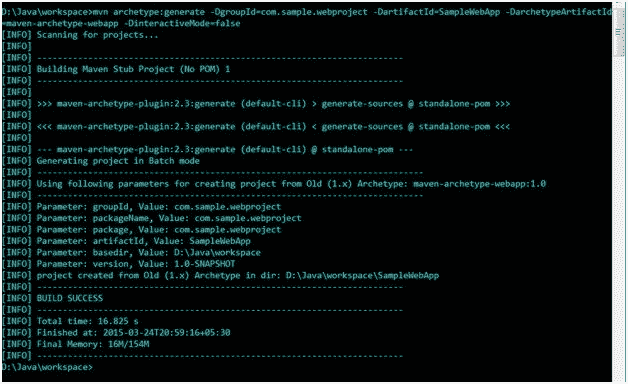
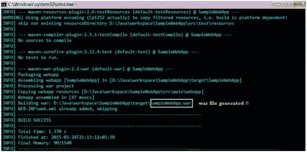

# 使用 Maven 模板创建 Web 应用

> 原文：<https://www.studytonight.com/maven/maven-web-application>

在前面的教程中，我们学习了如何使用 maven 原型创建一个简单的 java 项目，也了解了 maven 如何基于所选原型组织项目结构。在本章中，我们将学习如何使用 maven 创建 web 应用项目。

用 maven 创建 web 项目最简单的方法是使用 maven 原型**maven-原型-webapp** 。只需打开命令提示符，导航到需要创建项目的文件夹。运行下面提到的命令，Maven 将开始执行该命令，并将为基于 web 的应用创建一个完整的项目结构。

```
mvn archetype:generate -DgroupId=com.sample.webproject -DartifactId=SampleWebApp -DarchetypeArtifactId=maven-archetype-webapp -DinteractiveMode=false
```



下面是 maven 使用**maven-原型-webapp** 插件生成的 web 应用的项目结构。

| 文件夹结构 | 描述 |
| SampleWebApp | 包含源文件夹和 pom.xml 文件。 |
| src/main/webapp | 包含默认 index.jsp |
| src/main/webapp/WEB-INF | 包含 web.xml 文件。 |
| src/main/resources | 包含使用的资源文件。(图像或属性文件) |

* * *

## 使用`maven-archetype-webapp`插件生成的默认文件

在任何 Java/J2ee Web 应用中，总会有一个文件驻留在 WEB-INF 文件夹 web.xml 下，这被称为**部署描述符**文件。该文件主要用于为以下主要因素配置 servlets:

*   拦截来自客户端(浏览器端)的请求，并在请求到达后端资源之前验证它们。
*   用于在响应被定向到客户端之前操纵来自服务器端的响应。

下面是 maven 为 web 应用生成的 **pom.xml** 。

```
<project  xmlns:xsi="http://www.w3.org/2001/XMLSchema-instance"
  xsi:schemaLocation="http://maven.apache.org/POM/4.0.0 
  http://maven.apache.org/maven-v4_0_0.xsd">
  <modelVersion>4.0.0</modelVersion>
  <groupId>com.sample.webproject</groupId>
  <artifactId>SampleWebApp</artifactId>
  <packaging>war</packaging>
  <version>1.0-SNAPSHOT</version>
  <name>SampleWebApp Maven Webapp</name>
  <url>http://maven.apache.org</url>
  <dependencies>
    <dependency>
      <groupId>junit</groupId>
      <artifactId>junit</artifactId>
      <version>3.8.1</version>
      <scope>test</scope>
    </dependency>
  </dependencies>
  <build>
    <finalName>SampleWebApp</finalName>
  </build>
</project> 
```

利用这个原型，maven 生成了一个名为**index.jsp**的示例 JSP 文件，其内容如下所示:

```
<html>
   <body>
       <h2>Hello World!</h2>
   </body>
</html> 
```

* * *

### 构建和部署 Web 应用

只需打开命令提示符，导航到 web app 的根文件夹，发出命令`mvn clean package`。该命令将编译、测试并生成项目的 war 文件。




生成警告文件后，将警告文件复制到网络服务器(您使用的任何网络服务器)的目标文件夹中，并启动服务器。您可以通过调用 web 项目的 URL 来测试应用:

**http://localhost:8080/<project name>/index . JSP**


* * *