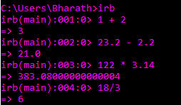
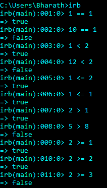
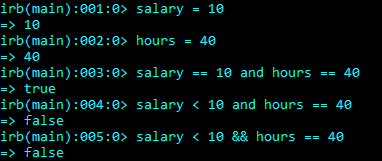

# Ruby 中的运算符和表达式

> 原文：<https://www.studytonight.com/ruby/operators-in-ruby>

在本课中，我们将了解 ruby 包含的不同`operators`以及如何在`expressions`中使用它们。

* * *

## 鲁比:加法运算符

`+`符号被使用。它既是二元运算符，也是一元运算符。顾名思义,`Binary operator`需要运算符两侧的两个操作数/值来执行运算，一元运算符只需要一个操作数。一元加号没有任何作用，它的存在只是为了与一元减号对称。

```
For example : 1 + 2 *//binary addition*
value = +3 *//unary plus*

```

## 鲁比:减法运算符

`-`符号被使用。您可以使用一元减号来反转变量的符号。

```
For Example : 23.2 - 2.2 *//binary subtraction*
value = -3 *//unary minus*

```

## 鲁比:乘法运算符

`*`符号被使用。对两个数字操作数执行乘法运算。

```
For Example : 122 * 3.14
```

## 鲁比:除法运算符

`/`符号被使用。返回第一个数字操作数除以第二个操作数的结果。

```
For Example : 18 / 3
```



## 鲁比:模运算符

除法后返回余数。

```
For Example : 13 % 2 *//returns 1*
```


## 鲁比:指数算子

如果你想提升`x`到`y`的力量(即)`x ^ y`。

```
It is done by x ** y
```


2 的幂 4 返回 16。

* * *

## Ruby:运算符优先级

`Operators`有一些`precedence`的顺序，它决定了表达式的求值顺序。

```
Consider this example, 1 + 2 * 3
```

我们可能会认为 **1 + 2** 执行，结果 **3** 将乘以 **3** 并给出 **9** 。但是**乘法**、**除法**和**指数**运算符的优先级高于**加法**和**减法**运算符。因此，首先执行 **2 *3** ，并将结果添加到 **1** 中，并给出 **7** 作为答案。


但是，我们可以通过将子表达式放在括号中来修改优先顺序。在表达式 **1 + 2 * 3** 中，如果 **1 + 2** 需要先执行，将该表达式放在括号中。

```
(1 + 2) * 3 this expression produces 9
```


* * *

## Ruby:关系运算符

`Relational operators`用于比较。他们返回`Boolean values`。我们比较两个值是否相等、不相等、小于、大于、小于或等于以及大于或等于。

`==`符号被使用。用于检查两个数是否相等。

```
1 == 1 returns true because 1 is equal to 1.
```

`<` -小于

`>` -大于

`<=` -小于或等于

`>=` -大于或等于

**小于运算符**检查一个数字是否小于另一个数字，如果**是**则返回**真**否则返回**假**。**小于或等于运算符**检查一个数是否小于另一个数，还检查一个数是否等于另一个数，如果任一条件正确，则返回真，否则返回假。**大于和大于等于**也一样，检查是否大于**。**

 **

比较两个值的另一种方法是使用**通用比较**运算符。它根据操作数返回 **0(零)**、 **-1** 或 **+1** 。如果两个值相等，则返回**零**，如果第一个操作数小于第二个操作数，则返回 **-1** ，如果第一个操作数大于第二个操作数，则返回 **+1** 。

```
The General Comparison operator is <=>(< = >).
```


`Relational operators`也可以搭配琴弦使用。


如果相同，则返回真。你可以看到它为操作**【苹果】=【苹果】**返回假，这是因为 Ruby 区分大小写，一个单词有`Uppercase A`，而另一个单词有`lowercase a`。我们也可以使用带字符串的**通用比较运算符**。


比较**【车】**和**【车】**时，返回 **0** ，因为两者相等。将**【驾驶室】**与**【汽车】**进行对比时，由于**【驾驶室】**中**【b】**一词的第 3 个字母小于**【汽车】**中的**【r】**，因此返回 **-1** 。

* * *

## 鲁比:逻辑运算符

`Logical operators`允许您组合两个或多个关系表达式并返回`Boolean`值。

*   **和运算符:**

当所有表达式都为真时，它返回真；如果其中一个表达式的计算结果为假，它返回假。您可以使用`and`或`&&`使用该运算符。



表达式**工资== 10 & &小时== 40** 返回真，因为我们已经将工资和小时变量的值初始化为 10 和 40。对于所有其他情况，它将返回 false。

*   **或运算符:**

`OR`当任意一个条件/表达式为真时，运算符返回真，只有当所有条件/表达式都为假时，运算符才返回假。您可以使用`or`(或)`||`来使用该运算符


可以看到，即使只有一个表达式为真**或**运算符也返回真。

*   **非运算符:**

`NOT`运算符否定关系表达式。该操作员可以使用`not`(或)`!`。


在第一个表达式中，它返回 false，因为表达式 **salary == 10** 返回 true，not 运算符否定 true 并返回 false。同样，表达式**工资< 10** 返回假，非运算符否定并返回真。

* * ***