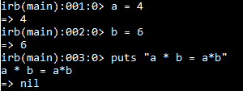

# Ruby 中的插值

> 原文：<https://www.studytonight.com/ruby/interpolation-in-ruby>

`Interpolation`是关于在字符串内部使用表达式和值。例如，考虑一个名为 **a** 的变量，它包含 4，而变量 **b** 包含 6。现在，我们要打印 **4 * 6 = 24**

```rb
a * b = a*b. Will this work?
```



没有。它返回了一个意外的结果。我们需要打印 **a** 、 **b** 和 **a*b** 的数值。现在，`Interpolation`进入画面。使用`Interpolation`，我们可以在字符串中包含表达式和值。

```rb
To Interpolate the value of a, do the following: puts " #{a} "
```


它返回一个的**值，而不是作为字符串**的**“a”。同样，我们必须对变量 **b** 和表达式 **a*b** 做同样的操作。**


Ruby 计算变量或花括号之间的表达式的值。

`#{a*b}`

Ruby，计算 **a*b** 的值并插值成字符串。

#### 插入字符串:

考虑一个有值的变量。

`person = "Sachin Tendulkar";`

现在，我们要展示**“我爱萨钦·坦杜尔卡”。**


我们期待**“我爱萨钦·坦杜尔卡尔”**但是它显示了**“我爱这个人”**。现在，让我们插入变量`person`。


* * *