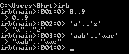

# Ruby 中的范围

> 原文：<https://www.studytonight.com/ruby/ranges-in-ruby>

范围是一系列数据。例如，数字 **0** 到 **9** 是一个范围。字母 **a** 至 **z** 为 a `range`。我们也可以定义自己的范围。

```rb
The syntax for defining range is startvalue..endvalue
```

示例: **0..9** 是包含从 0 到 9 的值的`range`。同样**‘一’..z'** 也是一个`range`里面有所有的字母。

您也可以创建自己的范围，如**“aab”..aae'** 包含值 **aab** 、 **aac** 、 **aad** 、 **aae** 。



`Range`是 Ruby 中灵活的数据类型。一旦定义了范围，我们也可以在范围上调用方法。


* * *

## Ruby:范围数据类型的方法

*   `include()`方法用于检查特定元素是否存在于范围内。如果该元素存在于该范围内，则返回`true`，否则返回`false`。
*   `min()`方法返回范围的**最小**元素。
*   `max()`方法返回范围的**最大**元素。
*   `each` method is used to loop around a range and print all the elements of a range on the shell output.

    我们可以这样显示`range`的每个元素/成员:

    ```rb
    letters.each { |letter| print(letter) }
    ```

    

    在上面的代码中，范围**‘a’的每个成员..存储在变量`letters`中的 z'** 在每次迭代中被复制到变量`letter`中。这是通过使用符号`||`来完成的。然后，我们可以用这个值做任何我们想做的事情。这里，我们刚刚打印了变量`letter`中的值。`Ranges`通常用作循环中的条件。

*   There is also another useful operator called **case equality operator** `(===)`. Using this operator, we can determine that whether any particular element is present in the given range or not. If the element is present in the range it returns **true**, else returns **false**.

    

    这里元素**‘c’**出现在变量`letters`中，所以它返回**真**。同样的，`digits`是一个包含 0 到 9 范围的变量，我们正在用`case equality operator`检查 **100** 是否在范围内，它返回 false 表示 100 不属于这个范围。

* * *