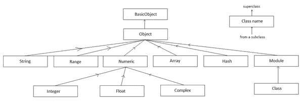
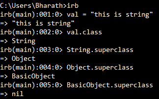
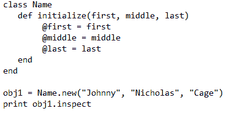
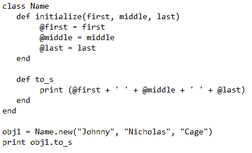
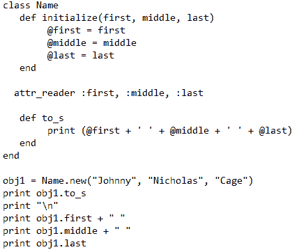
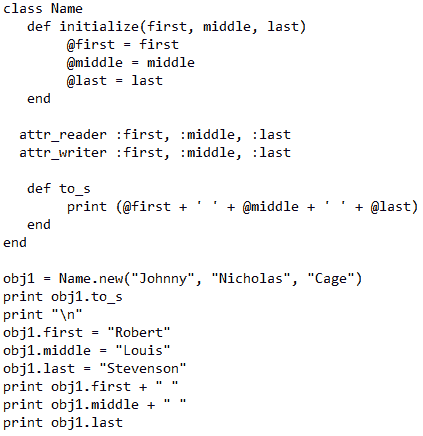

# Ruby类

> 原文：<https://www.studytonight.com/ruby/class-in-ruby>

`Ruby`是一种纯面向对象的编程语言。面向对象程序由`Classes`和`Objects`组成。`object`是一个实体，它充当数据的容器并控制对数据的访问。

A `class`就像一个蓝图，允许你创建对象，并创建与这些对象相关的方法。例如，您可以使用形状类来制作不同的形状，如**矩形**、**正方形**、**圆形**等。一个`object`就是一个`class`的例子。



**等级体系**

`Ruby`有很多班。并非所有的类都包含在这个层次结构中。**类基本对象**是所有类中的**超类**。



我们已经将局部变量**值**设置为一个字符串。当我们通过调用**来检查**值**的等级时。类**方法，它告诉我们 **val** 的类是 String。然后，当我们检查字符串的超类时，通过调用**。超类方法**它告诉我们`Object`等等。

```
The reason the last value is nil is because the class BasicObject has no superclass.
```

* * *

## 在 Ruby 中定义类

`Ruby`中的一个类以关键字`class`开头，后面跟着类的名称。


* * *

## 在 Ruby 中创建对象

使用方法`new`创建Ruby中的`Objects`。`new`法属类**类**。

```
obj1 = Shape.new
```

这是创建对象的语法。这里 **obj1** 是对象名， **Shape** 是类名。

**类**的另一个例子:



在上面的程序中，我们创建了一个名为**名为**的类。

方法`initialize`是一种特殊类型的方法，由对象创建中的`new`方法调用。`initialize`方法接受存储在实例变量**@第一个**、**@中间**和**@最后一个**中的三个参数，而变量**第一个**、**中间**和**最后一个**是局部变量。`inspect`方法给出关于类名和实例变量及其值的列表的信息。

这是程序的输出:


使用**到 _s 方法**的另一个例子:

```
to_s (to string) method allows us to display the state of the object. State refers to all the data that is being stored in the class objects.
```



程序的输出是:


当我们将程序的最后一行改为**时，打印 obj1** 。这里我们是字面上的打印对象，让我们看看这个变化后的输出:


所以，当打印对象时，自动调用`to_s method`。此方法可用于通过在任何特定时间显示对象的状态来调试或测试代码。

* * *

### Ruby:访问类和对象属性

我们还可以编写方法来检查对象的单个字段或属性。


您必须使用**属性/字段**的名称来定义方法。这里我们已经为领域**首先**创建了一个方法。使用`object name`调用该方法。

程序的输出是:


同样，我们可以检查对象的每个属性。我们可以用另一种简单的方法做到这一点。



属性可以通过以下语句来检查 **attr_Reader:第一个，:中间，:最后一个**。该方法返回使用`print`方法打印的对象的属性值。

程序的输出是:


* * *

### 使属性可写

通过以下语句可以使属性**可写/可修改**:

```
attr_writer :first, :middle, :last
```



这里，我们修改了对象 **obj1** 的实例变量。程序的输出是:


这里可以看到**第一个**、**中间**、**最后一个**值被修改打印。

* * *