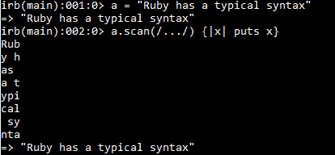
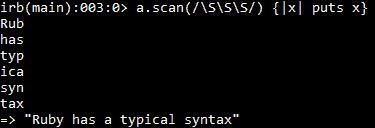

# Ruby 中的正则表达式

> 原文：<https://www.studytonight.com/ruby/regular-expressions-in-ruby>

**正则表达式**基本上是用来处理 ruby 中的字符/文本模式的。


`sub()`方法不是正则表达式。但是它解释了何时使用正则表达式。它用用户指定的其他字符串替换字符串的一部分。它包含两个参数，第一个参数是要被**取代**的`substring`，第二个参数是要被取代的`substring`。

例如，要将 **badjohnny** 中的子字符串 **bad** 替换为**bad**我们可以使用:

```rb
puts "badjohnny".sub('bad','good')
```

它用`good`代替`bad`。但是它不会替换子字符串的所有实例。


您可以看到它只替换了子字符串**坏的**的第一个实例。使用`gsub()`方法替换子串的所有实例。


像这样的事情可以在**正则表达式**中完成。

* * *

## 鲁比:正则表达式


变量`a`有值**“嘿，你想要什么？”**。如果你想把**“嘿”**换成**“打扰一下”**，那你可以用正则表达式。如前所述，`sub()`方法有两个参数。我们必须用我们想要的字符串替换前三个字符。

第一个参数包含`/^.../`

正则表达式以正斜杠`/`开始和结束。`^`符号用于匹配从字符串开头开始的子字符串。它没有用替换中间的字符，而是从头开始替换字符。**圆点** `.`代表任何字符，它可以是数字、字母、符号任何东西

现在，它所做的是，从开始匹配 3 个字符，在我们的例子中是**“嘿”**，并用用户指定的字符串替换它。



* * *

## Ruby:扫描方法

变量**一个**包含一些值。使用`scan()`方法，我们将扫描变量 **a** ，并使用正则表达式，我们读取字符并以我们想要的方式显示它。

正则表达式`(/.../)`读取三个字符，并将其临时存储在变量 **x** 中，使用该值我们可以进行所需的操作。如前所述，点代表任何字符，因此它可以读取任何三个字符(包括空格)。我们刚刚打印了 **x** 的数值。



在正则表达式中，我们使用了`'\S'`。`\S`为非空白字符。可以是**号**或任何**字母**。我们给出了三个 **\S\S\S** ，它遍历变量，找到三个非空白字符，存储在变量 **x** 中。

首先读取 **x** 的`"Rub"`店铺并打印出来。然后它读取`"y"`即 **y** 和一个**空格**，它忽略它，因为它包含空格字符。同样，典型中的`"a"`和`"l"`被忽略。

* * *