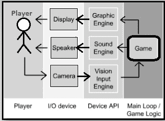

# 理解游戏架构

> 原文：<https://www.studytonight.com/3d-game-engineering-with-unity/game-development-architecture>

富有创造力和艺术感的人，在分享他们的梦想、想法和愿景中找到奉献。画家通过绘画做到这一点，而音乐家创作音乐。同样，程序员希望自动化，让你的生活变得轻松，游戏设计师希望通过他们的游戏让他们的想法和想法变得生动起来。

每一个标准游戏都由一些系列的关卡组成:嵌入并与游戏的故事情节紧密相关，要直播的动作和冒险序列，要体验的壮观视觉效果，它们通过探索和展现我们的战术和战略制定技巧来挑战我们的心智能力。游戏是所有娱乐媒介中最独特的，因为它能与观众互动。

大多数游戏都赋予玩家故事中最重要的角色:英雄。这是让玩家融入游戏的好方法。

* * *

## 游戏的架构

游戏的架构和结构类似于软件。但是它确实有一些额外的组件，这使得它不同于软件。每个游戏都有以下组件:

*   图形引擎
*   声音/音频引擎
*   渲染和视觉输入引擎
*   输入/输出设备(如鼠标、键盘、扬声器、显示器等)
*   动态链接库文件和驱动程序/设备接口

所有这些上面提到的组件结合在一起，使一个游戏可以充分发挥它的作用。在讨论它们之前，让我们先搞清楚什么是引擎。引擎是一个完整过程的自处理组件，它在原始过程之后自动运行。

* * *

### 图形引擎

图形引擎是一种软件，它与应用一起帮助在计算机的显示设备上绘制图形。

计算机领域中的**引擎**一词指的是帮助对程序执行某种确定类型的处理的软件，例如文本到语音引擎、数据库引擎、布局引擎和图形引擎。图形引擎有助于通过提高分辨率和单位面积像素数量来改善游戏图形。这个引擎也让你的游戏场景清晰流畅。

* * *

### 声音/音频引擎

音频/声音引擎是由处理声音的算法组成的组件，内置程序被写入其中以处理游戏中嵌入的声音效果。它能够使用中央处理器或任何专用的**专用集成电路**进行计算。抽象 API，如 Open-AL、SDL 音频、X-Audio 2、网络音频等。可以在这个引擎中使用。

* * *

### 渲染和视觉输入引擎

渲染引擎和视觉输入系统使用不同的技术，如光栅化和光线跟踪，生成三维动画图形。由于被编程和编译为直接在任何中央处理器或图形处理器上执行，大多数渲染引擎都是基于一个或多个渲染应用编程接口开发的，如为图形处理单元(GPU)提供软件抽象层的 Direct3D 和/或 OpenGL。

像 DirectX 或 OpenGL 这样的低级库被广泛地集成到游戏中，因为它们提供了对不同计算机硬件的独立硬件访问。这些硬件设备可以是输入设备，如鼠标、键盘和操纵杆；网络设备，如网卡和声卡。

* * *

### 输入输出设备

用于在计算机中输入数据和程序的设备称为**输入设备**。输入设备可以读取数据，并将其转换成计算机可以使用的形式。输出设备可以将机器加工的成品生成人类可用/可读的形式。对于游戏来说，用户和他/她玩的游戏之间应该有很强的互动。因此，像鼠标、键盘、操纵杆和显示器这样的外围设备在游戏互动中扮演着重要角色。

* * *

### 动态链接库文件和驱动程序/设备接口

一个 **DLL(动态链接库)**文件，是一种包含以程序形式编写的指令的文件，其他程序可以调用或使用这些指令来执行某些任务。以这种方式，不同的程序可以共享已经被编程到单个文件中的能力和特征。

这些系统级文件对构建游戏的架构起到了支持作用，并有助于使其表现良好。你可能已经注意到，如果你已经安装了一个你想玩的游戏，你点击了可执行文件(。exe 文件)来运行游戏，而就在游戏开始前，一条错误消息弹出，并带有一条消息-**<special _ dll _ name>。dll 缺少“**”。这些文件是支持文件，你的系统应该有使游戏工作。

同样，设备应用编程接口可以定义为**应用编程接口**，它允许开发人员创建任何最终可以与插入或安装在您系统中的硬件设备交互的应用。设备应用编程接口通常为最终用户提供使用其插入的或关联的硬件与系统交互的机会。大多数游戏(流行的)都需要这些设备驱动程序和应用编程接口来使游戏在所有组件成功运行的情况下工作。

这五个组件构成了游戏的内部和外部架构。

* * *

* * *