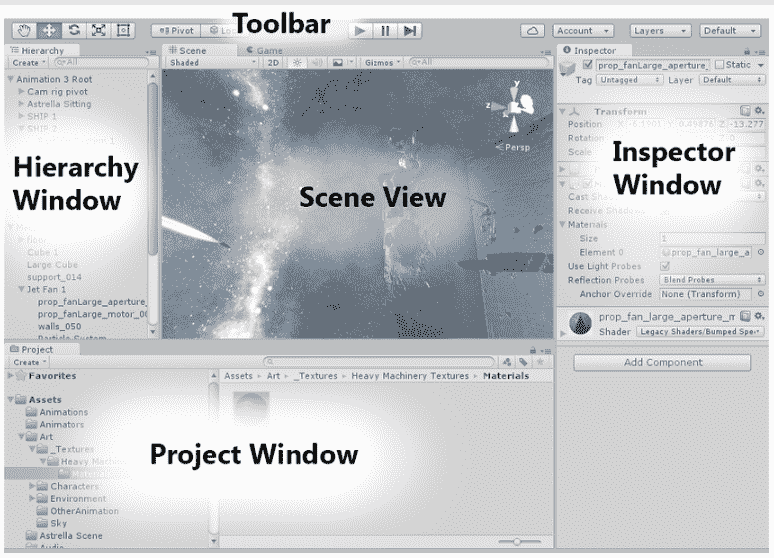
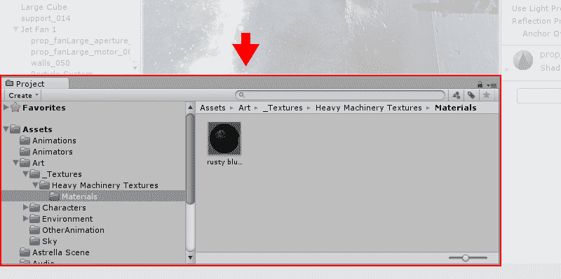
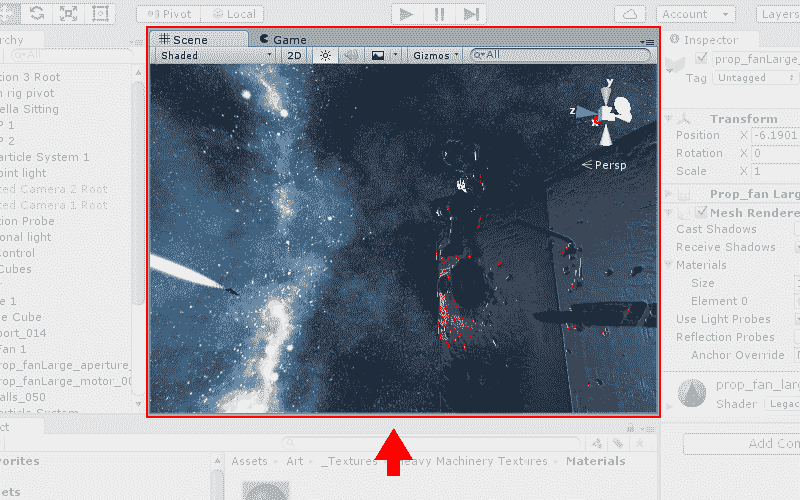
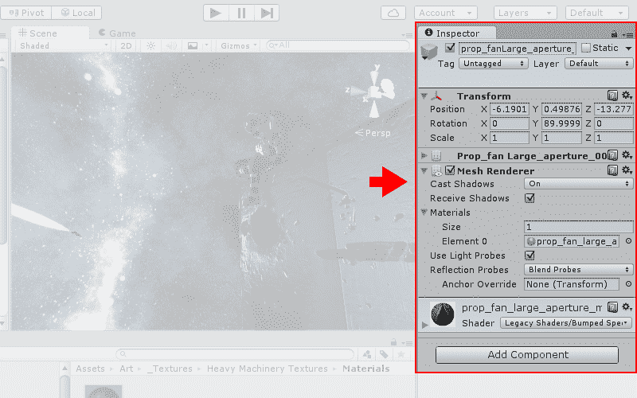

# Unity3D 简介

> 原文：<https://www.studytonight.com/3d-game-engineering-with-unity/introduction-to-unity>

在本教程中，您将了解**Unity3D 游戏引擎**和**Unity3D** 的基本元素。

Unity 是目前全世界开发者使用的最流行的游戏引擎，这是有充分理由的。它有一个强大的可视化界面，用于制作游戏、跨平台开发和活跃的贡献社区。Unity 是一个跨平台游戏引擎，主要用于为 PC、控制台、移动设备和网站开发视频游戏和模拟。它是由 Unity Technologies 开发的，并在 2005 年的苹果全球开发者大会上首次仅针对 OS X 发布，此后它几乎扩展到了所有可用的平台。

* * *

## Unity3D 的特点

这里从技术角度列出了 Unity 的众多特性。这些是:

*   **创建和销毁游戏对象**
*   **访问组件**
*   **游戏对象的事件**
*   **处理矢量变量和定时变量**
*   **面向物理的事件**
*   **协同和返回类型**

* * *

## Unity3D：界面/窗口

如您所见，Unity 的主编辑器窗口，您会注意到 Unity3D 的窗口是由小的独立窗口组成的，这些窗口可以重新排列、分组、从一个位置分离并再次停靠回主窗口。这表明编辑器的外观可能因项目和开发者而异。

* * *

### Unity3D:项目窗口

它将显示可供使用的资源库以及您将在项目中实现的图像、音乐文件和其他附加文件。当您在项目中导入素材时，它们会出现在此处。

在“项目”视图中，就在“素材”上方，有一个**收藏夹**部分，您可以在其中选择并保存经常使用的项目。

左上角的**创建**选项可用于向项目添加新的素材。

* * *

### Unity3D：场景视图

它允许开发人员为您正在创建的场景提供可视化导航和编辑功能。该视图能够根据您正在处理的项目类型显示 2D 视图和三维视图。您可以在此视图中移动 obejcts 以正确定位它们。

* * *

### Unity3D：层次窗口

它显示了场景中每个可用对象的分层表示。它揭示了物体如何相互附着的形成过程。整个场景为**父对象**，添加到其中的对象成为**子对象**，这个概念在 Unity 世界中也被称为**育儿**。

* * *

### Unity3D：检查器窗口

它允许开发人员检查和分析所选对象的所有可编辑属性。因为不同的对象类型具有不同的属性集，具有不同的布局和内容。例如，当您从项目窗口中选择一个资源时，检查器窗口将显示关于该资源的所有可用信息，并且可编辑属性可供编辑。

* * *

### Unity3D：工具栏窗口

这是 Unity 编辑器中最重要的窗口。在左侧，它将包含操纵场景视图的主要工具以及其中包含的对象。

**播放**、**暂停**和**步进控制**也将在该窗口中可用。您还可以使用右侧的按钮和Unity帐户访问Unity云服务，以及**可见性**菜单&编辑器布局菜单，该菜单将为编辑器窗口提供一些交替布局。

基本上工具栏不属于窗口类别。

### Unity3D：游戏视角

在这个窗口中，实际的游戏视图是由游戏中的摄像机呈现的。这允许您检查实际游戏视图的外观。

* * *

* * *