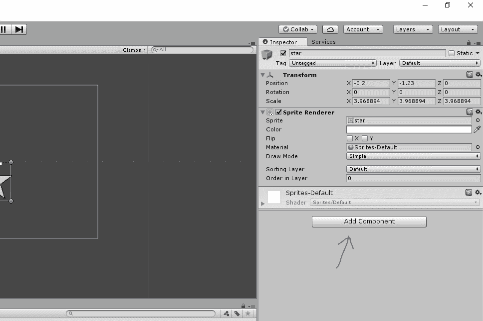
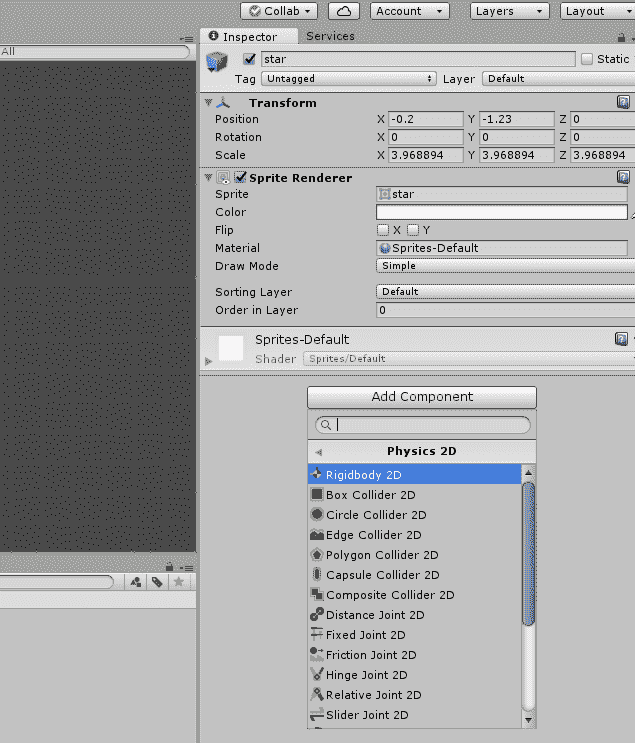
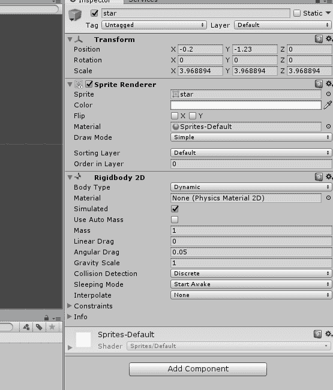
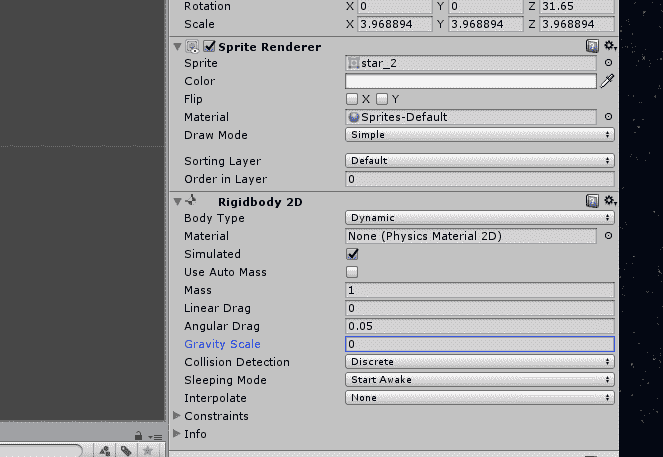

# 理解Unity3D刚体

> 原文：<https://www.studytonight.com/game-development-in-2D/rigid-bodies>

刚体是一种属性，当它被添加到任何物体上时，允许它与许多基本的物理行为相互作用，比如力和加速度。你可以在任何你想在游戏中拥有**质量**的物体上使用刚体。

换句话说，向游戏对象添加刚体是告诉 Unity 的方式，

> *好的，看到这个物体了吗？我希望它表现得像有一些质量和重量，它应该以现实的方式对力和碰撞做出反应。*

当我们使用 2D 游戏设计时，我们使用**刚体 2D** ，而不是**刚体**。它们的不同之处在于，刚体 2D 仅在`XY`轴上相互作用，并且总体上是二维的。刚体 2D 组件覆盖**变换**，并将其更新为刚体 2D 定义的位置/旋转。这有助于在需要时增加物体的速度和加速度。

为了进一步理解刚体，这里有一个例子。假设你有一个普通的纸箱，形状像一个立方体。考虑到盒子本身目前没有一个确定的重量，它只是一个存在的盒子。如果你想在盒子里移动，你可以用各种不同的方法。想象一下，你想让硬纸板盒表现得像一个真实的、有质量的物体。假设我们用沙子填满了它。然后，我们有一个有实际质量的纸箱，感觉**很重**。如果你拉或推它，你可以期望在它移动之前必须施加一些力。在这个例子中，刚体的行为类似于**沙**。它们给游戏物体(也就是你的硬纸板盒)增加了一种质量感，这样它就可以与力和其他物理基础如重力和摩擦力相互作用。

关于什么是刚体的描述已经够多了，让我们深入研究一下这个游戏。在*检查器*中，对于**游戏对象**，像石凡星一样，点击底部的**添加组件**。如果你没有修改游戏对象，按钮应该在精灵渲染器组件的正下方。

从那里，转到**物理 2D →刚体 2D** 。这将为你的游戏对象添加一个刚体 2D 组件。

在*交互*视图中，在精灵渲染器的正下方添加了一行新的**刚体 2D** 特征。

让我们运行我们的游戏，看看会发生什么。“呃...什么？”很可能是此时从你嘴里说出来的。你会注意到你的游戏物体像石头一样掉落！那真的不好玩，是吗？

要解决这个问题，只需将刚体属性的**重力标度**值设置为`0`。

虽然没有什么不同，是吗？你之前在游戏中有一个精灵，添加了一个刚体，并将其重力设置为零，这似乎让我们回到了完全相同的点。

不完全是。你看，通过改变刚体的重力比例，你基本上定义了物体受重力影响的程度。事实上，试着将质量和重力标度改变到不同的值，看看会发生什么。物体仍然有质量，它只是不关心作用在它上面的重力，因此保持不变。

通过改变其他属性的值并查看其对游戏对象的影响，可以自由探索刚体的更多选项。

* * *

* * *