# 统一 3D -使用碰撞器 r2D 处理游戏对象的碰撞

> 原文：<https://www.studytonight.com/game-development-in-2D/colliders-and-collisions>

碰撞是 Unity 理解两个刚体之间，实际上是两个游戏物体之间的物理相互作用的方式。在现实生活中，当我们说两个物体相撞时，我们的意思是它们在物理上相互接触。

在统一中，碰撞不是由刚体本身定义的，而是由一个名为**碰撞 r2D** 的新组件定义的。碰撞器 2 是定义一个**区域**的组件，在该区域中游戏对象之间发生碰撞交互。简单来说，碰撞器就是游戏物体相对于其他游戏物体的固定区域**。我们强调它们是区域的事实，因为不是所有碰撞器的形状都完全像定义它们的游戏对象。事实上，对于高度详细的模型和精灵，大多数开发人员使用基本形状，使**近似**形状。**

 **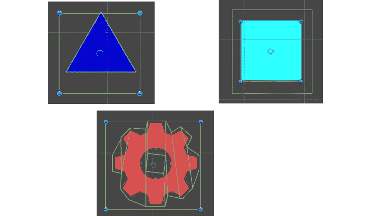

在上图中，请注意绿色边界。这些边界定义了各自游戏对象中的碰撞区域。在三角形中，边界非常适合游戏对象的形状，因为我们使用了一个简单的三角形。在正方形中，我们将碰撞区域做得比游戏对象的实际形状大，以再次表明碰撞器是独立于游戏对象的区域。

最有意思的案例是**档位**对象。请注意，碰撞器没有完美地缠绕齿轮的齿，而是 Unity 对形状的碰撞区域进行了近似，导致了更简单的碰撞区域。(我们没有制作那个碰撞区域，Unity 自动生成的。我们将很快向您展示如何自己完成)。

所以，让我们利用对撞机的知识。我们甚至不需要使用脚本，耶！在你的项目中，打开你的主角，通过转到**添加组件→物理 2D →盒子对撞机**来添加一个`Box Collider 2D`。你现在会注意到一个新的组件，盒子碰撞器，出现在*检查器面板*中。

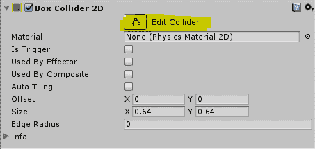

当然，**大小**值可能会根据您的图像的形状而有所不同。

你可以看到上面图片中我们高亮显示的**编辑碰撞器**选项。如果你点击那个按钮，你会注意到你的图像现在有几个**手柄**，你可以用来调整碰撞区域的大小。

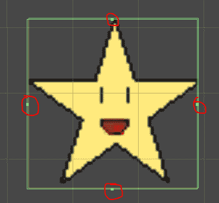

如果你现在运行游戏，你不会真的注意到任何不同。你的角色仍然会像正常人一样使用箭头键移动。所以，让我们通过给我们的主角一些可以碰撞的东西来测试碰撞器的真正魔力。为此，右键单击**资产**区域，并转到**创建→精灵**。

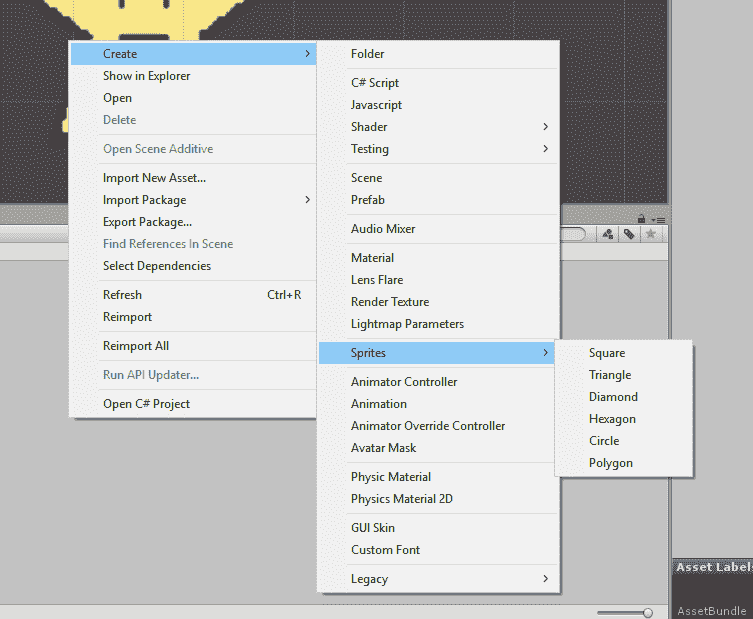

该菜单为您提供了许多基本形状，您可以将其用作占位符精灵或测试交互。点击**方块**，会生成一个新的方块形状供你使用。

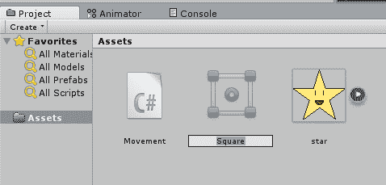

按回车键，然后将方块拖放到*层次结构*中，就像我们添加了石凡星一样。

使用蓝色手柄将正方形调整到合适的大小，这样您就可以测试碰撞。像下面这样的图片就足够了。

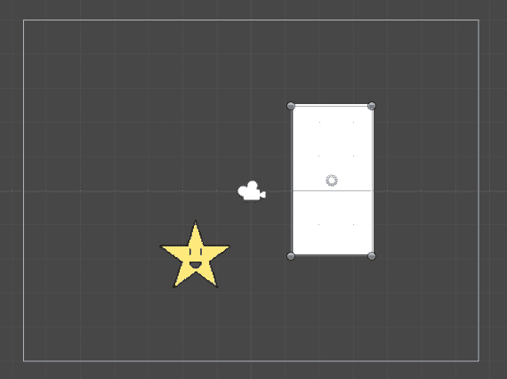

如果你现在运行这个游戏，你会发现石凡星并不真的在乎他前进道路上的障碍，他只是在白色的障碍物下平稳地滑行。

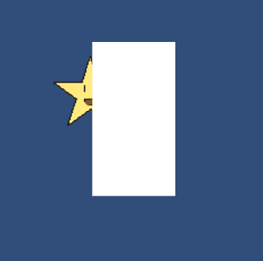

我们如何解决这个问题？方法如下:在不改变其他任何东西的情况下，也给新的方块精灵添加一个`Box Collider 2D`。因为它是一个基本的矩形物体，Unity 会自动添加一个碰撞器区域，就像精灵形状一样。现在，再次尝试运行游戏。

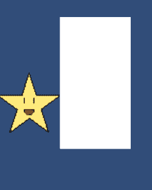

我们的角色现在像我们希望的那样与白色块碰撞！但是一旦你试图在推着角色的同时让他转过街角，事情就开始变得不稳定了。

好吧，让我们从 Unity 的角度来看一下整个场景。玩游戏时，只需点击**场景**选项卡，即可看到场景背后发生的事情。如果你点击你的主角，你可能会看到这样的东西:

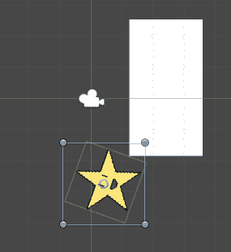

有问题！你试图把方形对撞机推到一个角落，从而旋转它。事实上，这里有一个方法，你可以在现实生活中测试这一点，甚至不用从你的电脑座位上站起来。试着推一下显示器(轻轻地！)中间。会向后移一点，对吗？但是试着把它推到一个角落。会发生什么？你的显示器旋转。如果你学过一点高级物理，你会知道你正在做的是给你的显示器施加一个扭矩，让它转动。

回到游戏中，我们如何让我们的角色不在角落里摇摆不定？很简单。只需打开你的主角，在刚体 2D 属性中，打开**约束**部分。

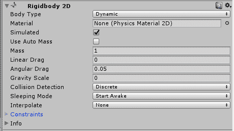

如果您打开该菜单(通过单击三角形)，您将看到禁用(或冻结，统一称之为)对象移动和旋转的选项。勾选**冻结旋转 Z** 框，就可以开始了。但还是不太令人满意。两个对撞机之间有一个很大的空间间隙，由于对撞区域的盒子形状，你无法移动。

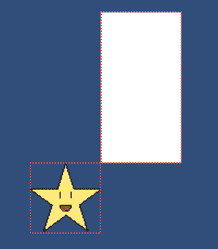

我们如何让对撞机的形状更逼真一点？就像我们的明星一样。好吧，我们不要用盒子对撞机，让我们继续看稍微复杂一点的版本，也就是`Polygon Collider`。要添加一个**多边形碰撞器 2D** ，让我们首先去掉已经附着在我们角色身上的方块碰撞器。只需点击组件右上角的齿轮(打开设置)(我们已经在图片中突出显示了它)，并选择选项，**移除组件**。

现在，按照我们在添加*箱式对撞机*时遵循的相同步骤进行操作，但这次，请选择*多边形对撞机*来代替。如果你的角色有一个相当简单的形状，Unity 应该不会在为你自动定义一个类似形状的碰撞区域上有太多问题。然而，如果不是这样，就像石凡星的情况一样，我们将不得不自己做这件事。

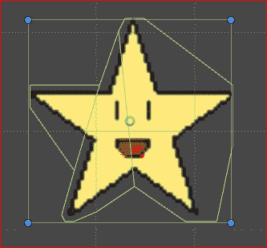

只需点击**编辑碰撞器**按钮，即可编辑碰撞器的边界区域。

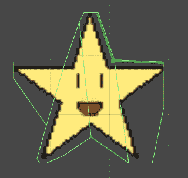

在石凡星对撞机上稍作编辑后，这是我们最终得出的产品:

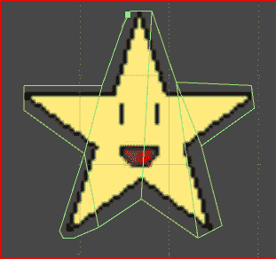

尝试在游戏中测试你的新对撞机。

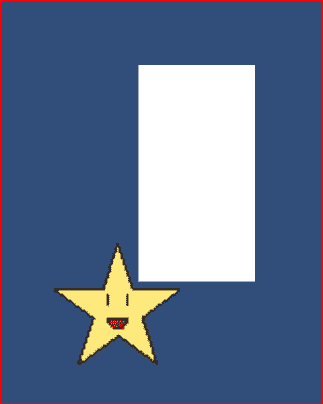

现在，你可能想保存你的工作。只需按下`Ctrl + S`，保存为**场景**即可。我们在前面的课程中已经解释了场景是如何工作的，接下来，我们还将教您如何使用多个场景。

* * *

### 练习练习

*   试着让玩家**在游戏内部绑定**，这样他就不会在屏幕外徘徊了。通过制造新的精灵来使用碰撞器。

    **提示:**主摄像头静止不动，所以通过对摄像头边缘的判断，你对对撞机放在哪里有一个相当好的想法。

*   一旦你掌握了窍门，让你的第一个游戏真正可以玩！用对撞机和精灵做一个迷宫，试着让一个主角找到出路！你甚至可以尝试用**开始**和**结束**文本导入图像，并将其放入游戏中来帮助玩家。

* * *

* * ***