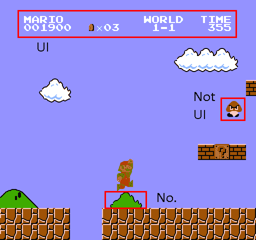
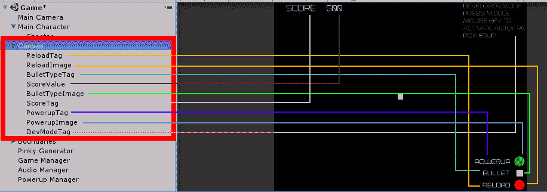
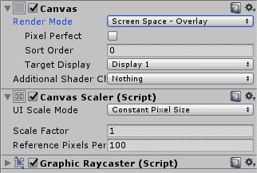
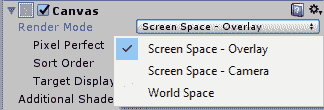
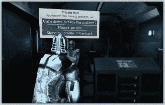

# 了解Unity3D 画布

> 原文：<https://www.studytonight.com/game-development-in-2D/the-canvas>

Unity 中的画布不是一个大画板放在一个木架上。画布实际上是游戏中可以绘制用户界面元素的区域。

**什么是 UI 元素？** UI 元素只是游戏中(最常见的是在屏幕上)向玩家传递有用信息的元素。这些通常持续存在。用户界面元素的一个最好的例子是一个分数计数器，或者一个健康计等等。

* * *

## Unity3D画布和用户界面元素

UI 元素是什么形式*暂停菜单*、*主菜单*、HUDs 或*平视显示器*、*计分器*等等。在本教程中，我们将讨论一下画布是如何工作的，在下一个教程中，我们将继续在游戏中添加我们自己的用户界面元素。

到目前为止，我们唯一说过的是它在游戏中是一个很大的矩形空间。在 Unity 中，画布也是一个游戏对象，附带一个**画布组件**。这个画布组件充当屏幕上所有用户界面元素的**主控件**。这就是为什么所有的用户界面元素都必须是画布游戏对象的子游戏对象。

* * *

### Unity3D 画布:画布组件属性

让我们看看画布组件。

**注:**我们缩小了 Graphic Raycaster 组件，因为目前它对我们来说没有另外两个重要。

画布脚本的第一部分是**画布**本身。它具有改变画布在屏幕上呈现的位置和方式的属性。第二部分**画布缩放器**，用于根据不同的屏幕大小设置 UI 元素的大小和缩放。

在画布脚本中，我们最重要的属性是**渲染模式**。

**渲染模式**中的三种模式决定了画布在游戏中的处理和渲染方式。让我们进一步探索这些选项，以便更好地理解它们。

#### Unity3D 画布:屏幕空间-覆盖

这种渲染模式将用户界面元素放置在渲染场景的屏幕顶部。这是你在制作平视显示器或任何类似的静态用户界面元素时，大部分时间都会用到的东西。它非常有用，因为它会根据屏幕大小自动将画布中的用户界面元素缩放到所需的大小。

#### Unity3D 画布:屏幕空间

这与**叠加**模式的工作原理非常相似，但是在这种模式下，我们指定一个摄像机来渲染我们的用户界面。因此，改变相机的属性，如形状、大小、覆盖区域或分辨率，将改变用户界面在屏幕上的外观。开发人员通常不会使用这个选项，因为他们发现 Overlay 更有用，因为它能够自动缩放用户界面元素。

#### Unity3D 画布:世界空间

这种模式与其他两种模式大不相同。在世界空间中，用户界面元素被简单地视为场景中的另一个游戏对象，而不是优先渲染。世界空间在处理作为游戏本身一部分的用户界面元素时非常有用，而不仅仅是对玩家来说。

* * *

* * *