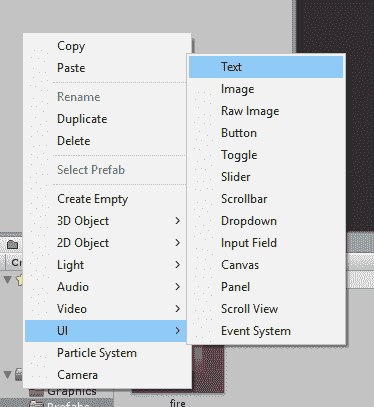
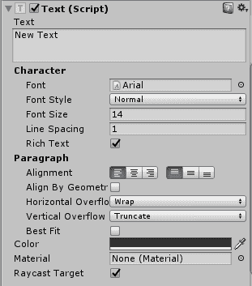
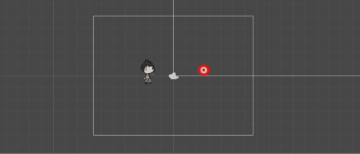
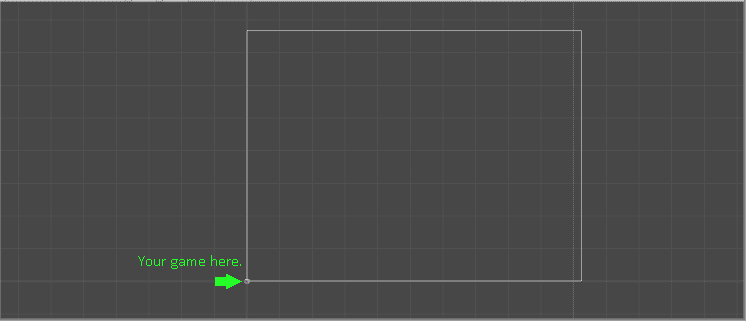
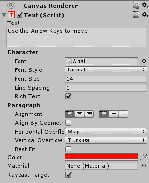
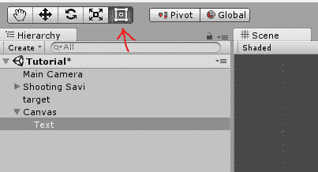
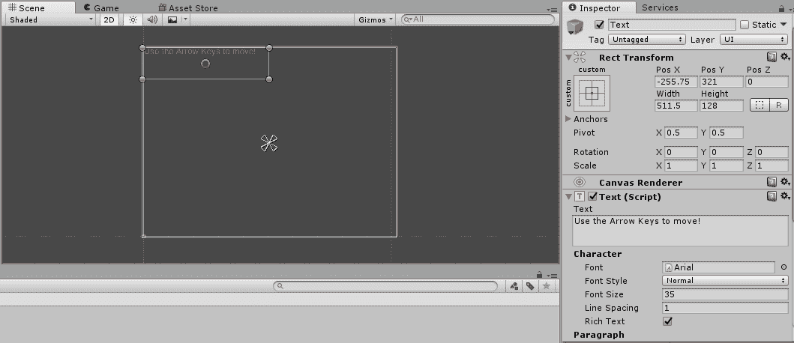
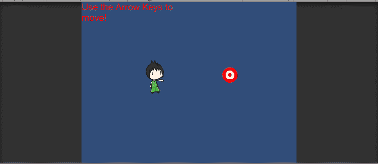

# Unity3D：向游戏画布添加用户界面元素

> 原文：<https://www.studytonight.com/game-development-in-2D/adding-ui-elements>

现在我们已经很好地了解了 Canvas 是如何工作的，让我们尝试将自己的元素添加到游戏中。我们将从一个非常简单的标签开始。一个**标签**只是你在用户界面上使用的静态文本。让我们的标签说**使用箭头键移动**。

首先，为了添加任何用户界面元素，我们现在知道我们首先需要一个**画布**。然而，当你在一个还没有画布的场景中创建一个用户界面元素时，Unity 为我们省去了在场景中插入一个新画布的麻烦。

要在场景中添加标签，右键单击**层次结构**，选择**用户界面元素→文本**。

一旦你点击**文本**，你会注意到在你的**层级视图**中有一个新的增加。

您可以安全地忽略或摆脱**事件系统**游戏对象。顾名思义，它处理的是处理事件，这是我们目前还没有涉及到的事情。查看 Unity 如何添加新的**画布**并自动使**文本**元素成为该画布的子元素。

现在，看看文本标签的属性。

你看到的大部分都是不言自明的。可以选择改变文本的**颜色**、文本**大小**、**字体**(通过将字体文件导入到资源中)、**对齐方式**等等。现在，看看游戏视图。

屏幕上出现的这个新的角(圆点)是什么？尝试缩小游戏，直到您可以完全看到画布。

* * *

### Unity3D：了解画布大小

画布为什么这么大？你看，Unity的长度是以**单位**计量的。这些单位是横跨整个游戏世界的小方块。画布使用默认的比例因子`1 UI pixel = 1 Unit`，这意味着画布在场景编辑器中实际上是`800`单位长。

现在尺寸理解已经不在我们的视线范围内，选择**层次**中的**文本**元素，放大文本，这样你就可以正确地看到它了。让我们给文本一个明亮的**红色**颜色，并在**文本字段**中写下我们想要它说的话。

* * *

### Unity3D画布:格式化文本用户界面元素

由于默认的标签**大小**比我们希望它显示的文本略短，我们可以通过拖动到目前为止我们在精灵中使用的**蓝色手柄**来增加标签框的大小。如果看不到蓝色手柄，只需点击编辑器左上角的最后一个选项，选择**文本**。

我们还建议尝试更改文本属性中的**水平**和**垂直溢出**选项，因为它们处理的问题与我们刚刚通过调整大小解决的问题相同。

现在，将标签拖到巨大画布的右上角。您将会看到 Unity 有很多区域，用户界面元素将在这些区域中自我修复。这包括画布的角和中点。当您处理需要看起来有条理和一致的更复杂的用户界面时，这将非常有用。

最后，进一步更改标签的大小，并增加属性中的字体大小。这确保了我们有一个在游戏中清晰可见的标签。

在下一个教程中，我们将学习如何实时更新文本用户界面元素，以使用它来显示分数和其他游戏进度信息。

* * *

* * *