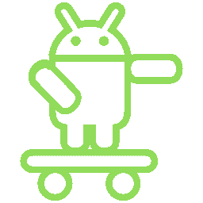

# 安卓编程入门

> 原文：<https://www.studytonight.com/android/introduction-to-android>

欢迎光临！你们正在阅读这篇文章，这意味着你们渴望学习如何自己编写一个安卓应用。在当今世界，移动应用市场正在爆炸式增长，特别是安卓在很短的时间内就崛起了，与 iOS、黑莓、视窗等其他竞争对手相比占据了领先地位。

每种技术([操作系统](/operating-system/introduction-operating-systems))都有自己的用户群，但安卓已经能够覆盖世界上最大的用户群。在第一个教程中，我们将看到什么是安卓，它的版本以及自 2005 年以来有哪些功能帮助它达到现在的水平？最后，我们还将尝试了解[安卓架构](android-architecture)。

* * *

## 安卓是什么？

安卓是一个修改后的基于 Linux 的移动操作系统，最初由同名的**安卓公司**启动。2005 年，谷歌收购安卓，接手开发工作，进军移动领域。

作为世界上最大的科技巨头的一部分，安卓是开源和免费的；因此，安卓的大部分源代码都是在开源 Apache 许可证下发布的。这使得任何人都可以下载源代码并根据自己的要求进行更改，因此他们可以拥有自己的安卓操作系统，例如: **Cynogen** 、 **MIUI** (小米)等只是安卓操作系统的不同风格。

在开发过程中，开发人员只需在软件层面进行编码，添加新功能，修改用户体验等，将不同设备配置的担忧和软硬件集成抛在脑后，这使得面向移动的安卓应用开发更加容易。

* * *

### 安卓版本

自发布以来，安卓经历了多次更新。以下是其不同版本及其代码名称的列表:

| 版本 | 出厂日期 | 代号 | 空气污染指数 |
| One | 2008 年 9 月 23 日 | 不适用的 | one |
| One point one | 2009 年 2 月 9 日 | 不适用的 | Two |
| One point five | 2009 年 4 月 30 日 | 纸杯蛋糕 | three |
| one point six | 2009 年 9 月 15 日 | 甜甜圈 | four |
| 2.0/2.1 | 2009 年 10 月 26 日 | 闪了闪了闪了闪了闪了闪了闪了闪了闪了闪了闪了闪了闪了闪了闪了闪了闪了闪了闪了闪了闪了闪了闪了闪 | 5-7 |
| Two point two | 2010 年 5 月 20 日 | 弗罗约 | eight |
| Two point three | 2010 年 12 月 6 日 | 姜饼 | 9-10 |
| 3.0/3.1/3.2 | 2011 年 2 月 22 日 | 蜂窝 | 11-13 |
| Four | 2011 年 10 月 18 日 | 冰淇淋三明治 | 14-15 |
| 4.1/4.2/4.3 | 2012 年 7 月 9 日 | 果冻豆 | 16-18 |
| Four point four | 2013 年 10 月 31 日 | KitKat | 19-20 |
| 5.0/5.1 | 2014 年 11 月 12 日 | 棒棒糖 | 21-22 |
| Six | 2015 年 10 月 5 日 | 棉花糖 | Twenty-three |
| Seven | 2016 年底 | 牛轧糖 | Twenty-four |
| Eight | 2017 年 8 月 21 日 | 奥利欧 | Twenty-six |

* * *

## 安卓的特点

作为一款开源免费的软件，厂商和开发者都是根据自己的需求来做定制的，所以安卓不需要特定的软硬件配置。安卓本身提供了如下一些功能，

1.  **存储**:使用 SQLite 这种轻量级的关系数据库存储进行数据存储(考虑到移动内存存储有限的情况下确实很有帮助)。
2.  **媒体支持**:包括对图像、音频以及视频的大量媒体格式的支持，如:H.263、H.264、MPEG-4 SP、AMR、AMR WB、AAC、MP3、MIDI、WAV、JPEG、PNG、GIF & BMP。
3.  **短信**:支持短信和彩信。
4.  **网页浏览器**:基于开源的 WebKit，现在被称为 Chrome。
5.  **连接性**:支持大组网络，如:GSM/EDGE、IDEN、CDMA、EV-DO、UMTS、蓝牙、WiFi、LTE、WiMAX。
6.  **硬件支持**:加速度传感器、摄像头、数字罗盘、接近传感器&全球定位系统等等。
7.  **多点触控**:支持多点触控屏幕。
8.  **多任务**:支持应用多任务。
9.  **支持闪存**:支持闪存。
10.  **共享**:支持作为有线或无线热点共享互联网。

* * *

* * *